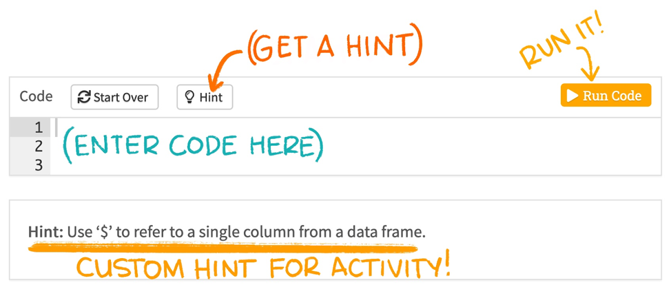
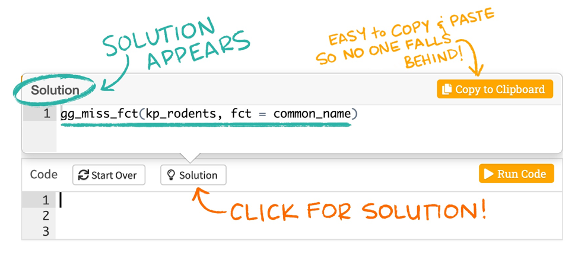

```{r setup, include = FALSE}
require(learnr, quietly = TRUE)
require(knitr, quietly = TRUE)
require(ggplot2, quietly = TRUE)
require(shiny, quietly = TRUE)

knitr::opts_chunk$set(echo = FALSE)

df_thx <- as.data.frame(cbind(
  Strategy = c(1:9),
  Name = c("No screening (REF)",  
           "Screening once, at age 40",
           "Screening once, at age 60",  
           "Screening once, at age 80",
           "Screening twice, at age 40 and 60",  
           "Screening every 10 years from age 40 to 80",
           "Screening every 10 years from age 50 to 80",
           "Screening every 5 years from age 40 to 80",
           "Screening every 5 years from age 50 to 80"),
  Costs = c(0, 23500, 12500, 14000, 36000, 67500, 57500, 113000,  88000),
  QALYs = c(0.0, 1.1, 0.9, -0.5, 1.9, 3.3, 3.2, 4.1, 4.0)
))

df_thx[, c("Costs", "QALYs")] <- apply(df_thx[, c("Costs", "QALYs")], 2, function(x) as.numeric(as.character(x)))
df_thx[, "Strategy"] <- as.factor(as.character(df_thx[, "Strategy"]))
```


## Cost-effectiveness acceptability frontier (CEAF)

### Aims
This assignment aims to familiarise you with the concept of the cost-effectiveness acceptability frontier (CEAF), by constructing one yourself, based on a fictive example. The aim of this assignment is to identify which of the screening strategies is the most cost effective.  

### Instructions
The provided solutions are one way to perform the calculations. You can obtain the same results using other fomula's or R commands. The last 'Hint' is always the solution to the assignment. Solutions can be copied and pasted in the chunk as shown in the figures below. Once you have completed a code chunk, you can run it by clicking the 'Run code' button on the upper-right side of the chunk or using the shortcut CRTL+Enter.    

```{r, fig.align = 'center', out.width = "70%", echo = F}

```

```{r, fig.align = 'center', out.width = "70%", echo = F}

```

[Link to figures](https://education.rstudio.com/blog/2020/05/learnr-for-remote/)

### The data
The assignment uses the `df_thx` object, which is already loaded in this tutorial. 

The `df_thx` object contains 4 variables and 9 observations (the outcomes of the strategies to compare):  

- `Strategy` = the number identifying the screening strategy  
- `Name` = the name of the screening strategy  
- `Costs` = the total costs of the screening strategy    
- `QALYs` = the total QALYs gained through the screening strategy 

The `df_thx` object is displayed herebelow. Have a look at this dataframe before starting the assignment.

```{r show_data}
df_thx
```

The graph below displays the strategies in a cost-effectiveness plane.
```{r show_data_plot}
ggplot(data = df_thx, aes(x = QALYs, Costs, colour = Strategy)) +
  geom_point() + 
  geom_hline(yintercept = 0, linetype = "dashed", color = "grey") +
  geom_vline(xintercept = 0, linetype = "dashed", color = "grey") +
  ggtitle("Cost-effectiveness plane") +
  theme_bw()
```


```{r quiz_start}
quiz(
  question("Based on this graph, can you already guess which strategy is dominated?",
    answer("Strategy 1", correct = TRUE),
    answer("Strategy 2", correct = TRUE),
    answer("Strategy 3", correct = TRUE),
    answer("Strategy 4", correct = TRUE),
    answer("Strategy 5", correct = TRUE),
    answer("Strategy 6", correct = TRUE),
    answer("Strategy 7", correct = TRUE),
    answer("Strategy 8", correct = TRUE),
    answer("Strategy 9", correct = TRUE),
    answer("None", correct = TRUE),
    correct = "Let's have a look whether you guessed it right by performing the assignment!",
    incorrect = "Let's have a look whether you guessed it right by performing the assignment!"
    ),
  question("Based on this graph, can you already guess which strategy is extendedly dominated?",
    answer("Strategy 1", correct = TRUE),
    answer("Strategy 2", correct = TRUE),
    answer("Strategy 3", correct = TRUE),
    answer("Strategy 4", correct = TRUE),
    answer("Strategy 5", correct = TRUE),
    answer("Strategy 6", correct = TRUE),
    answer("Strategy 7", correct = TRUE),
    answer("Strategy 8", correct = TRUE),
    answer("Strategy 9", correct = TRUE),
    answer("None", correct = TRUE),
    correct = "Let's have a look whether you guessed it right by performing the assignment!",
    incorrect = "Let's have a look whether you guessed it right by performing the assignment!"
    )
)
```

### Assignment and questions
Calculate the fully incremental ICERs of these screening strategies against each other and answer the questions below.     
**To do so, you can use a pen, paper, and calculator and use the method described in the paper from [Paulden](https://doi.org/10.1007/s40273-020-00914-6) OR you can follow this tutorial. The answers to these questions are at the end of this tutorial.**  
1. Which strategies are dominated?  
2. Which strategies are extendedly dominated?  
3. Which strategies are on the cost-effectiveness acceptability frontier?  
4. Which strategy is optimal if the WTP threshold is equal to €20,000/QALY?  
5. Which strategy is optimal if the WTP threshold is equal to €40,000/QALY?  
6. Which strategy is optimal if the WTP threshold is equal to €100,000/QALY?  
7. At which WTP threshold would strategy 4 be the optimal strategy?  
8. At which WTP threshold would strategy 7 be the optimal strategy?  
9.	Calculate the Net Monetary Benefit (NMB) for each strategy for a WTP threshold of €20,000/QALY. Which strategy has the highest NMB? Does this correspond with your answer to question 4?  

### Step 1: order the strategies by increasing total QALYs
```{r order, echo = TRUE}
df_thx <- df_thx[order(df_thx$QALYs),]
df_thx
```

### Step 2: identify the dominated strategies
```{r quiz_dominated}
question("Based on the table where strategies are ordered by increasing total number of QALYs, which strategy is dominated?",
  answer("Strategy 1"),
  answer("Strategy 2"),
  answer("Strategy 3"),
  answer("Strategy 4", correct = TRUE),
  answer("Strategy 5"),
  answer("Strategy 6"),
  answer("Strategy 7"),
  answer("Strategy 8"),
  answer("Strategy 9"),
  answer("None")
)
```

Can you explain why this (these) strategy(ies) are dominated?
```{r, echo = FALSE}
textInput("Answer_1", "Enter your answer")
```

### Explanation answer Step 2
Strategy 4 is dominated by Strategy 1 because Strategy 1 provides more health benefits (QALYs) at a lower costs.  

### Step 3: Calculate ICERs
Since strategy 4 is dominated, it will not be used further in the comparison of the strategies. It is now time to calculate the different ICERs.  
```{r}
df_thx <- df_thx[order(df_thx$QALYs),]
rownames(df_thx) <- NULL
df_thx[which(df_thx$Strategy !=4), ]
```

Calculate the ICERs of strategies 3, 2, 5, 7, 6, 9, 8. You can use a calculator or the R code chunk below to calculate them. Round your results to the closest euro and write your answers. **DO NOT FORGET THAT THE ICER OF A SPECIFIC STRATEGY HAS TO BE CALCULATED AGAINST THE NEXT BEST STRATEGY!**  
Check your answers by clicking on 'Continue'!

```{r calc_icers_1, exercise = TRUE}

```

```{r calc_icers_1-hint}
"Example: The ICER of strategy 3 is obtained by 1) calculating the difference in costs between strategy 3 and 1, 2) calculating the difference in QALYs between strategy 3 and 1, and 3) dividing the difference in costs by the difference in QALYs. Strategy 3 is compared with strategy 1 because strategy 1 is the first non-(extendedly) dominated strategy above 3."
```

```{r calc_icers_1-solution}
# EXAMPLE: ICER of 3 versus 1
diff_costs <- df_thx[which(df_thx$Strategy == 3), "Costs"] - df_thx[which(df_thx$Strategy == 1), "Costs"] # difference in costs between strategy 3 and 1
diff_effects <- df_thx[which(df_thx$Strategy == 3), "QALYs"] - df_thx[which(df_thx$Strategy == 1), "QALYs"] # difference in effects between strategy 3 and 1

icer <- diff_costs / diff_effects # ratio of the difference in costs by the difference in effect
icer_rounded <- round(icer) # rounding off
icer_rounded # shows results
```

```{r calc_icers_user}
textInput("icer_3", "ICER of strategy 3", width = "300px")
textInput("icer_2", "ICER of strategy 2", width = "300px")
textInput("icer_5", "ICER of strategy 5", width = "300px")
textInput("icer_7", "ICER of strategy 7", width = "300px")
textInput("icer_6", "ICER of strategy 6", width = "300px")
textInput("icer_9", "ICER of strategy 9", width = "300px")
textInput("icer_8", "ICER of strategy 8", width = "300px")
```

### Step 3: Explanations
The results in the table below are obtained by calculating the difference in costs and effects between consecutive strategies in the table.
```{r calc_icer1}
df_thx <- df_thx[order(df_thx$QALYs),]
rownames(df_thx) <- NULL
df_thx2 <- df_thx[which(df_thx$Strategy !=4), ]
ICER <- format(round(c(0, diff(df_thx2$Costs)) / c(0, diff(df_thx2$QALYs))), big.mark = ",", scientific = FALSE)
ICER[1] <- "-"
df_thx2 <- cbind(df_thx2, ICER)
df_thx2
```

### Step 4: Identify extendedly dominated strategies
Based on the table above, we can now identify the extendedly dominated strategies!
```{r quiz_ext_dom}
quiz(
question("Based on the table above, which strategy(ies) is(are) extendedly dominated? ",
  answer("Strategy 1"),
  answer("Strategy 2", correct = TRUE),
  answer("Strategy 3"),
  answer("Strategy 5"),
  answer("Strategy 6", correct = TRUE),
  answer("Strategy 7"),
  answer("Strategy 8"),
  answer("Strategy 9"),
  answer("None"),
  allow_retry = TRUE,
  try_again = "Did you select all the correct answers?"
  )
)
```

Can you explain your answer?
```{r, echo = FALSE}
textInput("Answer_2", "Enter your answer")
```

### Step 4: Explanations
Strategies 2 and 6 are extendedly dominated because their ICER is greater than the strategy below them in the table. Strategy 2 is **extendedly dominated** by strategies 3 and 5 because, in theory, it may possible to screen some individuals following strategy 3 and some other individuals following strategy 5, which would results in costs and benefits which dominate strategy 2 (the ICER of the combination of strategies 3 and 5 would be lower than the ICER of strategy 2). Thus strategy 2 is not extendedly dominated by a single strategy but by the combination of 3 and 5. The same applies to strategy 6, when considering strategy 7 and 9.

### Step 5: Re-calculate ICERs and identify extendedly dominated strategies
Now, ICERs have to be recalculated since strategies 2 and 6 have been ruled out of the comparison. Calculate the ICERs of strategies 3, 5, 7, 9, 8. You can use a calculator or the R code chunk below to calculate them. Round your results to the closest euro and write your answers. Check your answers by clicking on 'Continue'!
```{r}
df_thx <- df_thx[order(df_thx$QALYs),]
rownames(df_thx) <- NULL
df_thx[which(df_thx$Strategy != 4 &
               df_thx$Strategy != 2 &
               df_thx$Strategy != 6), ]
```

```{r calc_icers_2, exercise = TRUE}

```

```{r calc_icers_2-solution}
# EXAMPLE: ICER of 3 versus 1
diff_costs <- df_thx[which(df_thx$Strategy == 3), "Costs"] - df_thx[which(df_thx$Strategy == 1), "Costs"] # difference in costs between strategy 3 and 1
diff_effects <- df_thx[which(df_thx$Strategy == 3), "QALYs"] - df_thx[which(df_thx$Strategy == 1), "QALYs"] # difference in effects between strategy 3 and 1

icer <- diff_costs / diff_effects # ratio of the difference in costs by the difference in effect
icer_rounded <- round(icer) # rounding off
icer_rounded # shows results
```

```{r calc_icers_user2}
textInput("icer_3b", "ICER of strategy 3", width = "300px")
textInput("icer_5b", "ICER of strategy 5", width = "300px")
textInput("icer_7b", "ICER of strategy 7", width = "300px")
textInput("icer_9b", "ICER of strategy 9", width = "300px")
textInput("icer_8b", "ICER of strategy 8", width = "300px")
```

### Step 5: Explanations
The results in the table below are obtained by calculating the difference in costs and effects between consecutive strategies in the table
```{r calc_icer2}
df_thx <- df_thx[order(df_thx$QALYs),]
rownames(df_thx) <- NULL
df_thx2 <- df_thx[which(df_thx$Strategy != 4 &
               df_thx$Strategy != 2 &
               df_thx$Strategy != 6), ]
ICER <- format(round(c(0, diff(df_thx2$Costs)) / c(0, diff(df_thx2$QALYs))), big.mark = ",", scientific = FALSE)
ICER[1] <- "-"
df_thx2 <- cbind(df_thx2, ICER)
df_thx2
```

### Step 5: Identify extendedly dominated strategies
Based on the table above, we can now identify the extendedly dominated strategies!
```{r quiz_ext_dom2}
quiz(
question("Based on the table above, which strategy(ies) is (are) extendedly dominated?",
  answer("Strategy 1"),
  answer("Strategy 3"),
  answer("Strategy 5", correct = TRUE),
  answer("Strategy 7"),
  answer("Strategy 8"),
  answer("Strategy 9"),
  answer("None"),
  type = "learnr_radio",
  incorrect = "The right answer is strategy 5, see the explanation to the previous step.",
  allow_retry = TRUE
)
)
```

### Step 6: Re-calculate ICERs and identify extendedly dominated strategies
Now, ICERs have to be recalculated since strategies 2, 5, and 6 have been ruled out of the comparison. Calculate the ICERs of strategies 3, 7, 9, 8. You can use a calculator or the R code chunk below to calculate them. Round your results to the closest euro and write your answers. Check your answers by clicking on 'Continue'!
```{r}
df_thx <- df_thx[order(df_thx$QALYs),]
rownames(df_thx) <- NULL
df_thx[which(df_thx$Strategy != 4 &
               df_thx$Strategy != 2 &
               df_thx$Strategy != 6 &
               df_thx$Strategy != 5), ]
```

```{r calc_icers_3, exercise = TRUE}

```

```{r calc_icers_3-solution}
# EXAMPLE: ICER of 3 versus 1
diff_costs <- df_thx[which(df_thx$Strategy == 3), "Costs"] - df_thx[which(df_thx$Strategy == 1), "Costs"] # difference in costs between strategy 3 and 1
diff_effects <- df_thx[which(df_thx$Strategy == 3), "QALYs"] - df_thx[which(df_thx$Strategy == 1), "QALYs"] # difference in effects between strategy 3 and 1

icer <- diff_costs / diff_effects # ratio of the difference in costs by the difference in effect
icer_rounded <- round(icer) # rounding off
icer_rounded # shows results
```

```{r calc_icers_user3}
textInput("icer_3c", "ICER of strategy 3", width = "300px")
textInput("icer_7c", "ICER of strategy 7", width = "300px")
textInput("icer_9c", "ICER of strategy 9", width = "300px")
textInput("icer_8c", "ICER of strategy 8", width = "300px")
```

### Step 6: Explanations
The results in the table below are obtained by calculating the difference in costs and effects between consecutive strategies in the table
```{r calc_icer3}
df_thx <- df_thx[order(df_thx$QALYs),]
rownames(df_thx) <- NULL
df_thx3 <- df_thx[which(df_thx$Strategy != 4 &
               df_thx$Strategy != 2 &
               df_thx$Strategy != 6 &
                 df_thx$Strategy != 5), ]
ICER <- format(round(c(0, diff(df_thx3$Costs)) / c(0, diff(df_thx3$QALYs))), big.mark = ",", scientific = FALSE)
ICER[1] <- "-"
df_thx3 <- cbind(df_thx3, ICER)
df_thx3
```

### Step 6: Identify extendedly dominated strategies
Based on the table above, we can now identify the extendedly dominated strategies!
```{r quiz_ext_dom3}
quiz(
question("Based on the table above, which strategy(ies) is(are) extendedly dominated? ",
  answer("Strategy 1"),
  answer("Strategy 3"),
  answer("Strategy 7"),
  answer("Strategy 8"),
  answer("Strategy 9"),
  answer("None", correct = TRUE),
  type = "learnr_radio",
  incorrect = "Too bad... The right answer is that none of these strategies are extendedly dominated since all ICERs are increasing! Strategies 1, 3, 7, 8, 9 are thus all on the cost-effectiveness acceptability frontier!",
  correct = "Good job! This means that strategies 1, 3, 7, 8, 9 are all on the cost-effectiveness acceptability frontier!",
  allow_retry = TRUE
)
)
```


### Quiz
The table and plot below provide the final results. Using these, please answer the questions below.
```{r final_res, warning = FALSE, message = FALSE}
df_thx <- df_thx[order(df_thx$QALYs),]
rownames(df_thx) <- NULL
df_thx3 <- df_thx[which(df_thx$Strategy != 4 &
               df_thx$Strategy != 2 &
               df_thx$Strategy != 6 &
                 df_thx$Strategy != 5), ]
ICER <- format(round(c(0, diff(df_thx3$Costs)) / c(0, diff(df_thx3$QALYs))), big.mark = ",", scientific = FALSE)

df_thx$ICER <- NA 
df_thx[which(df_thx$Strategy == 1 |
               df_thx$Strategy ==3 |
               df_thx$Strategy == 7|
               df_thx$Strategy == 9 | 
               df_thx$Strategy == 8), "ICER"] <- ICER
df_thx[which(df_thx$Strategy == 1), "ICER"] <- "-"

df_thx[which(df_thx$Strategy == 5 |
               df_thx$Strategy == 2 |
               df_thx$Strategy == 6), "ICER"] <- "Ext. dominated"
df_thx[which(df_thx$Strategy == 4), "ICER"] <- "Dominated"
df_thx

ggplot(data = df_thx, aes(x = QALYs, Costs, colour = Strategy)) +
  geom_point() +
  geom_hline(yintercept = 0, linetype = "dashed", color = "grey") +
  geom_vline(xintercept = 0, linetype = "dashed", color = "grey") +
  geom_line(data = df_thx[which(df_thx$ICER != "Ext. dominated" & df_thx$ICER != "Dominated"), ], aes(x = QALYs, y = Costs), col = "lightgrey") +
  ggtitle("Cost-effectiveness plane with CEAF") +
  theme_bw()
```

```{r quiz_inter}
quiz(
  question("Which intervention is optimal if the willingness-to-pay (WTP) threshold is equal to €20,000/QALY?",
           answer("Strategy 1"),
           answer("Strategy 2"),
           answer("Strategy 3"),
           answer("Strategy 4"),
           answer("Strategy 5"),
           answer("Strategy 6"),
           answer("Strategy 7", correct = TRUE),
           answer("Strategy 8"),
           answer("Strategy 9"),
           answer("None"),
           correct = "Good job, strategy 7 is the optimal at a WTP threshold of €20,000/QALY because its ICER is €19,565.",
           incorrect = "Too bad, this is not correct. Strategy 7 is most optimal at a WTP threshold of €20,000/QALY because its ICER is €19,565.",
           allow_retry = TRUE
           ),
    question("Which intervention is optimal if the willingness-to-pay (WTP) threshold is equal to €40,000/QALY?",
           answer("Strategy 1"),
           answer("Strategy 2"),
           answer("Strategy 3"),
           answer("Strategy 4"),
           answer("Strategy 5"),
           answer("Strategy 6"),
           answer("Strategy 7"),
           answer("Strategy 8"),
           answer("Strategy 9", correct = TRUE),
           answer("None"),
           correct = "Good job, strategy 9 is the most optimal at a WTP threshold of €40,000/QALY because its ICER is €38,125.",
           incorrect = "Too bad, this is not correct. Strategy 9 is the most optimal at a WTP threshold of €40,000/QALY because its ICER is €38,125.",
           allow_retry = TRUE
           ),
      question("Which intervention is optimal if the willingness-to-pay (WTP) threshold is equal to €100,000/QALY?",
           answer("Strategy 1"),
           answer("Strategy 2"),
           answer("Strategy 3"),
           answer("Strategy 4"),
           answer("Strategy 5"),
           answer("Strategy 6"),
           answer("Strategy 7"),
           answer("Strategy 8"),
           answer("Strategy 9", correct = TRUE),
           answer("None"),
           correct = "Good job, strategy 9 is still the most optimal at a WTP threshold of €100,000/QALY because its ICER is €38,125.",
           incorrect = "Too bad, this is not correct. Strategy 9 is the most optimal at a WTP threshold of €100,000/QALY because its ICER is €38,125.",
           allow_retry = TRUE
           ),
   question("At which WTP threshold would intervention 5 be the optimal intervention?",
           answer("€50,000"),
           answer("€80,000"),
           answer("€150,000"),
           answer("€300,000"),
           answer("None", correct = TRUE),
           correct = "Good job, none because it is extendedly dominated.",
           incorrect = "Too bad, this is not correct. Strategy 5 will never be the optimal intervention because it is extendedly dominated.",
           allow_retry = TRUE
           ),
  question("At which WTP threshold would intervention 8 be the optimal intervention?",
           answer("When the WTP threshold becomes €150,000/QALY or higher"),
           answer("When the WTP threshold becomes €200,000/QALY or higher"),
           answer("When the WTP threshold becomes €250,000/QALY or higher", correct = TRUE),
           answer("When the WTP threshold becomes €300,000/QALY or higher"),
           answer("None"),
           correct = "Good job, because its ICER is €250,000",
           incorrect = "Too bad, this is not correct. Strategy 8 will be the optimal intervention when the WTP threshold becomes €250,000/QALY or higher because its ICER is €250,000",
           allow_retry = TRUE
           )
)
```

### Using Net Monetary Benefits
Calculate the Net Monetary Benefit (NMB) for each intervention for a WTP threshold of €20,000/QALY. Store the NMBs in a column called `NMB` in the `df_thx` dataframe.  

```{r calc_nmb, exercise = TRUE}

```

```{r calc_nmb-hint}
"The NMB of each strategy is calculated by multiplying the number of QALY of each intervention by the WTP threshold and then substracting the costs of each intervention."
```

```{r calc_nmb-solution}
df_thx$NMB <- df_thx$QALYs * 20000 - df_thx$Costs
df_thx # shows results
```

### Using Net Monetary Benefits - question
The table below shows the correct results. You can use it to check your answer.  

```{r nmb}
df_thx$NMB <- as.numeric(as.character(df_thx$QALYs)) * 20000 - as.numeric(as.character(df_thx$Costs))
df_thx <- df_thx[order(df_thx$Strategy),]
df_thx # shows results
```

```{r quiz_nmb}
quiz(
  question("Based on these NMBs, which intervention is optimal?",
           answer("Strategy 1"),
           answer("Strategy 2"),
           answer("Strategy 3"),
           answer("Strategy 4"),
           answer("Strategy 5"),
           answer("Strategy 6"),
           answer("Strategy 7", correct = TRUE),
           answer("Strategy 8"),
           answer("Strategy 9"),
           answer("None"),
           correct = "Good job, strategy 7 is the  optimal at a WTP threshold of €20,000/QALY because its NMBs is the highest. This answer correspond to the first answer in the previous quiz!",
           incorrect = "Too bad, this is not correct. Strategy 7 is the  optimal at a WTP threshold of €20,000/QALY because its NMBs is the highest. This answer correspond to the first answer in the previous quiz!",
           allow_retry = TRUE
           )
)
```

### Try again!
Determine which strategies are on the CEAF and calculate the ICERs for the strategies in the following table. Use a pen, paper, and calculator or the R code chunck below to perform the calculations.  

```{r extra}
df_thx_extra <- data.frame(
  Strategy = c(1:4),
  Costs = c(0, 30000, 10000, 20000),
  QALYs = c(5, 15, 7.5, 7)
)
df_thx_extra
```

```{r extra_calc, exercise = TRUE}

```

```{r quiz_extra}
quiz(
  question("Which strategy(ies) is(are) dominated?",
           answer("Strategy 1"),
           answer("Strategy 2"),
           answer("Strategy 3"),
           answer("Strategy 4", correct = TRUE),
           answer("None"),
           correct = "Good job, strategy 4 is dominated by strategy 3 because 3 provides more QALYs at a lower costs.",
           incorrect = "Too bad, this is not correct. Strategy 4 is dominated by strategy 3 because 3 provides more QALYs at a lower costs.",
           allow_retry = TRUE
           ),
  question("Which strategy(ies) is(are) extendedly dominated?",
           answer("Strategy 1"),
           answer("Strategy 2"),
           answer("Strategy 3", correct = TRUE),
           answer("Strategy 4"),
           answer("None"),
           correct = "Good job, strategy 3 is extendedly dominated by strategies 1 and 2.",
           incorrect = "Too bad, this is not correct. Strategy 3 is extendedly dominated by strategies 1 and 2.",
           allow_retry = TRUE
           ),
  question("Which strategies are on the cost-effectiveness acceptability frontier?",
           answer("Strategy 1", correct = TRUE),
           answer("Strategy 2", correct = TRUE),
           answer("Strategy 3"),
           answer("Strategy 4"),
           answer("None"),
           incorrect = "Too bad, this is not correct. Strategies 1 and 4 are on the frontier.",
           allow_retry = TRUE
           ),
    question("What are the ICERs in this comparison?",
           answer("Strategy 2 versus Strategy 1, ICER = 3,000 euros per QALY gained", correct = TRUE),
           answer("Strategy 3 versus Strategy 1, ICER = 4,000 euros per QALY gained"),
           answer("Strategy 2 versus Strategy 3, ICER = 2,667 euros per QALY gained"),
           allow_retry = TRUE
           )
)
```


### Try again! - Results
This table shows the correct results.  

```{r extra_results}
df_thx_extra <- data.frame(
  Strategy = c(1:4),
  Costs = c(0, 30000, 10000, 20000),
  QALYs = c(5, 15, 7.5, 7)
)

df_thx_extra <- df_thx_extra[order(df_thx_extra$QALYs), ]
df_thx_extra$ICER <- NULL
df_thx_extra$ICER[1] <- "-"
df_thx_extra$ICER[which(df_thx_extra$Strategy == 4)] <- "Dominated"
df_thx_extra$ICER[which(df_thx_extra$Strategy == 3)] <- "Ext. dominated"
df_thx_extra$ICER[which(df_thx_extra$Strategy == 2)] <- format((df_thx_extra$Costs[which(df_thx_extra$Strategy == 2)] - df_thx_extra$Costs[which(df_thx_extra$Strategy == 1)]) / (df_thx_extra$QALYs[which(df_thx_extra$Strategy == 2)] - df_thx_extra$QALYs[which(df_thx_extra$Strategy == 1)]), big.mark = ",", scientific = FALSE)
df_thx_extra
```

**THE END**
