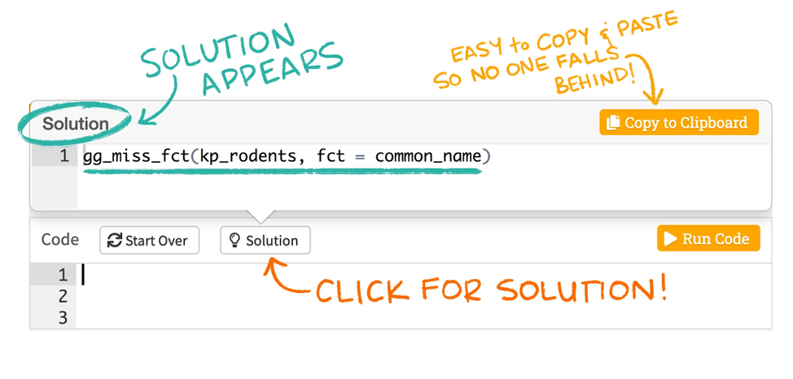

```{r setup, include = FALSE}
require(learnr, quietly = TRUE)
require(knitr, quietly = TRUE)
require(ggplot2, quietly = TRUE)
require(shiny, quietly = TRUE)
require(dplyr, quietly = TRUE)
require(diagram, quietly = TRUE)
require(magrittr, quietly = TRUE)
require(tidyr, quietly = TRUE)
require(shinyWidgets, quietly = TRUE)
require(shinyjs, quietly = TRUE)

knitr::opts_chunk$set(echo = FALSE)
dir.create("data",  showWarnings = FALSE)
NL_tariff <- read.csv2("data/EQ5D5L_NLtariff.csv")

#### Function SF-36 ----
calculate_sf_36 <- function(v_sf_36) {
  v_sf_36_recoded <- c(5 - v_sf_36[1],
                       5 - v_sf_36[2],
                       v_sf_36[3:19] - 1,
                       5 - v_sf_36[20],
                       6 - v_sf_36[21],
                       5 - v_sf_36[22],
                       6 - v_sf_36[23],
                       v_sf_36[24:25] - 1,
                       6 - v_sf_36[26:27],
                       v_sf_36[28:29] - 1,
                       6 - v_sf_36[30],
                       v_sf_36[31:33] - 1,
                       5 - v_sf_36[34],
                       v_sf_36[35] - 1,
                       5 - v_sf_36[36]
  )
  v_sf_36_transform <- c(v_sf_36_recoded[1] * 25,
                         v_sf_36_recoded[2] * 25,
                         v_sf_36_recoded[3:12] * 50,
                         v_sf_36_recoded[13:19] * 100,
                         v_sf_36_recoded[20] * 25,
                         v_sf_36_recoded[21] * 20,
                         v_sf_36_recoded[22] * 25,
                         v_sf_36_recoded[23:31] * 20,
                         v_sf_36_recoded[32:36] * 25
                         )
  
  df_plot <- data.frame(cbind(Group = c("Respondent", "Migraine", "Control"),
                              PF = c(sum(v_sf_36_transform[3:12])/10, 84.8, 86.1),
                              RP = c(sum(v_sf_36_transform[13:16])/4, 63.3, 76.6),
                              RE = c(sum(v_sf_36_transform[17:19])/3, 75.1, 81.2),
                              VT = c(sum(v_sf_36_transform[c(23, 27, 29, 31)])/4, 61.5, 68),
                              MH = c(sum(v_sf_36_transform[c(24, 25, 26, 28, 30)])/5, 72.2, 76.8),
                              SF = c(sum(v_sf_36_transform[c(20, 32)])/2, 76.6, 84.7),
                              BP = c(sum(v_sf_36_transform[c(21, 22)])/2, 69.4, 81.6),
                              GH = c(sum(v_sf_36_transform[c(1, 33, 34, 35, 36)])/5, 66.4, 72)
                              )
  )
  
  
  df_plot <- df_plot %>% 
    tidyr::pivot_longer(c(PF, RP, RE, VT, MH, SF, BP, GH), names_to = "Domain", values_to = "Score")
  
  df_plot$Score <- as.numeric(as.character(df_plot$Score))
  
  return(df_plot)
  
}

#### Function EQ-5D-5L ----
estimate_utility <- function(mo = 1, sc = 1, ua = 1, pd = 1, ad = 1, tbl_decrements = NL_tariff){
  ##mo = mobility level (1 to 5)
  ##sc = self-care level (1 to 5)
  ##ua = usual activities level (1 to 5)
  ##pd = pain/ discomfort level (1 to 5)
  ##ad = anxiety/ discomfort level (1 to 5)
  ##tbl_decrements = table with decrements, with 2 columns (Levels and Decrements), order by category and levels
  
  res <- numeric() # object to store result
  v_levels <- c(mo, sc, ua, pd, ad) # create vector of levels
  v_possible_levels <- c(1:5)
 
  try(if(all(v_levels %in% v_possible_levels) == FALSE) stop ("levels different than 1 to 5"))

  if(v_levels[1] == 1 &
     v_levels[2] == 1 &
     v_levels[3] == 1 &
     v_levels[4] == 1 &
     v_levels[5] == 1) {
    
    res <- tbl_decrements[which(tbl_decrements$Levels == "Constant"), "Decrements"]
    
  } else{
    
    constant <- tbl_decrements[which(tbl_decrements$Levels == "Constant"), "Decrements"] # Constant when deviating from full health
    utility <- as.numeric(as.character(constant)) + 
      ifelse(as.numeric(as.character(v_levels[1])) == 1, as.numeric(as.character("0")), as.numeric(as.character(tbl_decrements[which(tbl_decrements$Levels == paste0("mo", v_levels[1])), "Decrements"]))) +
      ifelse(as.numeric(as.character(v_levels[2])) == 1, as.numeric(as.character("0")), as.numeric(as.character(tbl_decrements[which(tbl_decrements$Levels == paste0("sc", v_levels[2])), "Decrements"]))) +
      ifelse(as.numeric(as.character(v_levels[3])) == 1, as.numeric(as.character("0")), as.numeric(as.character(tbl_decrements[which(tbl_decrements$Levels == paste0("ua", v_levels[3])), "Decrements"]))) +
      ifelse(as.numeric(as.character(v_levels[4])) == 1, as.numeric(as.character("0")), as.numeric(as.character(tbl_decrements[which(tbl_decrements$Levels == paste0("pd", v_levels[4])), "Decrements"]))) +
      ifelse(as.numeric(as.character(v_levels[5])) == 1, as.numeric(as.character("0")), as.numeric(as.character(tbl_decrements[which(tbl_decrements$Levels == paste0("ad", v_levels[5])), "Decrements"]))) # apply decrements
    
    res <- utility
    }
  
  return(res)
}
```

## Health effects

### Aims and instructions
The overall aim of this assignment is to get you acquainted with measuring and valuing quality of life using different instruments.  
**OF NOTE**: the solutions which are provided are one way to perform the calculations, you can obtain the same results using other fomula's. The last 'Hint' is always the solution of the assignment. Solutions can be copied & pasted in the chunk as shown in the figures below. Once you have completed a code chunk, you can run it by clicking the 'Run code' button on the upper-right side of the chunk.  

```{r, fig.align = 'center', out.width = "70%", echo = F}
knitr::include_graphics("Tutorial_health_effects_files/images/Image_hint.png")
```

```{r, fig.align = 'center', out.width = "70%", echo = F}

```

[Link to figures](https://education.rstudio.com/blog/2020/05/learnr-for-remote/)

## SF-36
In this assignment you will experience what it is like to fill out the SF-36 Health Survey, a descriptive health-related quality of life instrument. You will start by filling in the SF-36 questionnaire. Subsequently you will enter your individual responses using the button below. These answers will automatically be rescored in the 8 sub-scales of the SF-36. Below a table and a graph will be drawn with your scores ('Respondent’). In this table and graph, the scores of a group of patients with migraine and a healthy control group are also displayed for comparison purposes.  
**Instructions for completing the questionnaire**: Please answer every question. Some questions may look similar to others, but each one is different. Please take the time to read and answer each question carefully by selecting in the description that best represents your health status.  
```{r sf-36_shiny}
div(style = "display:inline-block",
    tags$div(class = "panel-heading", "1. In general, would you say your health is:"),
    radioButtons(inputId = "it_1",
                 label = NULL,
                 choices = list("Excellent" = 1, 
                                "Very good" = 2, 
                                "Good" = 3,
                                "Fair" = 4,
                                "Poor" = 5),
                 selected = 1),
    width = "350px")
div(style = "display:inline-block",
    tags$div(class = "panel-heading", "2. Compared to one year ago, how would you rate your health in general now?"),
    radioButtons(inputId = "it_2",
                 label = NULL,
                 choices = list("Much better now than a year ago" = 1, 
                                "Somewhat better now than a year ago" = 2, 
                                "About the same as one year ago" = 3,
                                "Somewhat worse now than one year ago" = 4,
                                "Much worse now than one year ago" = 5),
                 selected = 1),
    width = "350px")
tags$hr()
h4("3. The following items are about activities you might do during a typical day. Does your health now limit you in these activities? If so, how much?")
div(style = "display:inline-block",
    tags$div(class = "panel-heading", "3.a. Vigorous activities, such as running, lifting heavy objects, participating in strenuous sports."),
    radioButtons(inputId = "it_3a",
             label = NULL,
             choices = list("Yes, limited a lot." = 1, 
                            "Yes, limited a little." = 2, 
                            "No, not limited at all." = 3),
             selected = 3),
    width = "350px")
div(style = "display:inline-block",
    tags$div(class = "panel-heading", "3.b. Moderate activities, such as moving a table, pushing a vacuum cleaner, bowling, or playing golf?"),
    radioButtons(inputId = "it_3b",
             label = NULL,
             choices = list("Yes, limited a lot." = 1, 
                            "Yes, limited a little." = 2, 
                            "No, not limited at all." = 3),
             selected = 3),
    width = "350px")
div(style = "display:inline-block",
    tags$div(class = "panel-heading", "3.c. Lifting or carrying groceries."),
    radioButtons(inputId = "it_3c",
             label = NULL,
             choices = list("Yes, limited a lot." = 1, 
                            "Yes, limited a little." = 2, 
                            "No, not limited at all." = 3),
             selected = 3),
    width = "350px"
)
div(style = "display:inline-block",
    tags$div(class = "panel-heading", "3.d. Climbing several flights of stairs."),
    radioButtons(inputId = "it_3d",
             label = NULL,
             choices = list("Yes, limited a lot." = 1, 
                            "Yes, limited a little." = 2, 
                            "No, not limited at all." = 3),
             selected = 3),
    width = "350px")
div(style = "display:inline-block",
    tags$div(class = "panel-heading", "3.e. Climbing one flight of stairs."),
    radioButtons(inputId = "it_3e",
             label = NULL,
             choices = list("Yes, limited a lot." = 1, 
                            "Yes, limited a little." = 2, 
                            "No, not limited at all." = 3),
             selected = 3),
    width = "350px")
div(style = "display:inline-block",
    tags$div(class = "panel-heading", "3.f. Bending, kneeling or stooping."),
    radioButtons(inputId = "it_3f",
             label = NULL,
             choices = list("Yes, limited a lot." = 1, 
                            "Yes, limited a little." = 2, 
                            "No, not limited at all." = 3),
             selected = 3),
    width = "350px")
div(style = "display:inline-block",
    tags$div(class = "panel-heading", "3.g. Walking more than one mile."),
    radioButtons(inputId = "it_3g",
             label = NULL,
             choices = list("Yes, limited a lot." = 1, 
                            "Yes, limited a little." = 2, 
                            "No, not limited at all." = 3),
             selected = 3),
    width = "350px")
div(style = "display:inline-block",
    tags$div(class = "panel-heading", "3.h. Walking several blocks."),
    radioButtons(inputId = "it_3h",
             label = NULL,
             choices = list("Yes, limited a lot." = 1, 
                            "Yes, limited a little." = 2, 
                            "No, not limited at all." = 3),
             selected = 3),
    width = "350px")
div(style = "display:inline-block",
    tags$div(class = "panel-heading", "3.i. Walking one block."),
    radioButtons(inputId = "it_3i",
             label = NULL,
             choices = list("Yes, limited a lot." = 1, 
                            "Yes, limited a little." = 2, 
                            "No, not limited at all." = 3),
             selected = 3),
    width = "350px")
div(style = "display:inline-block",
    tags$div(class = "panel-heading", "3.j. Bathing or dressing yourself."),
    radioButtons(inputId = "it_3j",
                 label = NULL,
                 choices = list("Yes, limited a lot." = 1, 
                                "Yes, limited a little." = 2, 
                                "No, not limited at all." = 3),
                 selected = 3),
    width = "350px")
tags$hr()
h4("4. During the past 4 weeks, have you had any of the following problems with your work or other regular daily activities as a result of your physical health?")
div(style = "display:inline-block",
    tags$div(class = "panel-heading", "4.a. Cut down the amount of time you spent on work or other activities?"),
    radioButtons(inputId = "it_4a",
                 label = NULL,
                 choices = list("Yes" = 1, 
                                "No" = 2),
                 selected = 2),
    width = "250px")
div(style = "display:inline-block",
    tags$div(class = "panel-heading", "4.b. Accomplished less than you would like?"),
    radioButtons(inputId = "it_4b",
                 label = NULL,
                 choices = list("Yes" = 1, 
                                "No" = 2),
                 selected = 2),
    width = "250px")
div(style = "display:inline-block",
    tags$div(class = "panel-heading", "4.c. Were limited in the kind of work or other activities"),
    radioButtons(inputId = "it_4c",
                 label = NULL,
                 choices = list("Yes" = 1, 
                                "No" = 2),
                 selected = 2),
    width = "250px")
div(style = "display:inline-block",
    tags$div(class = "panel-heading", "4.d. Had difficulty performing the work or other activities",
             tags$br(),
             "(for example, it took extra time)"),
    radioButtons(inputId = "it_4d",
                 label = NULL,
                 choices = list("Yes" = 1, 
                                "No" = 2),
                 selected = 2),
    width = "250px")
tags$hr()
h4("5. During the past 4 weeks, have you had any of the following problems with your work or other regular daily activities as a result of any emotional problems (such as feeling depressed or anxious)?")
div(style = "display:inline-block",
    tags$div(class = "panel-heading", "5.a. Cut down the amount of time you spent on work or other activities?"),
    radioButtons(inputId = "it_5a",
                 label = NULL,
                 choices = list("Yes" = 1, 
                                "No" = 2),
                 selected = 2),
    width = "250px")
div(style = "display:inline-block",
    tags$div(class = "panel-heading", "5b. Accomplished less than you would like?"),
    radioButtons(inputId = "it_5b",
                 label = NULL,
                 choices = list("Yes" = 1, 
                                "No" = 2),
                 selected = 2),
    width = "250px")
div(style = "display:inline-block",                            
    tags$div(class = "panel-heading", "5.c. Didn't do work or other activities as carefully as usual"),
    radioButtons(inputId = "it_5c",
                 label = NULL,
                 choices = list("Yes" = 1, 
                                "No" = 2),
                 selected = 2),
    width = "250px")
tags$hr()
div(style = "display:inline-block",
    tags$div(class = "panel-heading", 
             "6. During the past 4 weeks, to what extent has your physical health",
             tags$br(), 
             "or emotional problems interfered with your normal social activities",
             tags$br(),
             "with family, friends, neighbors, or groups?"),
    radioButtons(inputId = "it_6",
                 label = NULL,
                 choices = list("Not at all" = 1, 
                                "Slightly" = 2, 
                                "Moderately" = 3,
                                "Quite a bit" = 4,
                                "Extremely" = 5),
                 selected = 1),
    width = "350px")
div(style = "display:inline-block",
    tags$div(class = "panel-heading", "7. How much bodily pain have you had during the past 4 weeks?"),
    radioButtons(inputId = "it_7",
                 label = NULL,
                 choices = list("Not at all" = 1, 
                                "Slightly" = 2, 
                                "Moderately" = 3,
                                "Quite a bit" = 4,
                                "Extremely" = 5),
                 selected = 1),
    width = "350px")
div(style = "display:inline-block",
    tags$div(class = "panel-heading", "8. During the past 4 weeks, how much did pain interfere with your normal work (including both work outside the home and housework)?"),
    radioButtons(inputId = "it_8",
                 label = NULL,
                 choices = list("Not at all" = 1, 
                                "Slightly" = 2, 
                                "Moderately" = 3,
                                "Quite a bit" = 4,
                                "Extremely" = 5),
                 selected = 1),
    width = "350px")
tags$hr()
h4("9. These questions are about how you feel and how things have been with you during the past 4 weeks. For each question, please give the one answer that comes closest to the way you have been feeling. How much of the time during the past 4 weeks.")
div(style = "display:inline-block",
    tags$div(class = "panel-heading", "9.a. did you feel full of pep?"),
    radioButtons(inputId = "it_9a",
                 label = NULL,
                 choices = list("Almost all the time" = 1, 
                                "Most of the time" = 2, 
                                "A good bit of the time" = 3,
                                "Some of the time" = 4,
                                "A little bit of the time" = 5,
                                "None of the time" = 6),
                 selected = 1),
    width = "250px")
div(style = "display:inline-block",
    tags$div(class = "panel-heading", "9.b. have you been a very nervous person?"),
    radioButtons(inputId = "it_9b",
                 label = NULL,
                 choices = list("Almost all the time" = 1, 
                                "Most of the time" = 2, 
                                "A good bit of the time" = 3,
                                "Some of the time" = 4,
                                "A little bit of the time" = 5,
                                "None of the time" = 6),
                 selected = 6),
    width = "250px")
div(style = "display:inline-block",
    tags$div(class = "panel-heading", "9.c. have you felt so down in the dumps nothing could cheer you up?"),
    radioButtons(inputId = "it_9c",
                 label = NULL,
                 choices = list("Almost all the time" = 1, 
                                "Most of the time" = 2, 
                                "A good bit of the time" = 3,
                                "Some of the time" = 4,
                                "A little bit of the time" = 5,
                                "None of the time" = 6),
                 selected = 6),
    width = "250px")
div(style = "display:inline-block",
    tags$div(class = "panel-heading", "d. have you felt calm and peaceful?"),
    radioButtons(inputId = "it_9d",
                 label = NULL,
                 choices = list("Almost all the time" = 1, 
                                "Most of the time" = 2, 
                                "A good bit of the time" = 3,
                                "Some of the time" = 4,
                                "A little bit of the time" = 5,
                                "None of the time" = 6),
                 selected = 1),
    width = "250px")
div(style = "display:inline-block",
    tags$div(class = "panel-heading", "9.e. did you have a lot of energy?"),
    radioButtons(inputId = "it_9e",
                 label = NULL,
                 choices = list("Almost all the time" = 1, 
                                "Most of the time" = 2, 
                                "A good bit of the time" = 3,
                                "Some of the time" = 4,
                                "A little bit of the time" = 5,
                                "None of the time" = 6),
                 selected = 1),
    width = "250px")
div(style = "display:inline-block",
    tags$div(class = "panel-heading", "9.f. have you felt downhearted and blue?"),
    radioButtons(inputId = "it_9f",
                 label = NULL,
                 choices = list("Almost all the time" = 1, 
                                "Most of the time" = 2, 
                                "A good bit of the time" = 3,
                                "Some of the time" = 4,
                                "A little bit of the time" = 5,
                                "None of the time" = 6),
                 selected = 6),
    width = "250px")
div(style = "display:inline-block",
    tags$div(class = "panel-heading", "9.g. did you feel worn out?"),
    radioButtons(inputId = "it_9g",
                 label = NULL,
                 choices = list("Almost all the time" = 1, 
                                "Most of the time" = 2, 
                                "A good bit of the time" = 3,
                                "Some of the time" = 4,
                                "A little bit of the time" = 5,
                                "None of the time" = 6),
                 selected = 6),
    width = "250px")
div(style = "display:inline-block",
    tags$div(class = "panel-heading", "9.h. have you been a happy person?"),
    radioButtons(inputId = "it_9h",
                 label = NULL,
                 choices = list("Almost all the time" = 1, 
                                "Most of the time" = 2, 
                                "A good bit of the time" = 3,
                                "Some of the time" = 4,
                                "A little bit of the time" = 5,
                                "None of the time" = 6),
                 selected = 1),
    width = "250px")
div(style = "display:inline-block",
    tags$div(class = "panel-heading", "9.i. did you feel tired?"),
    radioButtons(inputId = "it_9i",
             label = NULL,
             choices = list("Almost all the time" = 1, 
                            "Most of the time" = 2, 
                            "A good bit of the time" = 3,
                            "Some of the time" = 4,
                            "A little bit of the time" = 5,
                            "None of the time" = 6),
             selected = 6),
    width = "250px")
tags$hr()
div(style = "display:inline-block",
    tags$div(class = "panel-heading", "10. During the past 4 weeks, how much of the time has your physical health or emotional problems interfered with your social activities (like visiting friends, relatives, etc.)?"),
    radioButtons(inputId = "it_10",
                 label = NULL,
                 choices = list("Almost all the time" = 1, 
                                "Most of the time" = 2,
                                "Some of the time" = 3,
                                "A little bit of the time" = 4,
                                "None of the time" = 5),
                 selected = 5),
    width = "350px")
tags$hr()
h4("How TRUE or FALSE is each of the following statements for you?")
div(style = "display:inline-block",
    tags$div(class = "panel-heading", "a. I seem to get sick a little easier than other people"),
    radioButtons(inputId = "it_11a",
                 label = NULL,
                 choices = list("Definitely true" = 1, 
                                "Mostly true" = 2, 
                                "Don't know" = 3,
                                "Moslty false" = 4,
                                "False" = 5),
                selected = 5),
    width = "250px")
div(style = "display:inline-block",
    tags$div(class = "panel-heading", "b. I am as healthy as anybody I know"),
    radioButtons(inputId = "it_11b",
                 label = NULL,
                 choices = list("Definitely true" = 1, 
                                "Mostly true" = 2, 
                                "Don't know" = 3,
                                "Moslty false" = 4,
                                "False" = 5),
                selected = 1),
    width = "250px")
div(style = "display:inline-block",
    tags$div(class = "panel-heading", "c. I expect my health to get worse"),
    radioButtons(inputId = "it_11c",
                 label = NULL,
                 choices = list("Definitely true" = 1, 
                                "Mostly true" = 2, 
                                "Don't know" = 3,
                                "Moslty false" = 4,
                                "False" = 5),
                selected = 5),
    width = "250px")
div(style = "display:inline-block",
    tags$div(class = "panel-heading", "d. My health is excellent"),
    radioButtons(inputId = "it_11d",
                 label = NULL,
                 choices = list("Definitely true" = 1, 
                                "Mostly true" = 2, 
                                "Don't know" = 3,
                                "Moslty false" = 4,
                                "False" = 5),
                selected = 1),
    width = "250px")
tags$hr()
h2("SF-36 results")
p("Your results are plotted in the graph and described in the table below, in comparison with the results of a group of migraine patients (N = 340) and a control group of healthy individuals (N = 467).")
plotOutput("SF_36_calc")
tableOutput("SF_36_calc2")
```

A score of 100 indicates no impairment in the specific domain.  
Abreviation of the domains:  
BP = Bodily Pain  
GH = General Health  
MH = Mental Health  
PF = Physical Performance  
RE = Role Emotional  
RP = Role Performance  
SF = Social Functioning  
VT = Vitality  

```{r sf-36_shiny_serv, context = "server"}
output$SF_36_calc <- renderPlot({
  
  v_resp_sf36 <- c(as.numeric(as.character(input$it_1)),
                   as.numeric(as.character(input$it_2)),
                   as.numeric(as.character(input$it_3a)), 
                   as.numeric(as.character(input$it_3b)),
                   as.numeric(as.character(input$it_3c)),
                   as.numeric(as.character(input$it_3d)),
                   as.numeric(as.character(input$it_3e)), 
                   as.numeric(as.character(input$it_3f)),
                   as.numeric(as.character(input$it_3g)),
                   as.numeric(as.character(input$it_3h)),
                   as.numeric(as.character(input$it_3i)), 
                   as.numeric(as.character(input$it_3j)),
                   as.numeric(as.character(input$it_4a)),
                   as.numeric(as.character(input$it_4b)),
                   as.numeric(as.character(input$it_4c)), 
                   as.numeric(as.character(input$it_4d)),
                   as.numeric(as.character(input$it_5a)),
                   as.numeric(as.character(input$it_5b)),
                   as.numeric(as.character(input$it_5c)), 
                   as.numeric(as.character(input$it_6)),
                   as.numeric(as.character(input$it_7)),
                   as.numeric(as.character(input$it_8)),
                   as.numeric(as.character(input$it_9a)), 
                   as.numeric(as.character(input$it_9b)),
                   as.numeric(as.character(input$it_9c)),
                   as.numeric(as.character(input$it_9d)),
                   as.numeric(as.character(input$it_9e)), 
                   as.numeric(as.character(input$it_9f)),
                   as.numeric(as.character(input$it_9g)),
                   as.numeric(as.character(input$it_9h)),
                   as.numeric(as.character(input$it_9i)), 
                   as.numeric(as.character(input$it_10)),
                   as.numeric(as.character(input$it_11a)),
                   as.numeric(as.character(input$it_11b)),
                   as.numeric(as.character(input$it_11c)), 
                   as.numeric(as.character(input$it_11d))
                   )
  
  df_plot <- calculate_sf_36(v_resp_sf36)
  
  ggplot(data = df_plot, aes(x = Domain, y = Score, group = Group, color = Group)) +
    geom_line() +
    ylim(0, 100) +
    theme_bw()
}
)

output$SF_36_calc2 <- renderTable({
  
  v_resp_sf36 <- c(as.numeric(as.character(input$it_1)),
                   as.numeric(as.character(input$it_2)),
                   as.numeric(as.character(input$it_3a)), 
                   as.numeric(as.character(input$it_3b)),
                   as.numeric(as.character(input$it_3c)),
                   as.numeric(as.character(input$it_3d)),
                   as.numeric(as.character(input$it_3e)), 
                   as.numeric(as.character(input$it_3f)),
                   as.numeric(as.character(input$it_3g)),
                   as.numeric(as.character(input$it_3h)),
                   as.numeric(as.character(input$it_3i)), 
                   as.numeric(as.character(input$it_3j)),
                   as.numeric(as.character(input$it_4a)),
                   as.numeric(as.character(input$it_4b)),
                   as.numeric(as.character(input$it_4c)), 
                   as.numeric(as.character(input$it_4d)),
                   as.numeric(as.character(input$it_5a)),
                   as.numeric(as.character(input$it_5b)),
                   as.numeric(as.character(input$it_5c)), 
                   as.numeric(as.character(input$it_6)),
                   as.numeric(as.character(input$it_7)),
                   as.numeric(as.character(input$it_8)),
                   as.numeric(as.character(input$it_9a)), 
                   as.numeric(as.character(input$it_9b)),
                   as.numeric(as.character(input$it_9c)),
                   as.numeric(as.character(input$it_9d)),
                   as.numeric(as.character(input$it_9e)), 
                   as.numeric(as.character(input$it_9f)),
                   as.numeric(as.character(input$it_9g)),
                   as.numeric(as.character(input$it_9h)),
                   as.numeric(as.character(input$it_9i)), 
                   as.numeric(as.character(input$it_10)),
                   as.numeric(as.character(input$it_11a)),
                   as.numeric(as.character(input$it_11b)),
                   as.numeric(as.character(input$it_11c)), 
                   as.numeric(as.character(input$it_11d))
  )
  
  df_plot <- calculate_sf_36(v_resp_sf36)
  df_plot
}
)
```

### Questions
```{r open_q_sf36_1}
textInput("sf36_1", "How do you feel about this result? Did you expect to score higher or lower? and why?")
quiz(
  question("Given these results, can you express your quality of life in a single numeric value (i.e. a utility value)?",
           answer("Yes"),
           answer("No", correct = TRUE)
  )
)
textInput("sf36_2", "Explain why (not)")
```

### Answers
The first answer is your own interpretation of these results. Concerning the second, you cannot express the results of the SF-36 in a utility value. You cannot add your results in the different domains to obtain a utility values for instance. Conversely, the results of the EQ-5D and SF-6D can be expressed in a single numeric value (also called a utility value). This is what we will do in a following assignment using the EQ-5D-5L.  

## QALY calculation
In this assignment you have to calculate the number of QALYs for a patient who is healthy for the first 10 years of her life (Utility (U) = 0.9), has moderate health (U = 0.60) in the next 5 years, and has poor health the last 10 years of her life (U = 0.30).
Fill in the utility values for each period of time in the boxes below, calculate the total number of QALY gained. The graph can help you to do so, i.e. the total number of QALY is equal to the area under the line. and check your answer by clicking the button.  
```{r calc_qaly_shiny}
div(style = "display:inline-block",
    tags$div(class = "panel-heading", "Utility value first 10 years"),
    numericInput(inputId = "util_first_10",
             label = NULL,
             value = 0,
             min = 0,
             max = 1,
             setp = 0.1),
    width = "300px")
div(style = "display:inline-block",
    tags$div(class = "panel-heading", "Utility value next 5 years"),
    numericInput(inputId = "util_5",
             label = NULL,
             value = 0,
             min = 0,
             max = 1,
             setp = 0.1),
    width = "300px")
div(style = "display:inline-block",
    tags$div(class = "panel-heading", "Utility value last 10 years"),
    numericInput(inputId = "util_last_10",
             label = NULL,
             value = 0,
             min = 0,
             max = 1,
             setp = 0.1),
    width = "300px")
plotOutput("QALY_calc")
numericInput(inputId = "n_QALYs",
             label = "How much QALY does this person accrue over the 25 years? Write your answer and check by clicking the button",
             value = 0,
             min = 0,
             max = 1,
             setp = 0.1)
tags$hr()
actionButton(inputId = "check_QALY_calc",
             label = "Click to check your answer!")
h3(textOutput("TEXT_QALY_calc", container = span))
```

```{r calc_qaly_shiny_serv, context = "server"}
output$QALY_calc <- renderPlot({
  v_u <-  c(rep(as.numeric(as.character(input$util_first_10)), 11),
            rep(as.numeric(as.character(input$util_5)), 6),
            rep(as.numeric(as.character(input$util_last_10)), 11)
            )# vector of utilities
  v_time <- c(c(0:10), 
              c(10:15),
              c(15:25)
              )# vector of time
  plot(x = v_time, y = v_u, type = 'l',
       xlab = "Time (in years)",
       ylab = "Utility value",
       ylim = c(0,1)
       )

}
)

text_button_QALY_calc <- eventReactive(input$check_QALY_calc, {
  if(as.numeric(as.character(input$n_QALYs)) == 15){
    
    paste("Good job, this is correct! 
          The calculation behind this answer is 10 * 0.9 + 5 * 0.6 + 10 * 0.3")
    
  } else {
    paste("This is not the correct answer, try again! Hint: QALYs = quality of life (utility) x length of life")
  }
  
})
  
output$TEXT_QALY_calc <- renderText({
  text_button_QALY_calc()
})
```

## QALYs comparison
The aim of this assignment is to compare the number of QALY gained by two interventions. Intervention A has a survival of 10 years after the intervention with a utility of 0.7. Intervention B has a survival of 5 years after the intervention with a utility of 0.9 followed by 5 years in a health state with a utility of 0.5. Use the fields to fill in the graph and answer the questions.  
```{r QALY_comp_shiny}
h3("Intervention A")
div(style = "display:inline-block",
    tags$div(class = "panel-heading", "Utility value 1st year - Intervention A"),
    numericInput(inputId = "u_A_1",
                 label = NULL,
                 value = 0,
                 min = 0,
                 max = 1),
    width = "250px")
div(style = "display:inline-block",
    tags$div(class = "panel-heading", "Utility value 2nd year - Intervention A"),
    numericInput(inputId = "u_A_2",
                 label = NULL,
                 value = 0,
                 min = 0,
                 max = 1),
    width = "250px")
div(style = "display:inline-block",
    tags$div(class = "panel-heading", "Utility value 3rd year - Intervention A"),
    numericInput(inputId = "u_A_3",
                 label = NULL,
                 value = 0,
                 min = 0,
                 max = 1),
    width = "250px")
div(style = "display:inline-block",
    tags$div(class = "panel-heading", "Utility value 4th year - Intervention A"),
    numericInput(inputId = "u_A_4",
                 label = NULL,
                 value = 0,
                 min = 0,
                 max = 1),
    width = "250px")
div(style = "display:inline-block",
    tags$div(class = "panel-heading", "Utility value 5th year - Intervention A"),
    numericInput(inputId = "u_A_5",
                 label = NULL,
                 value = 0,
                 min = 0,
                 max = 1),
    width = "250px")
div(style = "display:inline-block",
    tags$div(class = "panel-heading", "Utility value 6th year - Intervention A"),
    numericInput(inputId = "u_A_6",
                 label = NULL,
                 value = 0,
                 min = 0,
                 max = 1),
    width = "250px")
div(style = "display:inline-block",
    tags$div(class = "panel-heading", "Utility value 7th year - Intervention A"),
    numericInput(inputId = "u_A_7",
                 label = NULL,
                 value = 0,
                 min = 0,
                 max = 1),
    width = "250px")
div(style = "display:inline-block",
    tags$div(class = "panel-heading", "Utility value 8th year - Intervention A"),
    numericInput(inputId = "u_A_8",
                 label = NULL,
                 value = 0,
                 min = 0,
                 max = 1),
    width = "250px")
div(style = "display:inline-block",
    tags$div(class = "panel-heading", "Utility value 9th year - Intervention A"),
    numericInput(inputId = "u_A_9",
                 label = NULL,
                 value = 0,
                 min = 0,
                 max = 1),
    width = "250px")
div(style = "display:inline-block",
    tags$div(class = "panel-heading", "Utility value 10th year - Intervention A"),
    numericInput(inputId = "u_A_10",
                 label = NULL,
                 value = 0,
                 min = 0,
                 max = 1),
    width = "250px")
tags$hr()
h3("Intervention B")
div(style = "display:inline-block",
    tags$div(class = "panel-heading", "Utility value 1st year - Intervention B"),
    numericInput(inputId = "u_B_1",
                 label = NULL,
                 value = 0,
                 min = 0,
                 max = 1),
    width = "250px")
div(style = "display:inline-block",
    tags$div(class = "panel-heading", "Utility value 2nd year - Intervention B"),
    numericInput(inputId = "u_B_2",
                 label = NULL,
                 value = 0,
                 min = 0,
                 max = 1),
    width = "250px")
div(style = "display:inline-block",
    tags$div(class = "panel-heading", "Utility value 3rd year - Intervention B"),
    numericInput(inputId = "u_B_3",
                 label = NULL,
                 value = 0,
                 min = 0,
                 max = 1),
    width = "250px")
div(style = "display:inline-block",
    tags$div(class = "panel-heading", "Utility value 4th year - Intervention B"),
    numericInput(inputId = "u_B_4",
                 label = NULL,
                 value = 0,
                 min = 0,
                 max = 1),
    width = "250px")
div(style = "display:inline-block",
    tags$div(class = "panel-heading", "Utility value 5th year - Intervention B"),
    numericInput(inputId = "u_B_5",
                 label = NULL,
                 value = 0,
                 min = 0,
                 max = 1),
    width = "250px")
div(style = "display:inline-block",
    tags$div(class = "panel-heading", "Utility value 6th year - Intervention B"),
    numericInput(inputId = "u_B_6",
                 label = NULL,
                 value = 0,
                 min = 0,
                 max = 1),
    width = "250px")
div(style = "display:inline-block",
    tags$div(class = "panel-heading", "Utility value 7th year - Intervention B"),
numericInput(inputId = "u_B_7",
             label = NULL,
             value = 0,
             min = 0,
             max = 1),
width = "250px")
div(style = "display:inline-block",
    tags$div(class = "panel-heading", "Utility value 8th year - Intervention B"),
    numericInput(inputId = "u_B_8",
                 label = NULL,
                 value = 0,
                 min = 0,
                 max = 1),
    width = "250px")
div(style = "display:inline-block",
    tags$div(class = "panel-heading", "Utility value 9th year - Intervention B"),
    numericInput(inputId = "u_B_9",
                 label = NULL,
                 value = 0,
                 min = 0,
                 max = 1),
    width = "250px")
div(style = "display:inline-block",
    tags$div(class = "panel-heading", "Utility value 10th year - Intervention B"),
    numericInput(inputId = "u_B_10",
                 label = NULL,
                 value = 0,
                 min = 0,
                 max = 1),
    width = "250px")
tags$hr()
h3("Graphs displaying utility values of each intervention over time")
plotOutput("QALY_comp")
```

```{r QALY_comp_shiny_serv, context = "server"}
output$QALY_comp <- renderPlot({
  
  v_u_A <-  c(as.numeric(as.character(input$u_A_1)),
              as.numeric(as.character(input$u_A_1)),
              as.numeric(as.character(input$u_A_2)),
              as.numeric(as.character(input$u_A_3)),
              as.numeric(as.character(input$u_A_4)),
              as.numeric(as.character(input$u_A_5)),
              as.numeric(as.character(input$u_A_6)),
              as.numeric(as.character(input$u_A_7)),
              as.numeric(as.character(input$u_A_8)),
              as.numeric(as.character(input$u_A_9)),
              as.numeric(as.character(input$u_A_10))) # vector of utilities - intervention A
  
  v_u_B <-  c(as.numeric(as.character(input$u_B_1)),
              as.numeric(as.character(input$u_B_1)),
              as.numeric(as.character(input$u_B_2)),
              as.numeric(as.character(input$u_B_3)),
              as.numeric(as.character(input$u_B_4)),
              as.numeric(as.character(input$u_B_5)),
              as.numeric(as.character(input$u_B_6)),
              as.numeric(as.character(input$u_B_7)),
              as.numeric(as.character(input$u_B_8)),
              as.numeric(as.character(input$u_B_9)),
              as.numeric(as.character(input$u_B_10))) # vector of utilities - intervention B
  
  v_time_2 <- c(0:10) # vector of time
  
  plot(x = v_time_2, y = v_u_A, type = 'l',
       xlab = "Time (in years)",
       ylab = "Utility value",
       ylim = c(0, 1),
       xlim = c(0, 10),
       col = 1
  )
  lines(x = v_time_2, y = v_u_B, col = 2)
  legend(x = "topright",          # Position
         legend = c("Intervention A", "Intervention B"),  # Legend texts
         lty = c(1, 1),           # Line types
         col = c(1, 2)           # Line colors
         )             
  
  
}
)
```

### Questions
```{r QALY_comp_quiz}
quiz(
  question("Which intervention provides the most QALYs?",
           answer("Intervention A"),
           answer("Intervention B"), 
           answer("They provide the same number of QALYs", correct = TRUE),
  correct = "Good job, this is correct (because the interventions provide the same number of QALYs)!",
  try_again = "This is not the correct answer, try again! Hint: QALYs = quality of life (utility) x length of life",
  allow_retry = TRUE
  )
)
textInput("Answer_Q_comp1", "1. Based on the total number of QALYs gained, which intervention would you prefer?")
textInput("Answer_Q_comp2", "2. What if the quality of life with intervention A was 0.8, which one would you then prefer?")
```

### Answers/discussion  

1. In theory, you should not prefer the one over the other because they provide the same number of QALYs. None of these strategies is thus more effective than the other.  
2. In that case, intervention A would be preferred because it would provide more QALYs.  

## EQ-5D-5L
This assignment aims to get you acquainted with measuring health through the EQ-5D-5L. It is based on the sample version of the EQ-5D-5L that is available at https://euroqol.org/eq-5d-instruments/sample-demo/. It is composed of both a questionnaire and the visual analog scale (VAS).  
`r paste("&copy;")` EuroQol Research Foundation. EQ-5D^TM^ is a trade mark of the EuroQol Research Foundation. Reproduced by permission of EuroQol Research Foundation. Reproduction of this version is not allowed. For reproduction, use or modification of the EQ-5D (any version), please register your study by using the online EQ registration page: www.euroqol.org.  
**Instructions:** Under each heading, please tick the ONE box that best describes your health TODAY. Then rate your quality of life using the VAS.

```{r eq5d_shiny}
div(style = "display:inline-block",
    tags$div(class = "panel-heading", "Mobility"),
    radioButtons(inputId = "mo",
                 label = NULL,
                 choices = list("I have no problems in walking about" = 1, 
                               "I have slight problems in walking about" = 2, 
                               "I have moderate problems in walking about" = 3,
                               "I have severe problems in walking about" = 4,
                               "I am unable to walk about" = 5),
                 selected = 1),
    width = "300px")
div(style = "display:inline-block",
    tags$div(class = "panel-heading", "Self-care"),
    radioButtons(inputId = "sc",
                 label = NULL,
                 choices = list("I have no problems washing or dressing myself" = 1, 
                         "I have slight problems washing or dressing myself" = 2, 
                         "I have moderate problems washing or dressing myself" = 3,
                         "I have severe problems washing or dressing myself" = 4,
                         "I am unable to wash or dress myself" = 5),
                  selected = 1),
    width = "300px")
div(style = "display: inline-block",
    tags$div(class = "panel-heading", 
             HTML("Usual activities<br>e.g. work, study, housework, family or leisure activities")),
    radioButtons(inputId = "ua",
                 label = NULL,
                 choices = list("I have no problems doing my usual activities" = 1, 
                         "I have slight problems doing my usual activities" = 2, 
                         "I have moderate problems doing my usual activities" = 3,
                         "I have severe problems doing my usual activities" = 4,
                         "I am unable to do my usual activities" = 5),
                  selected = 1),
    width = "300px")
div(style = "display:inline-block",
    tags$div(class = "panel-heading", "Pain/ discomfort"),
    radioButtons(inputId = "pd",
                 label = NULL,
                 choices = list("I have no pain or discomfort" = 1, 
                         "I have slight pain or discomfort" = 2, 
                         "I have moderate pain or discomfort" = 3,
                         "I have severe pain or discomfort" = 4,
                         "I have extreme pain or discomfort" = 5),
                 selected = 1),
    width = "300px")
div(style = "display:inline-block",
    tags$div(class = "panel-heading", "Anxiety/ depression"),
    radioButtons(inputId = "ad",
                 label = NULL,
                 choices = list("I am not anxious or depressed" = 1, 
                         "I am slightly anxious or depressed" = 2, 
                         "I am moderately anxious or depressed" = 3,
                         "I am severely anxious or depressed" = 4,
                         "I am extremely anxious or depressed" = 5),
                 selected = 1),
    width = "300px")
tags$hr()
h3("Visual analog scale")
h4("We would like to know how good or bad your health is TODAY. This scale is numbered from 0 to 100. 100 means the best health you can imagine. 0 means the worst health you can imagine. Please slide the button to indicate how your health is TODAY.")
div(
	HTML("The best health you can imagine"),
	shinyWidgets::noUiSliderInput(
		inputId = "vas",
		label = "",
		tooltips = T,
    min = 0, max = 100,
    # color = "#EC008C",
    step = NULL,
    direction = "rtl",
    pips = list(
    	mode = "positions",
      values = seq(0, 100, by = 5),
      density = 1
      ),
		format = wNumbFormat(
			decimals = 0
		),
		value = 0,
    orientation = "vertical",
    width = 300,
    height = 400
    ),
   div(
	 	style = "margin-top:-20px", HTML("The worst health you can imagine")
	 )
	)

#sliderInput("vas", "Your health today:", 
 #           min = 0, max = 1, value = 0.5, step= 0.01)
tags$hr()
h3("EQ-5D-5L utility estimate based on the questionnaire")
h4(textOutput("EQ5D_calc"))
tags$hr()
h3("Utility estimate using the Visual Analog Scale")
h4(textOutput("VAS"))
tags$hr()
h4("Do you see differences between the results? Can you explain them?")
```

```{r eq5d_shiny_serv, context = "server"}
shinyjs::runjs("$( '.noUi-base').click(
  function(){
      $('.noUi-handle').css('visibility','visible')})")
 
output$EQ5D_calc <- renderText({ 

   paste("The estimated utility value is:",
         estimate_utility(mo = as.numeric(as.character(input$mo)),
                            ua = as.numeric(as.character(input$ua)),
                            sc = as.numeric(as.character(input$sc)),
                            pd = as.numeric(as.character(input$pd)),
                            ad = as.numeric(as.character(input$ad)),
                    tbl_decrements = NL_tariff))
 })
   
output$VAS <- renderText({
 paste("Your health today is", as.numeric(as.character(input$vas))/100)
})
```

## Determining utility values
This assignment aims to teach you how to use the Dutch EQ-5D-5L tarriff (Versteegh et al. - 2016) to calculate utility values based on a health state description.  
Instructions: For each health state description, calculate the utility value using the tarriff provided in the table. The EQ-5D codes are organised as follows: mobility, self-care , usual activities, pain/ discomfort level, anxiety/ discomfort level. Provide your answer until 3 decimals".  
Hint: Level 1 means that someone has no impairment in a dimension. For each dimension with a Level different than 1, a disutility is applied to the constant.  
Example: the code 12345 is interpreted as: I have no problems in walking about, I have slight problems washing or dressing myself, I have moderate problems doing my usual activities, I have severe pain or discomfort, I am extremely anxious or depressed.  
Reference: Matthijs M. Versteegh, Karin M. Vermeulen, Silvia M. A. A. Evers, G. Ardine de Wit, Rilana Prenger, Elly A. Stolk, Dutch Tariff for the Five-Level Version of EQ-5D, Value in Health, Volume 19, Issue 4, 2016, Pages 343-352, https://doi.org/10.1016/j.jval.2016.01.003").  
The table below shows the decrements associated with each level of each dimension.  

```{r eq5d_calc}
NL_tariff
```
*Abbreviations table: mo = mobility, sc = self-care , ua = usual activities, pd = pain/ discomfort level, ad = anxiety/ discomfort level*

```{r eq5d_calc_quiz}
quiz(
  question("What is the utility value associated with the following EQ-5D-5L description: 12423?",
           answer("0.512", correct = TRUE),
           answer("0.432"),
           answer("0.662"),
           answer("0.842"),
           allow_retry = TRUE,
           random_answer_order = TRUE
           ),
  question("What is the utility value associated with the following EQ-5D-5L description: 25431?",
           answer("0.223"),
           answer("0.368"),
           answer("0.587"),
           answer("0.466", correct = TRUE),
           allow_retry = TRUE,
           random_answer_order = TRUE
           ),
  question("What is the utility value associated with the following EQ-5D-5L description: 11122?",
           answer("0.985"),
           answer("0.817", correct = TRUE),
           answer("0.754"),
           answer("0.647"),
           allow_retry = TRUE,
           random_answer_order = TRUE
           )
)
```

## Valuing health states
In this assignment, you will value the first health state which is described in the previous assignment using the following techniques: Standard Gamble, Time-trade-off, and Visual analog scale. These methods are originally used to determine the decrements associated with each level of the EQ-5D-5L (for instance).  
EQ-5D description first health state (12423): I have no problems in walking about, I have slight problems washing or dressing myself, I have severe problems doing my usual activities,I have slight pain or discomfort, and I am moderately anxious or depressed

```{r hs_value_shiny}
h3("Standard Gamble")
h4("At which probability of immediate death would you be indifferent between the Gamble and remaining in health state 12423 for 10 years?")
helpText("Please indicate this probability using the slider")
sliderInput("sg_hs1", "Probability of death in the gamble",
            min = 0, max = 1, value = 0.5, step = 0.01)
h3("Standard Gamble health state 12423")
plotOutput("plot_sg_hs1")
h4(textOutput("res_sg_hs1"))
tags$hr()
h3("Time trade off")
h4("How much years of life in this health state (12423) would you trade to become indifferent between a) remaining in this health state for 10 years and b) living for 10 life years minus - the amount of traded life years in perfect health?")
helpText("Please indicate this number of years using the slider")
sliderInput("tto_hs1", "Number of traded years", 
            min = 0, max = 10, value = 5, step = 0.1)
h3("Time trade off health state 12423")
plotOutput("plot_tto_hs1")
h4(textOutput("res_tto_hs1"))
tags$hr()
h3("Visual analog scale")
h4("How do you rate the quality of life in this health state (12423)?")
helpText("Please indicate this on the visual analog scale using the slider")
div(
	HTML("The best health you can imagine"),
	shinyWidgets::noUiSliderInput(
		inputId = "vas_hs1",
		label = "",
		tooltips = T,
    min = 0, max = 100,
    # color = "#EC008C",
    step = NULL,
    direction = "rtl",
    pips = list(
    	mode = "positions",
      values = seq(0, 100, by = 5),
      density = 1
      ),
		format = wNumbFormat(
			decimals = 0
		),
		value = 0,
    orientation = "vertical",
    width = 300,
    height = 400
    ),
   div(
	 	style = "margin-top:-20px", HTML("The worst health you can imagine")
	 )
	)
h3("Visual analog scale health state 12423")
h4(textOutput("res_vas_hs1"))
```

```{r hs_value_shiny_serv, context = "server"}
shinyjs::runjs("$( '.noUi-base').click(
  function(){
      $('.noUi-handle').css('visibility','visible')})")

output$plot_sg_hs1 <- renderPlot({
   p <- input$sg_hs1
   
   v_names <- c("Current state", "Gamble", "Death", "Perfect health", "Remain in state")
   M <- matrix(nrow = 5, ncol = 5, byrow = TRUE, data = 0)
   M[5, 1] <- ""
   M[2, 1] <- ""
   M[3, 2] <- p
   M[4, 2] <- 1-p
   plotmat(M, pos = c(1, 1, 3), name = v_names, lwd = 1,
           curve = 0,
           box.lwd = 2, cex.txt = 1.2, box.size = 0.05,
           box.type = "square", box.prop = 0.5,
           shadow.size = 0
           )
   
 })

output$res_sg_hs1 <- renderText({
   paste0("You are considering a gamble with a ", round(input$sg_hs1*100,0), "% probability of immediate death. Your utility value for this health state is ",  1-input$sg_hs1, ".")
 })

 output$plot_tto_hs1 <- renderPlot({
   
   trade_off <- input$tto_hs1
   data <- data.frame(TTO = c(0, 10-trade_off, trade_off),
                      No_TTO = c(10, 0, 0)
   )
   
   barplot(as.matrix(data), col = c(4, 3, 2),
           legend.text = c("Current Health state",
                           "Healthy life years",
                           "Traded life years"),
           horiz = TRUE)
   
 })
 
output$res_tto_hs1 <- renderText({
   paste0("You are indifferent between a) trading ", round(input$tto_hs1, 1), " years of life and living ", 10 - round(input$tto_hs1, 1),  " years of life in perfect health and b) living in this health state for 10 years. Your utility value for this health state is ",  (10 - input$tto_hs1)/10, ".")
 })
 
output$res_vas_hs1 <- renderText({
   paste0("The quality of life (utility) you assign to this health state is ", as.numeric(as.character(input$vas_hs1))/100, ".")
 })
```


## Vignettes
In this assignment, you will value the two health states that are described as vignettes using the following techniques: Standard Gamble, Time-trade-off, and Visual analog scale. A vignette is a narrative description of a certain health state. These vignettes are used to value the quality of life of a group of individuals when these individuals may not be able to participate in their own quality of life elicitation (for example).  
Instructions: read the vignettes and fill in the Standard Gamble, Time-trade-off, and Visual analog scale.  

### Vignette 1: Reumatoid arthritis (mild variant)  
Your mobility is limited by pain. Walking long distances and standing still increase these complaints/ When you exercise, you experience increased joint complaints the day after. You are fully capable of bathing and clothing yourself. However, putting on shoes with laces is not an option. Activities that require lots of movement or physical strength cannot be performed. You require some help with usual activities such as doing groceries. It is important to take things slowly! You experience a constant mild pain in the joints and there is always a chance a relapse occurs. During a relapse, you are often feeling depressed, but you experience no cognitive symptoms. Your vision is normal for your age and you have no hearing problems. Your speech is normal but you experience mild to severe problems using your hands. Typing and other light activities are still possible, but every exercise that requires strength from your fingers is painful. The coordination of your fingers is also poor. Since other people do not directly observe where your pain is located, you experience some misunderstanding and miscomprehension. You are capable of maintaining normal social contacts, although the duration and frequency of such contacts are somewhat limited.

```{r vignettes_shiny_1}
h3("Standard Gamble")
h4("At which probability of immediate death would you be indifferent between the Gamble and remaining in the above-described health state for 30 years?")
helpText("Please indicate this probability using the slider")
div(style = "display:inline-block",
  sliderInput("sg_v1", "Probability of death in the gamble", 
            min = 0, max = 1, value = 0.5, step = 0.01),
  width = "400px")
plotOutput("plot_sg_v1")
h4(textOutput("res_sg_v1"))
tags$hr()
h3("Time trade off")
h4("How much years of life in the above-described health state would you trade to become indifferent between a) remaining in this health state for 30 years and b) living for 30 life years minus - the amount of traded life years in perfect health?")
helpText("Please indicate this number of years using the slider")
div(style = "display:inline-block",
    sliderInput("tto_v1", "Number of traded years", 
            min = 0, max = 30, value = 15, step = 0.1),
    width = "400px")
plotOutput("plot_tto_v1")
h4(textOutput("res_tto_v1"))
tags$hr()
h3("Visual analog scale")
h4("How do you rate the quality of life in the above-described health state?")
helpText("Please indicate this on the visual analog scale using the slider")
div(style = "display:inline-block",
	HTML("The best health you can imagine"),
	shinyWidgets::noUiSliderInput(
		inputId = "vas_v1",
		label = "",
		tooltips = T,
    min = 0, max = 100,
    # color = "#EC008C",
    step = NULL,
    direction = "rtl",
    pips = list(
    	mode = "positions",
      values = seq(0, 100, by = 5),
      density = 1
      ),
		format = wNumbFormat(
			decimals = 0
		),
		value = 0,
    orientation = "vertical",
    width = 300,
    height = 300
    ),
   div(
	 	style = "margin-top:-20px", HTML("The worst health you can imagine")
	 )
	)
div(style = "display:inline-block; margin-top: -1px",
    textOutput("res_vas_v1"),
    width = "300px"
)
```

### Vignette 2: Neurological disorder - Cerebral Vascular Accident (serious case)
Your mobility is severely limited. You are in a wheelchair during the day. Getting in and out of bed is only possible with (professional) help. You have to be straightened in your wheelchair several times per day and you are incapable of bathing and clothing yourself. You are incontinent and you are severely limited in the amount of daily activities that you can perform. You are still able to read a newspaper, listen to music, and watch television. You experience no pain but you experience some discomfort from sitting the whole day in your wheelchair. You are unable to swallow and are therefore fed intravenously. You experience emotional swings at least twice per day (spontaneous crying) and you are restless in the dark. You are able to see, but you are not able to recognize anything in your left visual space. You have severe aphasia (you cannot form sentences and have trouble finding the correct words). Only your partner and the nurses understand some of what you are trying to communicate. You are fully paralyzed on the right side of your body and you experience severe problems with coordination on the left side. There is only a limited form of social contact possible with the nursing staff and even with people who experience the same type of disorder.
             
```{r vignettes_shiny_2}
h3("Standard Gamble")
h4("At which probability of immediate death would you be indifferent between the Gamble and remaining in the above-described health state for 30 years?")
helpText("Please indicate this probability using the slider")
div(style = "display:inline-block",
    sliderInput("sg_v2", "Probability of death in the gamble",
            min = 0, max = 1, value = 0.5, step = 0.01),
    width = "400px")
plotOutput("plot_sg_v2")
h4(textOutput("res_sg_v2"))
tags$hr()
h3("Time trade off")
h4("How much years of life in the above-described health state would you trade to become indifferent between a) remaining in this health state for 30 years and b) living for 30 life years minus - the amount of traded life years in perfect health?")
helpText("Please indicate this number of years using the slider")
div(style = "display:inline-block",
    sliderInput("tto_v2", "Number of traded years", 
            min = 0, max = 30, value = 15, step = 0.1),
    width = "400px")
plotOutput("plot_tto_v2")
h4(textOutput("res_tto_v2"))
tags$hr()
h3("Visual analog scale")
h4("How do you rate the quality of life in the above-described health state?")
helpText("Please indicate this on the visual analog scale using the slider")
div(style = "display:inline-block",
	HTML("The best health you can imagine"),
	shinyWidgets::noUiSliderInput(
		inputId = "vas_v2",
		label = "",
		tooltips = T,
    min = 0, max = 100,
    # color = "#EC008C",
    step = NULL,
    direction = "rtl",
    pips = list(
    	mode = "positions",
      values = seq(0, 100, by = 5),
      density = 1
      ),
		format = wNumbFormat(
			decimals = 0
		),
		value = 0,
    orientation = "vertical",
    width = 300,
    height = 300
    ),
   div(
	 	style = "margin-top:-20px", HTML("The worst health you can imagine")
	 )
	)
div(style = "display:inline-block; margin-top: -1px",
    textOutput("res_vas_v2"),
    width = "300px")
```                    
                    
```{r vignettes_shiny_serv, context = "server"}
shinyjs::runjs("$( '.noUi-base').click(
  function(){
      $('.noUi-handle').css('visibility','visible')})")
# Vignette 1
output$plot_sg_v1 <- renderPlot({
 p <- input$sg_v1
 
 v_names <- c("Current state", "Gamble", "Death", "Perfect health", "Remain in state")
 M <- matrix(nrow = 5, ncol = 5, byrow = TRUE, data = 0)
 M[5, 1] <- ""
 M[2, 1] <- ""
 M[3, 2] <- p
 M[4, 2] <- 1-p
 plotmat(M, pos = c(1, 1, 3), name = v_names, lwd = 1,
         curve = 0,
         box.lwd = 2, cex.txt = 1.2, box.size = 0.05,
         box.type = "square", box.prop = 0.5
 )
 
})
output$res_sg_v1 <- renderText({
 paste0("You are considering a gamble with a ", round(input$sg_v1*100,0), "% probability of immediate death. Your utility value for this health state is ",  1-input$sg_v1, ".")
})


output$plot_tto_v1 <- renderPlot({
 
 trade_off <- input$tto_v1
 data <- data.frame(TTO = c(0, 30-trade_off, trade_off),
                    No_TTO = c(30, 0, 0)
 )
 
 barplot(as.matrix(data), col = c(4, 3, 2),
         legend.text = c("Current Health state",
                         "Healthy life years",
                         "Traded life years"),
         horiz = TRUE)
 
})

output$res_tto_v1 <- renderText({
 paste0("You are indifferent between a) trading ", round(input$tto_v1, 1), " years of life and living ", 30 - round(input$tto_v1, 1),  " years of life in perfect health and b) living in this health state for 30 years. Your utility value for this health state is ",  round((30 - input$tto_v1)/30, 2), ".")
})

output$res_vas_v1 <- renderText({
 paste0("The quality of life (utility) you assign to this health state is ", as.numeric(as.character(input$vas_v1)) / 100, ".")
})

# Vignette 2
output$plot_sg_v2 <- renderPlot({
 p <- input$sg_v2
 
 v_names <- c("Current state", "Gamble", "Death", "Perfect health", "Remain in state")
 M <- matrix(nrow = 5, ncol = 5, byrow = TRUE, data = 0)
 M[5, 1] <- ""
 M[2, 1] <- ""
 M[3, 2] <- p
 M[4, 2] <- 1-p
 plotmat(M, pos = c(1, 1, 3), name = v_names, lwd = 1,
         curve = 0,
         box.lwd = 2, cex.txt = 1.2, box.size = 0.05,
         box.type = "square", box.prop = 0.5
 )
 
})
output$res_sg_v2 <- renderText({
 paste0("You are considering a gamble with a ", round(input$sg_v2*100,0), "% probability of immediate death. Your utility value for this health state is ",  1-input$sg_v2, ".")
})


output$plot_tto_v2 <- renderPlot({
 
 trade_off <- input$tto_v2
 data <- data.frame(TTO = c(0, 30-trade_off, trade_off),
                    No_TTO = c(30, 0, 0)
 )
 
 barplot(as.matrix(data), col = c(4, 3, 2),
         legend.text = c("Current Health state",
                         "Healthy life years",
                         "Traded life years"),
         horiz = TRUE)
 
})

output$res_tto_v2 <- renderText({
 paste0("You are indifferent between a) trading ", round(input$tto_v2, 1), " years of life and living ", 30 - round(input$tto_v2, 1),  " years of life in perfect health and b) living in this health state for 30 years. Your utility value for this health state is ",  round((30 - input$tto_v2)/30, 2), ".")
})

output$res_vas_v2 <- renderText({
 paste0("The quality of life (utility) you assign to this health state is ", as.numeric(as.character(input$vas_v2)) / 100, ".")
})
```
