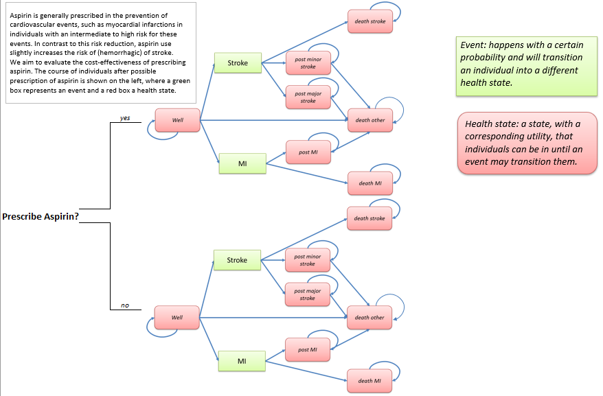

```{r setup, include = FALSE}
rm(list = ls())
options(scipen = 999)
require(learnr, quietly = TRUE)
require(shiny, quietly = TRUE)
require(hetuto, quietly = TRUE)
require(ggplot2, quietly = TRUE)
require(plotly, quietly = TRUE)

knitr::opts_chunk$set(echo = FALSE)

# Setting parameters
n_cycles <- 10 # number of cycles
r_d_effects <- 0.015 # annual discount rate, health effects
r_d_costs <- 0.04 # annual discount rate, costs
v_names_hs <- c("Well", "Post-minor_stroke", "Post-major_stroke", "Post-MI", "Death_stroke", "Death_MI", "Death_other") # vector of names of health states
n_hs <- length(v_names_hs) # number of health states
n_ind <- 100000 # number of individuals to simulate  
v_start_hs <- c(n_ind, 0, 0, 0, 0, 0, 0) # vector of starting position in the model  

# Input parameters

## Rates & probabilities
r_fatal_mi	<- 0.25 # rate fatal MI
r_fatal_stroke	<- 0.3 # rate fatal stroke

## Treatment effectiveness
eff_mi	<- 0.6 # Treatment effectiveness of Aspirin on the probability of experiencing a MI
eff_stroke	<- 1.2 # Treatment effectiveness of Aspirin on the probability of experiencing a stroke

## Utility values 
u_healthy	<- 1 # utility value health state: Well
u_post_mi	<- 0.85 # utility value health state: Post-MI
u_post_minor_stroke	<- 0.75 # utility value health state: Post-minor stroke
u_post_major_stroke	<- 0.5 # utility value health state: Post-major stroke
u_aspirin_use	<- 0.999 # utility value health state: Well when using aspiring

## Costs
c_aspirin_use	<- 100 # yearly costs of using aspiring
c_post_mi	<- 8000 # yearly costs after having experienced a NON-FATAL MI
c_post_minor_stroke	<- 2000 # yearly costs after having experienced a NON-FATAL minor stroke
c_post_major_stroke	<- 20000 # yearly costs after having experienced a NON_FATAL major stroke

# to change! now by hand, but should be loaded!
df_mort <- data.frame(
  Age = c(20:120),
  R_mort_10000 = c(0.541445, 0.541445, 0.541445, 0.541445, 0.541445,
                      0.6607366, 0.6607366, 0.6607366, 0.6607366, 0.6607366,
                      0.9016048, 0.9016048, 0.9016048, 0.9016048, 0.9016048, 
                      1.3032129, 1.3032129, 1.3032129, 1.3032129, 1.3032129,
                      1.9409494, 1.9409494, 1.9409494, 1.9409494, 1.9409494,
                      3.3514606, 3.3514606, 3.3514606, 3.3514606, 3.3514606,
                      5.3184832, 5.3184832, 5.3184832, 5.3184832, 5.3184832, 
                      8.1375915, 8.1375915, 8.1375915, 8.1375915, 8.1375915, 
                      14.4662578, 14.4662578, 14.4662578, 14.4662578, 14.4662578, 
                      23.4709654, 23.4709654, 23.4709654, 23.4709654, 23.4709654, 
                      37.7820953, 37.7820953, 37.7820953, 37.7820953, 37.7820953, 
                      68.3194902, 68.3194902, 68.3194902, 68.3194902, 68.3194902, 
                      121.3095346, 121.3095346, 21.3095346, 121.3095346, 121.3095346, 
                      232.4678458, 232.4678458, 232.4678458, 232.4678458, 232.4678458, 
                      449.3161783, 449.3161783, 449.3161783, 449.3161783, 449.3161783, 
                      438.9557537, 438.9557537, 438.9557537, 438.9557537, 438.9557537, 
                      438.9557537, 438.9557537, 438.9557537, 438.9557537, 438.9557537, 
                      438.9557537, 438.9557537, 438.9557537, 438.9557537, 438.9557537, 
                      438.9557537, 438.9557537, 438.9557537, 438.9557537, 438.9557537, 
                      438.9557537, 438.9557537, 438.9557537, 438.9557537, 438.9557537, 
                      438.9557537)
)
```

## Health state transition model - 2

### Aim
The aim of this practical assignment is to get you acquainted with the principle of HSTM. This assignmment focuses on evaluating the cost-effectiveness of aspirin treatment versus no aspirin treatment for the primary prevention of cardiovascular disease events using a HSTM, also called Markov model. During this assignment, you will first define the cohort simulation of both strategies (using transition probabilities, and matrix multiplication) and then calculate the outcomes (quality-adjusted life years, costs). First, familiarise yourself with the model structure.  
The method described in this practical is more extensively described in [Alarid Escudero et al. 2021](https://arxiv.org/abs/2001.07824).  

### Instructions

```{r, fig.align = 'center', out.width = "70%", echo = F}
knitr::include_graphics("Tutorial_hstm_2_files/images/Image_hint.png")
```

```{r, fig.align = 'center', out.width = "70%", echo = F}
knitr::include_graphics("Tutorial_hstm_2_files/images/Image_solution.png")
```

### Prerequisites
You should be able to use the following commands to perform this exercise:  

- `which()` function  
- `matrix()` and `array()` functions  
- `rowSums()` function
- perform matrix multiplication using `%*%`  
- using the command `for()` to perform forward loop  

## Model structure & parameters  
**DISCLAIMER: FOR THE FOLLOWING ASSIGNMENT, ASSUME THAT PROBABILITIES ARE THE SAME AS RATES. SEE Fleurence & Hollenbeak 2007 (https://doi.org/10.2165/00019053-200725010-00002) FOR AN EXPLANATION OF THE DIFFERENCES BETWEEN RATES AND PROBABILITIES AND REMEMBER THAT WE USUALLY USE PROBABILITIES IN HEALTH ECONOMIC MODELLING** 

### Model structure
In this HSTM, individuals either receive aspirin or not (the two strategies we compare).In this model, individuals may remain "Well", or they can experience a stroke or a myocardial infarction (MI). These two events may be fatal or individuals may remain alive in the "Post-minor stroke", "Post-major stroke", or "Post-MI" health states when they survive these events. From all health states, individuals may die from general causes of death to "Death other".  
  
```{r, fig.align = 'center', out.width = "90%", echo = F}

```

This model structure, which is the same for both strategies, can also be visualised as follows.  

```{r, fig.align = 'center', out.width = "90%", echo = F}
knitr::include_graphics("Tutorial_hstm_2_files/images/Fig_model_structure_2.png")
```

### Model inputs
As you can see both strategies (prescribing aspirin or not) have similar diagrams. However, there will be differences in the values of the parameters applied in these strategies. First, we will focus on the disease progression of patients not using aspirin. Have a look at the input parameters which are already defined herebelow.   

```{r inputs_gen, echo = TRUE, eval = FALSE}
# Setting parameters
n_cycles <- 10 # number of cycles in the health economic model
r_d_effects <- 0.015 # annual discount rate, health effects
r_d_costs <- 0.04 # annual discount rate, costs
v_names_hs <- c("Well", "Post-minor_stroke", "Post-major_stroke", "Post-MI", "Death_stroke", "Death_MI", "Death_other") # vector of names of health states
n_hs <- length(v_names_hs) # number of health states
n_ind <- 100000 # number of individuals to simulate  
v_start_hs <- c(n_ind, 0, 0, 0, 0, 0, 0) # vector of starting position in the model  

# Input parameters

## Rates & probabilities
r_fatal_mi	<- 0.25 # rate fatal MI
r_fatal_stroke	<- 0.3 # rate fatal stroke

## Treatment effectiveness
eff_mi	<- 0.6 # treatment effectiveness of Aspirin on the probability of experiencing a MI
eff_stroke	<- 1.2 # treatment effectiveness of Aspirin on the probability of experiencing a stroke

## Utility values 
u_healthy	<- 1 # utility value of health state: Well
u_post_mi	<- 0.85 # utility value of health state: Post-MI
u_post_minor_stroke	<- 0.75 # utility value of health state: Post-minor stroke
u_post_major_stroke	<- 0.5 # utility value of health state: Post-major stroke
u_aspirin_use	<- 0.999 # utility value of health state: Well when using aspiring

## Costs
c_aspirin_use	<- 100 # yearly costs of using aspirin
c_post_mi	<- 8000 # yearly costs after having experienced a NON-FATAL MI
c_post_minor_stroke	<- 2000 # yearly costs after having experienced a NON-FATAL minor stroke
c_post_major_stroke	<- 20000 # yearly costs after having experienced a NON-FATAL major stroke
```


When developing a health economic model we often have to combine evidence from different sources of literature. Assume that there was evidence that 235 out of 1,000 patients **who had a stroke and survived** moved into a post major stroke state (the remaining patients experienced a minor stroke). Based on this evidence, please define the parameter `p_minor_stroke` (probability of transiting to the "post-minor stroke" health state **after having experienced a NON-FATAL stroke** and `p_major_stroke` (probability of transiting to the "post-major stroke" health state **after having experienced a NON-FATAL stroke**.   
From other sources, you found that the incidence rates for myocardial infarction (MI), stroke, and death from other causes were respectively **400, 50, and 650 per 100,000 person-years**. Calculate the yearly incidence rates of MI, stroke, and death from other causes than MI and stroke in the placeholder of parameters `r_inc_mi`, `r_inc_stroke`, and `r_mort`.  

```{r calc_inputs, exercise = TRUE}
# Please calculate (based on the information in the text)
# the probability to transit to "Post-major stroke" after a NON-FATAL stroke occured
# the probability to transit to "Post-minor stroke" after a NON-FATAL stroke occured
# the yearly incidence rate MI
# the yearly incidence rate stroke
# the yearly rate of death
```

```{r calc_inputs-hint}
# Example
p_post_major_stroke	<- 235 / 1000 # probability to transit to "Post-major stroke" after a NON-FATAL stroke occured
p_post_minor_stroke	<- 1 - p_post_major_stroke # probability to transit to "Post-minor stroke" after a NON-FATAL stroke occured
```

```{r calc_inputs-solution}
p_post_major_stroke	<- 235 / 1000 # probability to transit to "Post-major stroke" after a NON-FATAL stroke occured
p_post_minor_stroke	<- 1 - p_post_major_stroke # probability to transit to "Post-minor stroke" after a NON-FATAL stroke occured
r_inc_mi <- 400 / 100000 # yearly incidence rate MI
r_inc_stroke <- 50 / 100000 # yearly incidence rate stroke
r_mort <- 650 / 100000 # yearly rate of death
#c(`Prob_post-major_stoke` = p_post_major_stroke, `Prob_post-minor_stoke` = p_post_minor_stroke, `Rate_inc_nonfatal_MI`= r_inc_mi, `Rate_inc_nonfatal_stroke`= r_inc_stroke, `Rate_deathothercauses`= r_mort) # show
```

## Transition matrices - "No aspirin" 

### Define the transition matrix of the "No aspirin" strategy  
The input parameter values looks as in the following code chunk. Based on these input values, determine the transition matrix of the "No aspirin" strategy, and call it `m_tp_comp` (for matrix transition probabilities of the comparator). Assume here that `r_mort` can be used for the probability of ‘Death other’.  

```{r inputs_gen2, echo = TRUE, eval = FALSE}
# Setting parameters
n_cycles <- 10 # number of cycles in the health economic model
r_d_effects <- 0.015 # annual discount rate, health effects
r_d_costs <- 0.04 # annual discount rate, costs
v_names_hs <- c("Well", "Post-minor_stroke", "Post-major_stroke", "Post-MI", "Death_stroke", "Death_MI", "Death_other") # vector of names of health states
n_hs <- length(v_names_hs) # number of health states
n_ind <- 100000 # number of individuals to simulate  
v_start_hs <- c(n_ind, 0, 0, 0, 0, 0, 0) # vector of starting position in the model  

# Input parameters

## Rates & probabilities
r_fatal_mi	<- 0.25 # rate fatal MI - no-Aspirin strategy
r_fatal_stroke	<- 0.3 # rate fatal stroke - no-Aspirin strategy

## Treatment effectiveness
eff_mi	<- 0.6 # Treatment effectiveness of Aspirin on the probability of experiencing a MI
eff_stroke	<- 1.2 # Treatment effectiveness of Aspirin on the probability of experiencing a stroke

## Utility values 
u_healthy	<- 1 # utility value health state: Well
u_post_mi	<- 0.85 # utility value health state: Post-MI
u_post_minor_stroke	<- 0.75 # utility value health state: Post-minor stroke
u_post_major_stroke	<- 0.5 # utility value health state: Post-major stroke
u_aspirin_use	<- 0.999 # utility value health state: Well when using aspiring

## Costs
c_aspirin_use	<- 100 # yearly costs of using aspirin
c_post_mi	<- 8000 # yearly costs after having experienced a NON-FATAL MI
c_post_minor_stroke	<- 2000 # yearly costs after having experienced a NON-FATAL minor stroke
c_post_major_stroke	<- 20000 # yearly costs after having experienced a NON-FATAL major stroke

## Calculated parameters
p_post_major_stroke	<- 235 / 1000 # probability to transit to "Post-major stroke" after a NON-FATAL stroke occured
p_post_minor_stroke	<- 1 - p_post_major_stroke # probability to transit to "Post-minor stroke" after a NON-FATAL stroke occured
r_inc_mi <- 400 / 100000 # yearly incidence rate MI
r_inc_stroke <- 50 / 100000 # yearly incidence rate stroke
r_mort <- 650 / 100000 # yearly rate of death
```

```{r inputs_complete_setup, echo = TRUE}
# Setting parameters
n_cycles <- 10 # number of cycles
r_d_effects <- 0.015 # annual discount rate, health effects
r_d_costs <- 0.04 # annual discount rate, costs
v_names_hs <- c("Well", "Post-minor_stroke", "Post-major_stroke", "Post-MI", "Death_stroke", "Death_MI", "Death_other") # vector of names of health states
n_hs <- length(v_names_hs) # number of health states
n_ind <- 100000 # number of individuals to simulate  
v_start_hs <- c(n_ind, 0, 0, 0, 0, 0, 0) # vector of starting position in the model  

# Input parameters

## Rates & probabilities
r_fatal_mi	<- 0.25 # rate fatal MI
r_fatal_stroke	<- 0.3 # rate fatal stroke

## Treatment effectiveness
eff_mi	<- 0.6 # Treatment effectiveness of Aspirin on the probability of experiencing a MI
eff_stroke	<- 1.2 # Treatment effectiveness of Aspirin on the probability of experiencing a stroke

## Utility values 
u_healthy	<- 1 # utility value health state: Well
u_post_mi	<- 0.85 # utility value health state: Post-MI
u_post_minor_stroke	<- 0.75 # utility value health state: Post-minor stroke
u_post_major_stroke	<- 0.5 # utility value health state: Post-major stroke
u_aspirin_use	<- 0.999 # utility value health state: Well when using aspiring

## Costs
c_aspirin_use	<- 100 # yearly costs of using aspiring
c_post_mi	<- 8000 # yearly costs after having experienced a NON-FATAL MI
c_post_minor_stroke	<- 2000 # yearly costs after having experienced a NON-FATAL minor stroke
c_post_major_stroke	<- 20000 # yearly costs after having experienced a NON_FATAL major stroke

## Calculated parameters
p_post_major_stroke	<- 235 / 1000 # probability to transit to "Post-major stroke" after a NON-FATAL stroke occured
p_post_minor_stroke	<- 1 - p_post_major_stroke # probability to transit to "Post-minor stroke" after a NON-FATAL stroke occured
r_inc_mi <- 400 / 100000 # yearly incidence rate MI
r_inc_stroke <- 50 / 100000 # yearly incidence rate stroke
r_mort <- 650 / 100000 # yearly rate of death
```

To do so, create a matrix of 7 by 7, and use the evidence `p_` and `r_` parameters to fill it in. Use the model structure to fill in the transition matrix.  
Once an individuals die, that person remains in that health state.  
The transition probabilities to the post-minor stroke health states are the product of experiencing a non-fatal stroke and of the consequences being minor or major.

```{r m_tp_1, exercise = TRUE, exercise.setup = "inputs_complete_setup"}
# Create transition matrix 7x7
# Fill in transition matrix using above-defined paramteres

```

```{r m_tp_1-hint-1}
# Create transition matrix
m_tp_comp <- matrix(0, 
                    ncol = n_hs, 
                    nrow = n_hs,
                    dimnames = list(from = v_names_hs, 
                                    to = v_names_hs)
                    ) 
# Fill in transition matrix
m_tp_comp["Well", "Well"] <- 1 - r_inc_mi - r_inc_stroke - r_mort # example
```

```{r m_tp_1-solution}
# Create transition matrix
m_tp_comp <- matrix(0, 
                    ncol = n_hs, 
                    nrow = n_hs,
                    dimnames = list(from = v_names_hs, 
                                    to = v_names_hs)
                    ) 
# Fill in transition matrix
m_tp_comp["Well", "Well"] <- 1 - r_inc_mi - r_inc_stroke - r_mort 
m_tp_comp["Well", "Post-minor_stroke"] <- r_inc_stroke * (1 - r_fatal_stroke) * p_post_minor_stroke
m_tp_comp["Well", "Post-major_stroke"] <- r_inc_stroke * (1 - r_fatal_stroke) * p_post_major_stroke
m_tp_comp["Well", "Post-MI"] <- r_inc_mi * (1 - r_fatal_mi)
m_tp_comp["Well", "Death_stroke"] <- r_inc_stroke * r_fatal_stroke
m_tp_comp["Well", "Death_MI"] <- r_inc_mi * r_fatal_mi
m_tp_comp["Post-minor_stroke", "Post-minor_stroke"] <- m_tp_comp["Post-major_stroke", "Post-major_stroke"] <- m_tp_comp["Post-MI", "Post-MI"] <- 1 - r_mort
m_tp_comp[c("Post-MI", "Post-major_stroke", "Post-minor_stroke", "Well") , "Death_other"] <- r_mort
m_tp_comp["Death_stroke", "Death_stroke"] <- m_tp_comp["Death_MI", "Death_MI"] <- m_tp_comp["Death_other", "Death_other"] <- 1
m_tp_comp # show
```

### Transition matrix complete
The transition matrix should look as follows:
```{r m_tp_1_show, echo = TRUE, eval = TRUE}
## Calculated parameters
p_post_major_stroke	<- 235 / 1000 # probability to transit to "Post-major stroke" after a NON-FATAL stroke occured
p_post_minor_stroke	<- 1 - p_post_major_stroke # probability to transit to "Post-minor stroke" after a NON-FATAL stroke occured
r_inc_mi <- 400 / 100000 # yearly incidence rate MI
r_inc_stroke <- 50 / 100000 # yearly incidence rate stroke
r_mort <- 650 / 100000 # yearly rate of death

# Create transition matrix
m_tp_comp <- matrix(0,
                    ncol = n_hs,
                    nrow = n_hs,
                    dimnames = list(from = v_names_hs,
                                    to = v_names_hs)
                    )
# Fill in transition matrix
m_tp_comp["Well", "Well"] <- 1 - r_inc_mi - r_inc_stroke - r_mort 
m_tp_comp["Well", "Post-minor_stroke"] <- r_inc_stroke * (1 - r_fatal_stroke) * p_post_minor_stroke
m_tp_comp["Well", "Post-major_stroke"] <- r_inc_stroke * (1 - r_fatal_stroke) * p_post_major_stroke
m_tp_comp["Well", "Post-MI"] <- r_inc_mi * (1 - r_fatal_mi)
m_tp_comp["Well", "Death_stroke"] <- r_inc_stroke * r_fatal_stroke
m_tp_comp["Well", "Death_MI"] <- r_inc_mi * r_fatal_mi
m_tp_comp["Well", "Death_other"] <- r_mort

m_tp_comp["Post-minor_stroke", "Post-minor_stroke"] <- 1 - r_mort
m_tp_comp["Post-minor_stroke", "Death_other"] <- r_mort

m_tp_comp["Post-major_stroke", "Post-major_stroke"] <- 1 - r_mort
m_tp_comp["Post-major_stroke", "Death_other"] <- r_mort

m_tp_comp["Post-MI", "Post-MI"] <- 1 - r_mort
m_tp_comp["Post-MI", "Death_other"] <- r_mort

m_tp_comp["Death_stroke", "Death_stroke"] <- 1
m_tp_comp["Death_MI", "Death_MI"] <- 1
m_tp_comp["Death_other", "Death_other"] <- 1
data.frame(round(m_tp_comp, 4)) # show
```

### Validation check  
```{r m_tp_1_setup}
## Calculated parameters
p_post_major_stroke	<- 235 / 1000 # probability to transit to "Post-major stroke" after a NON-FATAL stroke occured
p_post_minor_stroke	<- 1 - p_post_major_stroke # probability to transit to "Post-minor stroke" after a NON-FATAL stroke occured
r_inc_mi <- 400 / 100000 # yearly incidence rate MI
r_inc_stroke <- 50 / 100000 # yearly incidence rate stroke
r_mort <- 650 / 100000 # yearly rate of death

# Create transition matrix
m_tp_comp <- matrix(0,
                    ncol = n_hs,
                    nrow = n_hs,
                    dimnames = list(from = v_names_hs,
                                    to = v_names_hs)
                    )
# Fill in transition matrix
m_tp_comp["Well", "Well"] <- 1 - r_inc_mi - r_inc_stroke - r_mort 
m_tp_comp["Well", "Post-minor_stroke"] <- r_inc_stroke * (1 - r_fatal_stroke) * p_post_minor_stroke
m_tp_comp["Well", "Post-major_stroke"] <- r_inc_stroke * (1 - r_fatal_stroke) * p_post_major_stroke
m_tp_comp["Well", "Post-MI"] <- r_inc_mi * (1 - r_fatal_mi)
m_tp_comp["Well", "Death_stroke"] <- r_inc_stroke * r_fatal_stroke
m_tp_comp["Well", "Death_MI"] <- r_inc_mi * r_fatal_mi
m_tp_comp["Well", "Death_other"] <- r_mort

m_tp_comp["Post-minor_stroke", "Post-minor_stroke"] <- 1 - r_mort
m_tp_comp["Post-minor_stroke", "Death_other"] <- r_mort

m_tp_comp["Post-major_stroke", "Post-major_stroke"] <- 1 - r_mort
m_tp_comp["Post-major_stroke", "Death_other"] <- r_mort

m_tp_comp["Post-MI", "Post-MI"] <- 1 - r_mort
m_tp_comp["Post-MI", "Death_other"] <- r_mort

m_tp_comp["Death_stroke", "Death_stroke"] <- 1
m_tp_comp["Death_MI", "Death_MI"] <- 1
m_tp_comp["Death_other", "Death_other"] <- 1
```
Check whether the sum of all rows equals 1 to ensure you will not "add" or "loose" individuals in the simulation because the sum of probabilities do not sum up to 1 for each health states.  

```{r check_tp, exercise = TRUE, exercise.setup = "m_tp_1_setup"}
# check the sum of all rows
```


```{r check_tp-hint}
"Use the rowSums() function"
```

```{r check_tp-solution}
rowSums(m_tp_comp) == 1
```

## Cohort simulation - "No aspirin"
It is now time to define and fill in the cohort simulation for the "No aspirin" strategy!  

### Fill in the transition matrix of the "No aspirin" strategy  
Assume all 100,000 individuals (`n_ind` object) start in the "Well" health state (first element of the `v_start_hs` vector), and perform the cohort simulation for the "No aspirin" strategy using the transition matrix `m_tp_comp`. Remember from previous assignment that you need the following elements to perform the cohort simulation:    
- `n_cycles`: the number of cycles to simulate, assume 10 years (yearly cycles)  
- `n_ind`: the number of individuals to simulate, assume 100,000  
- `v_start_hs`: a vector determining the starting position of the individuals over the different cycles (assume all individuals start in the "Well" health state)  
- `m_tp_comp`: a transition matrix  
- `m_hs_comp`: a matrix to store the number of individuals in each health state during each cycle for the comparator. This matrix has `n_cycles` + 1 row (because we need to account for the start position), and as much columns as health states (N=7). Numerate the rows from 0 to `n_cycles` and name the columns with the names of the health states ("Well", "Post-minor_stroke", "Post-major_stroke", "Post-MI", "Death_stroke", "Death_MI", "Death_other").  
`m_tp_comp`, `n_cycles`, and `n_ind` are already loaded. First, define `v_start_hs` and `m_hs_comp`. Second, use `v_start_hs` to determine the starting position of the individuals in the simulation, i.e. the first row of `m_hs_comp`. Finally, fill in `m_hs_comp` using matrix multiplication and the objects: `m_tp_comp` and `m_hs_comp`.  

```{r cohort_comp, exercise = TRUE, exercise.setup = "m_tp_1_setup"}
# Define cohort simulation matrix

# Define the starting position of the individuals in each health state

# Perform the matrix multiplication (for loop) to fill in the cohort simulation
```

```{r cohort_comp-hint}
# Define cohort simulation matrix
# m_hs_comp <- matrix(0,
#                     ncol = '__',
#                     nrow = '__',
#                     dimnames = list(cycle = '__',
#                                     health_state = '__'
#                     )
# )
# 
# # Define the starting position of the individuals in each health state
# m_hs_comp[1, ] <- '__'
# 
# # Perform the matrix multiplication (for loop) to fill in the cohort simulation
# for(cycle in 1:n_cycles){
#   
#   m_hs_comp[cycle + 1, ] <- '__' # perform matrix multiplication here
#   
# }
```

```{r cohort_comp-solution}
# Define cohort simulation matrix
m_hs_comp <- matrix(0,
                    ncol = n_hs,
                    nrow = n_cycles + 1,
                    dimnames = list(cycle = c(0:n_cycles),
                                    health_state = v_names_hs)
                    )

# Define the starting position of the individuals in each health state
m_hs_comp[1, ] <- v_start_hs

# Perform the matrix multiplication (for loop) to fill in the cohort simulation
for(cycle in 1:n_cycles){
  m_hs_comp[cycle + 1, ] <- m_hs_comp[cycle, ] %*% m_tp_comp # matrix multiplication
}
head(m_hs_comp) # show start cohort simulation
```

### Validation check  
Check whether all rows sum up to 100,000 to ensure you do not 'loose' or 'add' any person to the cohort simulation. Sometimes, due to rounding errors, it may seem that the sum does not exactly match the number of individuals, so round your sums to 5 decimals.  
```{r cohort_check_setup}
## Calculated parameters
p_post_major_stroke	<- 235 / 1000 # probability to transit to "Post-major stroke" after a NON-FATAL stroke occured
p_post_minor_stroke	<- 1 - p_post_major_stroke # probability to transit to "Post-minor stroke" after a NON-FATAL stroke occured
r_inc_mi <- 400 / 100000 # yearly incidence rate MI
r_inc_stroke <- 50 / 100000 # yearly incidence rate stroke
r_mort <- 650 / 100000 # yearly rate of death

# Create transition matrix
m_tp_comp <- matrix(0,
                    ncol = n_hs,
                    nrow = n_hs,
                    dimnames = list(from = v_names_hs,
                                    to = v_names_hs)
                    )
# Fill in transition matrix
m_tp_comp["Well", "Well"] <- 1 - r_inc_mi - r_inc_stroke - r_mort 
m_tp_comp["Well", "Post-minor_stroke"] <- r_inc_stroke * (1 - r_fatal_stroke) * p_post_minor_stroke
m_tp_comp["Well", "Post-major_stroke"] <- r_inc_stroke * (1 - r_fatal_stroke) * p_post_major_stroke
m_tp_comp["Well", "Post-MI"] <- r_inc_mi * (1 - r_fatal_mi)
m_tp_comp["Well", "Death_stroke"] <- r_inc_stroke * r_fatal_stroke
m_tp_comp["Well", "Death_MI"] <- r_inc_mi * r_fatal_mi
m_tp_comp["Well", "Death_other"] <- r_mort

m_tp_comp["Post-minor_stroke", "Post-minor_stroke"] <- 1 - r_mort
m_tp_comp["Post-minor_stroke", "Death_other"] <- r_mort

m_tp_comp["Post-major_stroke", "Post-major_stroke"] <- 1 - r_mort
m_tp_comp["Post-major_stroke", "Death_other"] <- r_mort

m_tp_comp["Post-MI", "Post-MI"] <- 1 - r_mort
m_tp_comp["Post-MI", "Death_other"] <- r_mort

m_tp_comp["Death_stroke", "Death_stroke"] <- 1
m_tp_comp["Death_MI", "Death_MI"] <- 1
m_tp_comp["Death_other", "Death_other"] <- 1

# Define cohort simulation matrix
m_hs_comp <- matrix(0,
                    ncol = n_hs,
                    nrow = n_cycles + 1,
                    dimnames = list(cycle = c(0:n_cycles),
                                    health_state = v_names_hs)
                    )

# Define the starting position of the individuals in each health state
m_hs_comp[1, ] <- v_start_hs

# Perform the matrix multiplication (for loop) to fill in the cohort simulation
for(cycle in 1:n_cycles){
  m_hs_comp[cycle + 1, ] <- m_hs_comp[cycle, ] %*% m_tp_comp # matrix multiplication
}
```

```{r cohort_check_exercise, exercise = TRUE, exercise.setup = "cohort_check_setup"}


```

```{r cohort_check_exercise-solution}
round(rowSums(m_hs_comp), 5) == n_ind
```

## Improving the cohort simulation
In this part of the assignmment, we will improve the transition matrix and cohort simulation of the "No aspirin" strategy that you just have built.  
We will now use age-dependent mortality values since we only used a mean estimate for all age in the previous assignment. However, the probability of death is increasing with age. Furthermore, you will include the "Aspirin" strategy to the model and make the comparison between the "Aspirin" and "No Aspirin" strategies.  
To do so, you will first define the cohort simulations of both strategies (using (age-dependent) transition probabilities, a three-dimentional array, and matrix multiplication) and then calculate the outcomes (quality-adjusted life years, costs). 
The method described in this practical is more extensively described in [Alarid Escudero et al. 2021](https://arxiv.org/abs/2001.07824). The approach we will use to do so is also similar to the one described in this [video](https://www.youtube.com/watch?v=s4ZeRL-HeSs&list=PLIT7NqYN7YT3fUQhsAQ8Pn7-SHRpCy-U7&index=3).  

### Model inputs
Here below you can see the inputs we will use in the model.

```{r inputs_time_var_setup, echo = T}
#### 0. Define model parameters ----

# Setting parameters
n_cycles <- 10 # number of cycles
r_d_effects <- 0.015 # annual discount rate, health effects
r_d_costs <- 0.04 # annual discount rate, costs
v_names_hs <- c("Well", "Post-minor_stroke", "Post-major_stroke", "Post-MI", "Death_stroke", "Death_MI", "Death_other") # vector of names of health states
n_hs <- length(v_names_hs) # number of health states
n_ind <- 100000 # number of individuals to simulate  
v_start_hs <- c(n_ind, 0, 0, 0, 0, 0, 0) # vector of starting position in the model  

# Input parameters

## Rates & probabilities
r_fatal_mi	<- 0.25 # rate fatal MI
r_fatal_stroke	<- 0.3 # rate fatal stroke
r_inc_mi <- 400 / 100000 # yearly incidence rate MI
r_inc_stroke <- 50 / 100000 # yearly incidence rate stroke

p_post_major_stroke	<- 235 / 1000 # probability to transit to "Post-major stroke" after a NON-FATAL stroke occured
p_post_minor_stroke	<- 1 - p_post_major_stroke # probability to transit to "Post-minor stroke" after a NON-FATAL stroke occured

## Treatment effectiveness
eff_mi	<- 0.6 # Treatment effectiveness of Aspirin on the probability of experiencing a MI
eff_stroke	<- 1.2 # Treatment effectiveness of Aspirin on the probability of experiencing a stroke

## Utility values 
u_healthy	<- 1 # utility value health state: Well
u_post_mi	<- 0.85 # utility value health state: Post-MI
u_post_minor_stroke	<- 0.75 # utility value health state: Post-minor stroke
u_post_major_stroke	<- 0.5 # utility value health state: Post-major stroke
u_aspirin_use	<- 0.999 # utility value health state: Well when using aspiring

## Costs
c_aspirin_use	<- 100 # yearly costs of using aspiring
c_post_mi	<- 8000 # yearly costs after having experienced a NON-FATAL MI
c_post_minor_stroke	<- 2000 # yearly costs after having experienced a NON-FATAL minor stroke
c_post_major_stroke	<- 20000 # yearly costs after having experienced a NON_FATAL major stroke
```

### Age-dependent mortality data  
As you can see in the R chunk above, there are no transition probabilities defined for the yearly rate of death (from other causes), `r_mort`. This is because we will now make this probability of death dependent on the age of individuals in the health economic model.  
To do so, we need the rate of death for each age. For this assignment, these rates have been obtained from the central bureau of statistics and are displayed below per 10,000 individuals. These rates are stored in the `df_mort` dataframe displayed below. The `df_mort` dataframe contains two variables:  

- `Age` contains the age at with mortality rates are defined  
- `R_mort_10000` contains the mortality rate, per 10,000 individuals  

```{r mort_data}
df_mort
```

Using the `df_mort` dataframe, calculate the per-person mortality rate as a new column `R_mort` in the `df_mort` dataframe.  

```{r calc_mort_data, exercise = TRUE}
# calculate the per person mortality rate
```


```{r calc_mort_data-solution}
df_mort$R_mort <- df_mort$R_mort_10000 / 10000
df_mort[, c("Age", "R_mort")] # show
```


### Filling in the "No aspirin" strategy transition array
Now that we have calculated the per person mortality rates for each age, we can include them in the transition array that we will use in the health economic model. To include these age-dependent transition probabilities in the model, we have to use 3-dimentional (3D) arrays instead of fixed transition matrices. The use of these 3D arrays allow to select a different transition matrix (containing different transition probabilities) for each cycle of the model. Arrays are defined using the `array()` function. The code chunk below shows how to define the transition array for the "No aspirin group. The comments describe what is happening. Have a look at the code and try to understand it! Below the code chunk, you can see the first two and the last two transition matrices contained in the 3D array. As you can see, the transition of to the `Death_other` health state has increased between the first and last cycles, as we expected!       
*NOTE: elements in a array are called by the number of dimension of the array. Thus, a single element of a 3D array is called via a x, y, and z dimension. If only the x and y coordinates are provided, the vector of elements with the coordinates x and y is returned. In this case, the third dimension (the 'z') represents the cycle number while the rows and columns represent the same as in the transition matrix (transition from - to).*  

```{r a_tp_1, echo = TRUE}
#### Define 3D array "No aspirin" group ----

# Define start age cohort
n_start_age <- 45

# Calculate per person mortality rate
df_mort$R_mort <- df_mort$R_mort_10000 / 10000

# Create a vector containing the mortality probability values for the age `n_start_age` to `n_start_age`+9
v_p_mort <- df_mort[c(which(df_mort$Age == n_start_age):which(df_mort$Age == n_start_age + (n_cycles - 1))), "R_mort"]

# Initialise 3D array which will contain the transition probabilities
a_tp_comp <- array(0, 
                   dim = c(n_hs, n_hs, n_cycles), # define length of the dimensions (7, 7, 10)
                   dimnames = list(v_names_hs, v_names_hs, 1:n_cycles) # define names of the dimensions
                   )

# Fill in the arrays using the background mortality for each age 
a_tp_comp["Well", "Well", ]   <- 1 - v_p_mort - r_inc_mi - r_inc_stroke  
##!!Notice, that only using the first 2 elements of the array will fill these transition probabilities for all 10 transition matrices used in all cycles!!

a_tp_comp["Well", "Post-minor_stroke", ] <- r_inc_stroke * (1 - r_fatal_stroke) * p_post_minor_stroke
a_tp_comp["Well", "Post-major_stroke", ] <- r_inc_stroke * (1 - r_fatal_stroke) * p_post_major_stroke
a_tp_comp["Well", "Post-MI", ] <- r_inc_mi * (1 - r_fatal_mi)
a_tp_comp["Well", "Death_stroke", ] <- r_inc_stroke * r_fatal_stroke
a_tp_comp["Well", "Death_MI", ] <- r_inc_mi * r_fatal_mi
a_tp_comp["Well", "Death_other", ] <- v_p_mort

a_tp_comp["Post-minor_stroke", "Post-minor_stroke", ] <- 1 - v_p_mort
a_tp_comp["Post-minor_stroke", "Death_other", ] <- v_p_mort

a_tp_comp["Post-major_stroke", "Post-major_stroke", ] <- 1 - v_p_mort
a_tp_comp["Post-major_stroke", "Death_other", ] <- v_p_mort

a_tp_comp["Post-MI", "Post-MI", ] <- 1 - v_p_mort
a_tp_comp["Post-MI", "Death_other", ] <- v_p_mort

a_tp_comp["Death_stroke", "Death_stroke",] <- 1
a_tp_comp["Death_MI", "Death_MI",] <- 1
a_tp_comp["Death_other", "Death_other",] <- 1

a_tp_comp[, , c(1, 2, 9, 10)]
```

### Filling in the "Aspirin" strategy transition array  
```{r a_tp_2_setup}
#### 0. Define model parameters ----

# Setting parameters
n_cycles <- 10 # number of cycles
r_d_effects <- 0.015 # annual discount rate, health effects
r_d_costs <- 0.04 # annual discount rate, costs
v_names_hs <- c("Well", "Post-minor_stroke", "Post-major_stroke", "Post-MI", "Death_stroke", "Death_MI", "Death_other") # vector of names of health states
n_hs <- length(v_names_hs) # number of health states
n_ind <- 100000 # number of individuals to simulate  
v_start_hs <- c(n_ind, 0, 0, 0, 0, 0, 0) # vector of starting position in the model  

# Input parameters

## Rates & probabilities
r_fatal_mi	<- 0.25 # rate fatal MI
r_fatal_stroke	<- 0.3 # rate fatal stroke
r_inc_mi <- 400 / 100000 # yearly incidence rate MI
r_inc_stroke <- 50 / 100000 # yearly incidence rate stroke

p_post_major_stroke	<- 235 / 1000 # probability to transit to "Post-major stroke" after a NON-FATAL stroke occured
p_post_minor_stroke	<- 1 - p_post_major_stroke # probability to transit to "Post-minor stroke" after a NON-FATAL stroke occured

## Treatment effectiveness
eff_mi	<- 0.6 # Treatment effectiveness of Aspirin on the probability of experiencing a MI
eff_stroke	<- 1.2 # Treatment effectiveness of Aspirin on the probability of experiencing a stroke

## Utility values 
u_healthy	<- 1 # utility value health state: Well
u_post_mi	<- 0.85 # utility value health state: Post-MI
u_post_minor_stroke	<- 0.75 # utility value health state: Post-minor stroke
u_post_major_stroke	<- 0.5 # utility value health state: Post-major stroke
u_aspirin_use	<- 0.999 # utility value health state: Well when using aspiring

## Costs
c_aspirin_use	<- 100 # yearly costs of using aspiring
c_post_mi	<- 8000 # yearly costs after having experienced a NON-FATAL MI
c_post_minor_stroke	<- 2000 # yearly costs after having experienced a NON-FATAL minor stroke
c_post_major_stroke	<- 20000 # yearly costs after having experienced a NON_FATAL major stroke

#### 1. Define 3D array "No aspirin" group ----

# Define start age cohort
n_start_age <- 45

# Calculate per person mortality rate
df_mort$R_mort <- df_mort$R_mort_10000 / 10000

# Create a vector containing the mortality probability values for the age `n_start_age` to `n_start_age`+9
v_p_mort <- df_mort[c(which(df_mort$Age == n_start_age):
                        which(df_mort$Age == n_start_age + (n_cycles - 1)
                              )
                      ), "R_mort"]

# Initialise 3D array which will contain the transition probabilities
a_tp_comp <- array(0, dim = c(n_hs, n_hs, n_cycles),
                               dimnames = list(v_names_hs, v_names_hs, 1:n_cycles)
                               )

# Fill in the arrays using the background mortality for each age 
a_tp_comp["Well", "Well", ]   <- 1 - v_p_mort - r_inc_mi - r_inc_stroke  
##!!Notice, that only using the first 2 elements of the array will fill these transition probabilities for all 10 transition matrices used in all cycles!!

a_tp_comp["Well", "Post-minor_stroke", ] <- r_inc_stroke * (1 - r_fatal_stroke) * p_post_minor_stroke
a_tp_comp["Well", "Post-major_stroke", ] <- r_inc_stroke * (1 - r_fatal_stroke) * p_post_major_stroke
a_tp_comp["Well", "Post-MI", ] <- r_inc_mi * (1 - r_fatal_mi)
a_tp_comp["Well", "Death_stroke", ] <- r_inc_stroke * r_fatal_stroke
a_tp_comp["Well", "Death_MI", ] <- r_inc_mi * r_fatal_mi
a_tp_comp["Well", "Death_other", ] <- v_p_mort

a_tp_comp["Post-minor_stroke", "Post-minor_stroke", ] <- 1 - v_p_mort
a_tp_comp["Post-minor_stroke", "Death_other", ] <- v_p_mort

a_tp_comp["Post-major_stroke", "Post-major_stroke", ] <- 1 - v_p_mort
a_tp_comp["Post-major_stroke", "Death_other", ] <- v_p_mort

a_tp_comp["Post-MI", "Post-MI", ] <- 1 - v_p_mort
a_tp_comp["Post-MI", "Death_other", ] <- v_p_mort

a_tp_comp["Death_stroke", "Death_stroke",] <- 1
a_tp_comp["Death_MI", "Death_MI",] <- 1
a_tp_comp["Death_other", "Death_other",] <- 1
```
It is now time to define and fill in the transition array for the "Aspirin" strategy, the intervention which will be compared to the "No aspirin" strategy.  
To do so, we have to perform the following:  
- Make a copy of `a_tp_comp` and call it `a_tp_int`. This will be the transition array we will use for the "Aspirin" strategy.  
- Aspirin has an effect on the probability of experiencing an MI (object `eff_mi`) and stroke (object `eff_stroke`). Use these two input parameters to adjust the probabilities to experience these cardiovascular events in the `a_tp_int` array. Again you may use the rates as probabilities when calculating the transitions.  
Assume that once individuals had an event they will no longer use aspirin.  

```{r a_tp_2, exercise = TRUE, exercise.setup = "a_tp_2_setup"}
# Make a copy of `a_tp_comp` and call it `a_tp_int`

# Modify the transition probabilities in `a_tp_int` since Aspirin has an effect on the occurence of MI and stroke

```

```{r a_tp_2-hint}
# Make a copy of `a_tp_comp` and call it `a_tp_int`
a_tp_int <- a_tp_comp

# Modify the transition probabilities in `a_tp_int` since Aspirin has an effect on the occurence of MI and stroke
## Multiply `r_inc_stroke` and `r_inc_mi` by  `eff_stroke` and `eff_mi` respectively to apply the effectiveness of Aspirin on the occurence of stroke and MI
## Do not forget to also modify the probability of staying in the "WELL" health state since less individuals will experience cardiovascular events!
```

```{r a_tp_2-solution}
# Make a copy of `a_tp_comp` and call it `a_tp_int`
a_tp_int <- a_tp_comp

# Modify the transition probabilities in `a_tp_int` since Aspirin has an effect on the occurence of MI and stroke
a_tp_int["Well", "Well", ]   <- 1 - v_p_mort - r_inc_mi * eff_mi - r_inc_stroke * eff_stroke
a_tp_int["Well", "Post-minor_stroke", ] <- r_inc_stroke * eff_stroke * (1 - r_fatal_stroke) * p_post_minor_stroke
a_tp_int["Well", "Post-major_stroke", ] <- r_inc_stroke * eff_stroke * (1 - r_fatal_stroke) * p_post_major_stroke
a_tp_int["Well", "Post-MI", ] <- r_inc_mi * eff_mi * (1 - r_fatal_mi)
a_tp_int["Well", "Death_stroke", ] <- r_inc_stroke * eff_stroke * r_fatal_stroke
a_tp_int["Well", "Death_MI", ] <- r_inc_mi * eff_mi * r_fatal_mi

#a_tp_int[,, 1] # show first transition matrix of the array
```

### Performing the cohort simulation  
```{r time_dep_cohort_setup}
#### 0. Define model parameters ----

# Setting parameters
n_cycles <- 10 # number of cycles
r_d_effects <- 0.015 # annual discount rate, health effects
r_d_costs <- 0.04 # annual discount rate, costs
v_names_hs <- c("Well", "Post-minor_stroke", "Post-major_stroke", "Post-MI", "Death_stroke", "Death_MI", "Death_other") # vector of names of health states
n_hs <- length(v_names_hs) # number of health states
n_ind <- 100000 # number of individuals to simulate  
v_start_hs <- c(n_ind, 0, 0, 0, 0, 0, 0) # vector of starting position in the model  

# Input parameters

## Rates & probabilities
r_fatal_mi	<- 0.25 # rate fatal MI
r_fatal_stroke	<- 0.3 # rate fatal stroke
r_inc_mi <- 400 / 100000 # yearly incidence rate MI
r_inc_stroke <- 50 / 100000 # yearly incidence rate stroke
r_mort <- 650 / 100000 # yearly rate of death

p_post_major_stroke	<- 235 / 1000 # probability to transit to "Post-major stroke" after a NON-FATAL stroke occured
p_post_minor_stroke	<- 1 - p_post_major_stroke # probability to transit to "Post-minor stroke" after a NON-FATAL stroke occured

## Treatment effectiveness
eff_mi	<- 0.6 # Treatment effectiveness of Aspirin on the probability of experiencing a MI
eff_stroke	<- 1.2 # Treatment effectiveness of Aspirin on the probability of experiencing a stroke

## Utility values 
u_healthy	<- 1 # utility value health state: Well
u_post_mi	<- 0.85 # utility value health state: Post-MI
u_post_minor_stroke	<- 0.75 # utility value health state: Post-minor stroke
u_post_major_stroke	<- 0.5 # utility value health state: Post-major stroke
u_aspirin_use	<- 0.999 # utility value health state: Well when using aspiring

## Costs
c_aspirin_use	<- 100 # yearly costs of using aspiring
c_post_mi	<- 8000 # yearly costs after having experienced a NON-FATAL MI
c_post_minor_stroke	<- 2000 # yearly costs after having experienced a NON-FATAL minor stroke
c_post_major_stroke	<- 20000 # yearly costs after having experienced a NON_FATAL major stroke

#### 1. Define 3D array "No aspirin" group ----

# Define start age cohort
n_start_age <- 45

# Calculate per person mortality rate
df_mort$R_mort <- df_mort$R_mort_10000 / 10000

# Create a vector containing the mortality probability values for the age `n_start_age` to `n_start_age`+9
v_p_mort <- df_mort[c(which(df_mort$Age == n_start_age):
                        which(df_mort$Age == n_start_age + (n_cycles - 1)
                              )
                      ), "R_mort"]

# Initialise 3D array which will contain the transition probabilities
a_tp_comp <- array(0, dim = c(n_hs, n_hs, n_cycles),
                               dimnames = list(v_names_hs, v_names_hs, 1:n_cycles)
                               )

# Fill in the arrays using the background mortality for each age 
a_tp_comp["Well", "Well", ]   <- 1 - v_p_mort - r_inc_mi - r_inc_stroke  
##!!Notice, that only using the first 2 elements of the array will fill these transition probabilities for all 10 transition matrices used in all cycles!!

a_tp_comp["Well", "Post-minor_stroke", ] <- r_inc_stroke * (1 - r_fatal_stroke) * p_post_minor_stroke
a_tp_comp["Well", "Post-major_stroke", ] <- r_inc_stroke * (1 - r_fatal_stroke) * p_post_major_stroke
a_tp_comp["Well", "Post-MI", ] <- r_inc_mi * (1 - r_fatal_mi)
a_tp_comp["Well", "Death_stroke", ] <- r_inc_stroke * r_fatal_stroke
a_tp_comp["Well", "Death_MI", ] <- r_inc_mi * r_fatal_mi
a_tp_comp["Well", "Death_other", ] <- v_p_mort

a_tp_comp["Post-minor_stroke", "Post-minor_stroke", ] <- 1 - v_p_mort
a_tp_comp["Post-minor_stroke", "Death_other", ] <- v_p_mort

a_tp_comp["Post-major_stroke", "Post-major_stroke", ] <- 1 - v_p_mort
a_tp_comp["Post-major_stroke", "Death_other", ] <- v_p_mort

a_tp_comp["Post-MI", "Post-MI", ] <- 1 - v_p_mort
a_tp_comp["Post-MI", "Death_other", ] <- v_p_mort

a_tp_comp["Death_stroke", "Death_stroke",] <- 1
a_tp_comp["Death_MI", "Death_MI",] <- 1
a_tp_comp["Death_other", "Death_other",] <- 1

# Make a copy of `a_tp_comp` and call it `a_tp_int`
a_tp_int <- a_tp_comp

# Modify the transition probabilities in `a_tp_int` since Aspirin has an effect on the occurence of MI and stroke
a_tp_int["Well", "Well", ]   <- 1 - v_p_mort - r_inc_mi * eff_mi - r_inc_stroke * eff_stroke
a_tp_int["Well", "Post-minor_stroke", ] <- r_inc_stroke * eff_stroke * (1 - r_fatal_stroke) * p_post_minor_stroke
a_tp_int["Well", "Post-major_stroke", ] <- r_inc_stroke * eff_stroke * (1 - r_fatal_stroke) * p_post_major_stroke
a_tp_int["Well", "Post-MI", ] <- r_inc_mi * eff_mi * (1 - r_fatal_mi)
a_tp_int["Well", "Death_stroke", ] <- r_inc_stroke * eff_stroke * r_fatal_stroke
a_tp_int["Well", "Death_MI", ] <- r_inc_mi * eff_mi * r_fatal_mi
```
Since we now have transition matrices for both strategies, we can perform the cohort simulation for both strategies. As a reminder, the steps to perform the cohort simulations are the following:  
- Define the matrix in which the cohort simulation will be stored (`m_hs_comp` and `m_hs_int`)  
- Determine the starting position of the cohort in the matrix of the cohort simulation, using `v_hs_start` (already defined)  
- Perform the simulation by using matrix multiplication of the cohort simulation and the transition array. In this case, we have to loop over the cycles (rows) of the cohort simulation but also over the matrices of the `a_tp_comp` and `a_tp_int` arrays.  

The R code chunk below shows how to do this for the "No aspirin" strategy.  

```{r time_dep_cohort_show, echo = TRUE}
#### Fill the cohort simulation for the "No aspirin" strategy ----

# Create a matrix to store the cohort simulation (`m_hs_comp`)
m_hs_comp <- matrix(0,
                    ncol = length(v_names_hs),
                    nrow = n_cycles + 1,
                    dimnames = list(c(0:n_cycles),
                                    v_names_hs)
                    ) 

# Define the start position of individuals (all in "well")
m_hs_comp[1,] <- v_start_hs

# Perform the matrix multiplication using the 3D array.
for(cycle in 1:n_cycles){
  m_hs_comp[cycle + 1,] <- m_hs_comp[cycle,] %*% a_tp_comp[, , cycle]
}
```

Perform the matrix multiplication for the "Aspirin" strategy using the same method.  

```{r time_dep_cohort_int, exercise = TRUE, exercise.setup = "time_dep_cohort_setup"}
#### Fill the cohort simulation for the "Aspirin" strategy ----

# Create a matrix to store the cohort simulation (`m_hs_int`)

# Define the start position of individuals (all in "well")

# Perform the matrix multiplication using the 3D array.

```

```{r time_dep_cohort_int-solution}
#### Fill the cohort simulation for the "Aspirin" strategy ----

# Create a matrix to store the cohort simulation (`m_hs_int`)
m_hs_int <- matrix(0,
                    ncol = length(v_names_hs),
                    nrow = n_cycles + 1,
                    dimnames = list(c(0:n_cycles),
                                    v_names_hs)
) 

# Define the start position of individuals (all in "well")
m_hs_int[1,] <- v_start_hs

# Perform the matrix multiplication using the 3D array.
for(cycle in 1:n_cycles){
  m_hs_int[cycle + 1,] <- m_hs_int[cycle,] %*% a_tp_int[, , cycle]
}
m_hs_int # show
```

### Results
The following data frame show the cohort simulation of both strategies.  

#### Aspirin strategy

```{r time_dep_cohort_2_show}
# Make a copy of `a_tp_comp` and call it `a_tp_int`
a_tp_int <- a_tp_comp

# Modify the transition probabilities in `a_tp_int` since Aspirin has an effect on the occurence of MI and stroke
a_tp_int["Well", "Well", ]   <- 1 - v_p_mort - r_inc_mi * eff_mi - r_inc_stroke * eff_stroke
a_tp_int["Well", "Post-minor_stroke", ] <- r_inc_stroke * eff_stroke * (1 - r_fatal_stroke) * p_post_minor_stroke
a_tp_int["Well", "Post-major_stroke", ] <- r_inc_stroke * eff_stroke * (1 - r_fatal_stroke) * p_post_major_stroke
a_tp_int["Well", "Post-MI", ] <- r_inc_mi * eff_mi * (1 - r_fatal_mi)
a_tp_int["Well", "Death_stroke", ] <- r_inc_stroke * eff_stroke * r_fatal_stroke
a_tp_int["Well", "Death_MI", ] <- r_inc_mi * eff_mi * r_fatal_mi

#### Fill the cohort simulation for the "Aspirin" group ----
# Create a matrix to store the cohort simulation (`m_hs_int`)
m_hs_int <- matrix(0,
                    ncol = length(v_names_hs),
                    nrow = n_cycles + 1,
                    dimnames = list(c(0:n_cycles),
                                    v_names_hs)
) 

# Define the start position of individuals (all in "well")
m_hs_int[1,] <- v_start_hs

# Perform the matrix multiplication using the 3D array.
for(cycle in 1:n_cycles){
  m_hs_int[cycle + 1,] <- m_hs_int[cycle,] %*% a_tp_int[, , cycle]
}
data.frame(round(m_hs_int))
```

#### No aspirin strategy

```{r comp_hs_show}
data.frame(round(m_hs_comp))
```

## Calculating undiscounted outcomes  
```{r calc_outcomes_setup}
#### 0. Define model parameters ----

# Setting parameters
n_cycles <- 10 # number of cycles
r_d_effects <- 0.015 # annual discount rate, health effects
r_d_costs <- 0.04 # annual discount rate, costs
v_names_hs <- c("Well", "Post-minor_stroke", "Post-major_stroke", "Post-MI", "Death_stroke", "Death_MI", "Death_other") # vector of names of health states
n_hs <- length(v_names_hs) # number of health states
n_ind <- 100000 # number of individuals to simulate  
v_start_hs <- c(n_ind, 0, 0, 0, 0, 0, 0) # vector of starting position in the model  

# Input parameters

## Rates & probabilities
r_fatal_mi	<- 0.25 # rate fatal MI
r_fatal_stroke	<- 0.3 # rate fatal stroke
r_inc_mi <- 400 / 100000 # yearly incidence rate MI
r_inc_stroke <- 50 / 100000 # yearly incidence rate stroke
r_mort <- 650 / 100000 # yearly rate of death

p_post_major_stroke	<- 235 / 1000 # probability to transit to "Post-major stroke" after a NON-FATAL stroke occured
p_post_minor_stroke	<- 1 - p_post_major_stroke # probability to transit to "Post-minor stroke" after a NON-FATAL stroke occured

## Treatment effectiveness
eff_mi	<- 0.6 # Treatment effectiveness of Aspirin on the probability of experiencing a MI
eff_stroke	<- 1.2 # Treatment effectiveness of Aspirin on the probability of experiencing a stroke

## Utility values 
u_healthy	<- 1 # utility value health state: Well
u_post_mi	<- 0.85 # utility value health state: Post-MI
u_post_minor_stroke	<- 0.75 # utility value health state: Post-minor stroke
u_post_major_stroke	<- 0.5 # utility value health state: Post-major stroke
u_aspirin_use	<- 0.999 # utility value health state: Well when using aspiring

## Costs
c_aspirin_use	<- 100 # yearly costs of using aspiring
c_post_mi	<- 8000 # yearly costs after having experienced a NON-FATAL MI
c_post_minor_stroke	<- 2000 # yearly costs after having experienced a NON-FATAL minor stroke
c_post_major_stroke	<- 20000 # yearly costs after having experienced a NON_FATAL major stroke

#### 1. Define 3D array for each group ----

# Define start age cohort
n_start_age <- 45

# Calculate per person mortality rate
df_mort$R_mort <- df_mort$R_mort_10000 / 10000

# Create a vector containing the mortality probability values for the age `n_start_age` to `n_start_age`+9
v_p_mort <- df_mort[c(which(df_mort$Age == n_start_age):
                        which(df_mort$Age == n_start_age + (n_cycles - 1)
                              )
                      ), "R_mort"]

# Initialise 3D array which will contain the transition probabilities
a_tp_comp <- array(0, dim = c(n_hs, n_hs, n_cycles),
                               dimnames = list(v_names_hs, v_names_hs, 1:n_cycles)
                               )

# Fill in the arrays using the background mortality for each age 
a_tp_comp["Well", "Well", ]   <- 1 - v_p_mort - r_inc_mi - r_inc_stroke  
##!!Notice, that only using the first 2 elements of the array will fill these transition probabilities for all 10 transition matrices used in all cycles!!

a_tp_comp["Well", "Post-minor_stroke", ] <- r_inc_stroke * (1 - r_fatal_stroke) * p_post_minor_stroke
a_tp_comp["Well", "Post-major_stroke", ] <- r_inc_stroke * (1 - r_fatal_stroke) * p_post_major_stroke
a_tp_comp["Well", "Post-MI", ] <- r_inc_mi * (1 - r_fatal_mi)
a_tp_comp["Well", "Death_stroke", ] <- r_inc_stroke * r_fatal_stroke
a_tp_comp["Well", "Death_MI", ] <- r_inc_mi * r_fatal_mi
a_tp_comp["Well", "Death_other", ] <- v_p_mort

a_tp_comp["Post-minor_stroke", "Post-minor_stroke", ] <- 1 - v_p_mort
a_tp_comp["Post-minor_stroke", "Death_other", ] <- v_p_mort

a_tp_comp["Post-major_stroke", "Post-major_stroke", ] <- 1 - v_p_mort
a_tp_comp["Post-major_stroke", "Death_other", ] <- v_p_mort

a_tp_comp["Post-MI", "Post-MI", ] <- 1 - v_p_mort
a_tp_comp["Post-MI", "Death_other", ] <- v_p_mort

a_tp_comp["Death_stroke", "Death_stroke",] <- 1
a_tp_comp["Death_MI", "Death_MI",] <- 1
a_tp_comp["Death_other", "Death_other",] <- 1

# Make a copy of `a_tp_comp` and call it `a_tp_int`
a_tp_int <- a_tp_comp

# Modify the transition probabilities in `a_tp_int` since Aspirin has an effect on the occurence of MI and stroke
a_tp_int["Well", "Well", ]   <- 1 - v_p_mort - r_inc_mi * eff_mi - r_inc_stroke * eff_stroke
a_tp_int["Well", "Post-minor_stroke", ] <- r_inc_stroke * eff_stroke * (1 - r_fatal_stroke) * p_post_minor_stroke
a_tp_int["Well", "Post-major_stroke", ] <- r_inc_stroke * eff_stroke * (1 - r_fatal_stroke) * p_post_major_stroke
a_tp_int["Well", "Post-MI", ] <- r_inc_mi * eff_mi * (1 - r_fatal_mi)
a_tp_int["Well", "Death_stroke", ] <- r_inc_stroke * eff_stroke * r_fatal_stroke
a_tp_int["Well", "Death_MI", ] <- r_inc_mi * eff_mi * r_fatal_mi

#### 2. Calculate cohort simulation for each group ----

### Fill the cohort simulation for the "No aspirin" strategy

# Create a matrix to store the cohort simulation (`m_hs_comp`)
m_hs_comp <- matrix(0,
                    ncol = length(v_names_hs),
                    nrow = n_cycles + 1,
                    dimnames = list(c(0:n_cycles),
                                    v_names_hs)
                    ) 

# Define the start position of individuals (all in "well")
m_hs_comp[1,] <- v_start_hs

# Perform the matrix multiplication using the 3D array.
for(cycle in 1:n_cycles){
  m_hs_comp[cycle + 1,] <- m_hs_comp[cycle,] %*% a_tp_comp[, , cycle]
}

# Make a copy of `a_tp_comp` and call it `a_tp_int`
a_tp_int <- a_tp_comp

# Modify the transition probabilities in `a_tp_int` since Aspirin has an effect on the occurence of MI and stroke
a_tp_int["Well", "Well", ]   <- 1 - v_p_mort - r_inc_mi * eff_mi - r_inc_stroke * eff_stroke
a_tp_int["Well", "Post-minor_stroke", ] <- r_inc_stroke * eff_stroke * (1 - r_fatal_stroke) * p_post_minor_stroke
a_tp_int["Well", "Post-major_stroke", ] <- r_inc_stroke * eff_stroke * (1 - r_fatal_stroke) * p_post_major_stroke
a_tp_int["Well", "Post-MI", ] <- r_inc_mi * eff_mi * (1 - r_fatal_mi)
a_tp_int["Well", "Death_stroke", ] <- r_inc_stroke * eff_stroke * r_fatal_stroke
a_tp_int["Well", "Death_MI", ] <- r_inc_mi * eff_mi * r_fatal_mi

### Fill the cohort simulation for the "Aspirin" group
# Create a matrix to store the cohort simulation (`m_hs_int`)
m_hs_int <- matrix(0,
                    ncol = length(v_names_hs),
                    nrow = n_cycles + 1,
                    dimnames = list(c(0:n_cycles),
                                    v_names_hs)
) 

# Define the start position of individuals (all in "well")
m_hs_int[1,] <- v_start_hs

# Perform the matrix multiplication using the 3D array.
for(cycle in 1:n_cycles){
  m_hs_int[cycle + 1,] <- m_hs_int[cycle,] %*% a_tp_int[, , cycle]
}
```
Now that we performed the cohort simulations, we can calculate the (un)discounted costs and effects (LYs and QALYs) over time. For convenience, account for state membership at the end of the year for these calculation. Practically, this means that you do not account for the state membership at cycle 0, the starting position. You do not have to apply half-cycle correction.  

### Life years
Calculate the life years of both strategies and the cumulative life years over the 10 years of the model. This is done in two steps:  
1.Define two vectors (`v_ly_comp` & `v_ly_int`) of 7 values which determine the number of life  years gained by an individual in each health state during a single cycle. These vectors are called the **rewards** vectors. The rewards vector should be ordered as the health states in the `m_hs_comp` & `m_hs_int` cohort simulation. For health state where individuals are alive, the reward should be 1, and 0 for the "Death" health states.  
2. Use matrix multiplication to multiply these health state rewards by the membership of individuals over the cycles (from row 2 onwards!). Store these results in vectors called `v_t_ly_comp` & `v_t_ly_int`, calculate the cumulative number of life years over the cycles (`v_cum_ly_comp` & `v_cum_ly_int`, using the `cumsum()` function) and calculate the total number of life years for each strategy as the sum of these vectors (`n_t_ly_comp` & `n_t_ly_int`).  
The calculations for the LYs are provided in the R code chunk below.  

```{r calc_ly_show, echo = T}
#### Calculate for undiscounted outcomes ---

## Life years
## Determine the number of life years won by 1 individual during 1 cycle in both strategies
v_ly_comp <- c("Well" = 1,
               "Post-minor_stroke" = 1, 
               "Post-major_stroke" = 1, 
               "Post-MI" = 1, 
               "Death_stroke" = 0, 
               "Death_MI" = 0, 
               "Death_other" = 0)
v_ly_int <- c("Well" = 1,
               "Post-minor_stroke" = 1, 
               "Post-major_stroke" = 1, 
               "Post-MI" = 1, 
               "Death_stroke" = 0, 
               "Death_MI" = 0, 
               "Death_other" = 0)

## Determine the number of life year gained over the cycles (reward at the end of the cycle!)
v_t_ly_comp <- m_hs_comp[2:nrow(m_hs_comp),] %*% v_ly_comp
v_t_ly_int  <- m_hs_int[2:nrow(m_hs_int),] %*% v_ly_int

## Determine the cumulative number of life year gained over the cycles (reward at the end of the cycle!)
v_cum_ly_comp <- cumsum(v_t_ly_comp)
v_cum_ly_int  <- cumsum(v_t_ly_int)

## Determine the total number of life year gained (sum of all cycles; reward at the end of the cycle!)
n_t_ly_comp <- sum(v_t_ly_comp)
n_t_ly_int <- sum(v_t_ly_int)
```

### QALYs
Using the utility values per health state defined below, calculate the total quality adjusted life-years (QALYs) in each year for the 100,000 hypothetical individuals in each group. Use the same approach as for the life years calculations, except that the state rewards are different across health states and may differ across strategies. Calculate also the cumulative and total QALY gained.  
**Assumptions:** Individuals in the "Well" health state have a utility value equal to `u_healthy` in the "No Aspirin" group, while in the "Aspirin" group, they have the utility associated with the use of aspirin, `u_aspiring_use`. Individuals in the "Death" health states do not accrue QALYs. 

```{r show_utils, echo = TRUE, eval = FALSE}
# Utility values 
u_healthy	<- 1 # utility value health state: Well
u_post_mi	<- 0.85 # utility value health state: Post-MI
u_post_minor_stroke	<- 0.75 # utility value health state: Post-minor stroke
u_post_major_stroke	<- 0.5 # utility value health state: Post-major stroke
u_aspirin_use	<- 0.999 # utility value health state: Well when using aspiring
``` 

```{r calc_q_out, exercise = TRUE, exercise.setup = "calc_outcomes_setup"}
# QALY's
## Determine the number of QALYs won by 1 individual during 1 cycle

## Determine the number of QALYs gained over the cycles (rewards at the end of the cycle!)

## Determine the cumulative number of QALYs gained over the cycles (rewards at the end of the cycle!)

## Determine the total number of QALYs gained (sum of all cycles; rewards at the end of the cycle!)

```

```{r calc_q_out-hint}
# QALY's
## Determine the number of QALYs won by 1 individual during 1 cycle
v_qaly_comp <- c("Well" = u_healthy,
                 "Post-minor_stroke" = u_post_minor_stroke, 
                 "Post-major_stroke" = u_post_major_stroke, 
                 "Post-MI" = u_post_mi, 
                 "Death_stroke" = 0, 
                 "Death_MI" = 0, 
                 "Death_other" = 0)

v_qaly_int <- c("Well" = '__',
                "Post-minor_stroke" = '__', 
                "Post-major_stroke" = '__', 
                "Post-MI" = '__', 
                "Death_stroke" = '__', 
                "Death_MI" = '__', 
                "Death_other" = '__')

## Determine the number of QALYs gained over the cycles (rewards at the end of the cycle!)
v_t_qaly_comp <- m_hs_comp[2:nrow(m_hs_comp),] %*% v_qaly_comp
v_t_qaly_int  <- '__'

## Determine the cumulative number of QALYsr gained over the cycles (rewards at the end of the cycle!)
v_cum_qaly_comp <- '__'
v_cum_qaly_int <- '__'

## Determine the total number of QALYs gained (sum of all cycles; rewards at the end of the cycle!)
n_t_qaly_comp <- '__'
n_t_qaly_int  <- '__'
```

```{r calc_q_out-solution}
# QALY's
## Determine the number of QALYs won by 1 individual during 1 cycle
v_qaly_comp <- c("Well" = u_healthy,
                 "Post-minor_stroke" = u_post_minor_stroke, 
                 "Post-major_stroke" = u_post_major_stroke, 
                 "Post-MI" = u_post_mi, 
                 "Death_stroke" = 0, 
                 "Death_MI" = 0, 
                 "Death_other" = 0)

v_qaly_int <- c("Well" = u_aspirin_use,
                "Post-minor_stroke" = u_post_minor_stroke, 
                "Post-major_stroke" = u_post_major_stroke, 
                "Post-MI" = u_post_mi, 
                "Death_stroke" = 0, 
                "Death_MI" = 0, 
                "Death_other" = 0)

## Determine the number of QALYs gained over the cycles (rewards at the end of the cycle!)
v_t_qaly_comp <- m_hs_comp[2:nrow(m_hs_comp),] %*% v_qaly_comp
v_t_qaly_int  <- m_hs_int[2:nrow(m_hs_int),] %*% v_qaly_int

## Determine the cumulative number of QALYsr gained over the cycles (rewards at the end of the cycle!)
v_cum_qaly_comp <- cumsum(v_t_qaly_comp)
v_cum_qaly_int <- cumsum(v_t_qaly_int)

## Determine the total number of QALYs gained (sum of all cycles; rewards at the end of the cycle!)
n_t_qaly_comp <- sum(v_t_qaly_comp)
n_t_qaly_int  <- sum(v_t_qaly_int)

c(`Total QALYs No aspirin group`= n_t_qaly_comp,
  `Total QALYs Aspirin group`= n_t_qaly_int) # show
```

### Costs
Using the annual costs per health state defined below, calculate the total costs in each year for the 100,000 hypothetical individuals. Use the same approach as for the (quality-adjusted) life years calculation, except that the state rewards are different axross health states and may differ across strategies. Calculate also the cumulative and total costs.  
**Assumptions:** Individuals in the "Well" health state do not incur any costs in the "No aspirin" group. However, in the "Apsirin" group, individuals in the "Well" health state incur the costs associated with aspirin use. Assume that after a MI or stroke, individuals stop with aspirin. Individuals in the "Death" health states do not incur any costs.   

```{r show_costs, echo = TRUE, eval = FALSE}
# Costs
c_aspirin_use	<- 100 # yearly costs of using aspiring
c_post_mi	<- 8000 # yearly costs after having experienced a NON-FATAL MI
c_post_minor_stroke	<- 2000 # yearly costs after having experienced a NON-FATAL minor stroke
c_post_major_stroke	<- 20000 # yearly costs after having experienced a NON_FATAL major stroke
``` 

```{r calc_c_out, exercise = TRUE, exercise.setup = "calc_outcomes_setup"}
# Costs
## Determine the costs accrued by 1 individual during 1 cycle

## Determine the costs accrued over the cycles (rewards at the end of the cycle!)

## Determine the costs accrued over the cycles (rewards at the end of the cycle!)

## Determine the total costs accrued (sum of all cycles; rewards at the end of the cycle!)
```

```{r calc_c_out-solution}
# Costs
## Determine the costs accrued by 1 individual during 1 cycle
v_c_comp <- c("Well" = 0,
              "Post-minor_stroke" = c_post_minor_stroke, 
              "Post-major_stroke" = c_post_major_stroke, 
              "Post-MI" = c_post_mi, 
              "Death_stroke" = 0, 
              "Death_MI" = 0, 
              "Death_other" = 0)

v_c_int <- c("Well" = c_aspirin_use,
             "Post-minor_stroke" = c_post_minor_stroke, 
             "Post-major_stroke" = c_post_major_stroke, 
             "Post-MI" = c_post_mi, 
             "Death_stroke" = 0, 
             "Death_MI" = 0, 
             "Death_other" = 0)

## Determine the costs accrued over the cycles (rewards at the end of the cycle!)
v_t_c_comp <- m_hs_comp[2:nrow(m_hs_comp),] %*% v_c_comp
v_t_c_int  <- m_hs_int[2:nrow(m_hs_int),] %*% v_c_int

## Determine the costs accrued over the cycles (rewards at the end of the cycle!)
v_cum_c_comp <- cumsum(v_t_c_comp)
v_cum_c_int  <- cumsum(v_t_c_int)

## Determine the total costs accrued (sum of all cycles; rewards at the end of the cycle!)
n_t_c_comp <- sum(v_t_c_comp)
n_t_c_int  <- sum(v_t_c_int)

c(`Total costs No aspirin group`= n_t_c_comp,
  `Total costs Aspirin group`= n_t_c_int) # show
```

### Mean outcomes and comparison
Using the total undiscounted total outcomes, calculate the mean outcomes (life years, QALYs, costs) per individual for each strategy. Calculate the incremental QALYs and costs of the "Aspirin" versus "No aspirin" group and calculate the incremental cost-effectiveness ratio.  

```{r calc_out_setup}
#### 0. Define model parameters ----

# Setting parameters
n_cycles <- 10 # number of cycles
r_d_effects <- 0.015 # annual discount rate, health effects
r_d_costs <- 0.04 # annual discount rate, costs
v_names_hs <- c("Well", "Post-minor_stroke", "Post-major_stroke", "Post-MI", "Death_stroke", "Death_MI", "Death_other") # vector of names of health states
n_hs <- length(v_names_hs) # number of health states
n_ind <- 100000 # number of individuals to simulate  
v_start_hs <- c(n_ind, 0, 0, 0, 0, 0, 0) # vector of starting position in the model  

# Input parameters

## Rates & probabilities
r_fatal_mi	<- 0.25 # rate fatal MI
r_fatal_stroke	<- 0.3 # rate fatal stroke
r_inc_mi <- 400 / 100000 # yearly incidence rate MI
r_inc_stroke <- 50 / 100000 # yearly incidence rate stroke
r_mort <- 650 / 100000 # yearly rate of death

p_post_major_stroke	<- 235 / 1000 # probability to transit to "Post-major stroke" after a NON-FATAL stroke occured
p_post_minor_stroke	<- 1 - p_post_major_stroke # probability to transit to "Post-minor stroke" after a NON-FATAL stroke occured

## Treatment effectiveness
eff_mi	<- 0.6 # Treatment effectiveness of Aspirin on the probability of experiencing a MI
eff_stroke	<- 1.2 # Treatment effectiveness of Aspirin on the probability of experiencing a stroke

## Utility values 
u_healthy	<- 1 # utility value health state: Well
u_post_mi	<- 0.85 # utility value health state: Post-MI
u_post_minor_stroke	<- 0.75 # utility value health state: Post-minor stroke
u_post_major_stroke	<- 0.5 # utility value health state: Post-major stroke
u_aspirin_use	<- 0.999 # utility value health state: Well when using aspiring

## Costs
c_aspirin_use	<- 100 # yearly costs of using aspiring
c_post_mi	<- 8000 # yearly costs after having experienced a NON-FATAL MI
c_post_minor_stroke	<- 2000 # yearly costs after having experienced a NON-FATAL minor stroke
c_post_major_stroke	<- 20000 # yearly costs after having experienced a NON_FATAL major stroke

#### 1. Define 3D array for each group ----

# Define start age cohort
n_start_age <- 45

# Calculate per person mortality rate
df_mort$R_mort <- df_mort$R_mort_10000 / 10000

# Create a vector containing the mortality probability values for the age `n_start_age` to `n_start_age`+9
v_p_mort <- df_mort[c(which(df_mort$Age == n_start_age):
                        which(df_mort$Age == n_start_age + (n_cycles - 1)
                              )
                      ), "R_mort"]

# Initialise 3D array which will contain the transition probabilities
a_tp_comp <- array(0, dim = c(n_hs, n_hs, n_cycles),
                               dimnames = list(v_names_hs, v_names_hs, 1:n_cycles)
                               )

# Fill in the arrays using the background mortality for each age 
a_tp_comp["Well", "Well", ]   <- 1 - v_p_mort - r_inc_mi - r_inc_stroke  
##!!Notice, that only using the first 2 elements of the array will fill these transition probabilities for all 10 transition matrices used in all cycles!!

a_tp_comp["Well", "Post-minor_stroke", ] <- r_inc_stroke * (1 - r_fatal_stroke) * p_post_minor_stroke
a_tp_comp["Well", "Post-major_stroke", ] <- r_inc_stroke * (1 - r_fatal_stroke) * p_post_major_stroke
a_tp_comp["Well", "Post-MI", ] <- r_inc_mi * (1 - r_fatal_mi)
a_tp_comp["Well", "Death_stroke", ] <- r_inc_stroke * r_fatal_stroke
a_tp_comp["Well", "Death_MI", ] <- r_inc_mi * r_fatal_mi
a_tp_comp["Well", "Death_other", ] <- v_p_mort

a_tp_comp["Post-minor_stroke", "Post-minor_stroke", ] <- 1 - v_p_mort
a_tp_comp["Post-minor_stroke", "Death_other", ] <- v_p_mort

a_tp_comp["Post-major_stroke", "Post-major_stroke", ] <- 1 - v_p_mort
a_tp_comp["Post-major_stroke", "Death_other", ] <- v_p_mort

a_tp_comp["Post-MI", "Post-MI", ] <- 1 - v_p_mort
a_tp_comp["Post-MI", "Death_other", ] <- v_p_mort

a_tp_comp["Death_stroke", "Death_stroke",] <- 1
a_tp_comp["Death_MI", "Death_MI",] <- 1
a_tp_comp["Death_other", "Death_other",] <- 1

# Make a copy of `a_tp_comp` and call it `a_tp_int`
a_tp_int <- a_tp_comp

# Modify the transition probabilities in `a_tp_int` since Aspirin has an effect on the occurence of MI and stroke
a_tp_int["Well", "Well", ]   <- 1 - v_p_mort - r_inc_mi * eff_mi - r_inc_stroke * eff_stroke
a_tp_int["Well", "Post-minor_stroke", ] <- r_inc_stroke * eff_stroke * (1 - r_fatal_stroke) * p_post_minor_stroke
a_tp_int["Well", "Post-major_stroke", ] <- r_inc_stroke * eff_stroke * (1 - r_fatal_stroke) * p_post_major_stroke
a_tp_int["Well", "Post-MI", ] <- r_inc_mi * eff_mi * (1 - r_fatal_mi)
a_tp_int["Well", "Death_stroke", ] <- r_inc_stroke * eff_stroke * r_fatal_stroke
a_tp_int["Well", "Death_MI", ] <- r_inc_mi * eff_mi * r_fatal_mi

#### 2. Calculate cohort simulation for each group ----

### Fill the cohort simulation for the "No aspirin" strategy

# Create a matrix to store the cohort simulation (`m_hs_comp`)
m_hs_comp <- matrix(0,
                    ncol = length(v_names_hs),
                    nrow = n_cycles + 1,
                    dimnames = list(c(0:n_cycles),
                                    v_names_hs)
                    ) 

# Define the start position of individuals (all in "well")
m_hs_comp[1,] <- v_start_hs

# Perform the matrix multiplication using the 3D array.
for(cycle in 1:n_cycles){
  m_hs_comp[cycle + 1,] <- m_hs_comp[cycle,] %*% a_tp_comp[, , cycle]
}

# Make a copy of `a_tp_comp` and call it `a_tp_int`
a_tp_int <- a_tp_comp

# Modify the transition probabilities in `a_tp_int` since Aspirin has an effect on the occurence of MI and stroke
a_tp_int["Well", "Well", ]   <- 1 - v_p_mort - r_inc_mi * eff_mi - r_inc_stroke * eff_stroke
a_tp_int["Well", "Post-minor_stroke", ] <- r_inc_stroke * eff_stroke * (1 - r_fatal_stroke) * p_post_minor_stroke
a_tp_int["Well", "Post-major_stroke", ] <- r_inc_stroke * eff_stroke * (1 - r_fatal_stroke) * p_post_major_stroke
a_tp_int["Well", "Post-MI", ] <- r_inc_mi * eff_mi * (1 - r_fatal_mi)
a_tp_int["Well", "Death_stroke", ] <- r_inc_stroke * eff_stroke * r_fatal_stroke
a_tp_int["Well", "Death_MI", ] <- r_inc_mi * eff_mi * r_fatal_mi

### Fill the cohort simulation for the "Aspirin" group
# Create a matrix to store the cohort simulation (`m_hs_int`)
m_hs_int <- matrix(0,
                    ncol = length(v_names_hs),
                    nrow = n_cycles + 1,
                    dimnames = list(c(0:n_cycles),
                                    v_names_hs)
) 

# Define the start position of individuals (all in "well")
m_hs_int[1,] <- v_start_hs

# Perform the matrix multiplication using the 3D array.
for(cycle in 1:n_cycles){
  m_hs_int[cycle + 1,] <- m_hs_int[cycle,] %*% a_tp_int[, , cycle]
}

#### 3.Calculate life years, quality-adjusted life years, and costs for both strategy ---

## Determine the number of life year won by 1 individual during 1 cycle
v_ly_comp <- c("Well" = 1,
               "Post-minor_stroke" = 1, 
               "Post-major_stroke" = 1, 
               "Post-MI" = 1, 
               "Death_stroke" = 0, 
               "Death_MI" = 0, 
               "Death_other" = 0)
v_ly_int <- c("Well" = 1,
               "Post-minor_stroke" = 1, 
               "Post-major_stroke" = 1, 
               "Post-MI" = 1, 
               "Death_stroke" = 0, 
               "Death_MI" = 0, 
               "Death_other" = 0)

## Determine the number of life year gained over the cycles (reward at the end of the cycle!)
v_t_ly_comp <- m_hs_comp[2:nrow(m_hs_comp),] %*% v_ly_comp
v_t_ly_int  <- m_hs_int[2:nrow(m_hs_int),] %*% v_ly_int

## Determine the cumulative number of life year gained over the cycles (reward at the end of the cycle!)
v_cum_ly_comp <- cumsum(v_t_ly_comp)
v_cum_ly_int  <- cumsum(v_t_ly_int)

## Determine the total number of life year gained (sum of all cycles; reward at the end of the cycle!)
n_t_ly_comp <- sum(v_t_ly_comp)
n_t_ly_int <- sum(v_t_ly_int)

# QALY's
## Determine the number of QALYs won by 1 individual during 1 cycle
v_qaly_comp <- c("Well" = u_healthy,
                 "Post-minor_stroke" = u_post_minor_stroke, 
                 "Post-major_stroke" = u_post_major_stroke, 
                 "Post-MI" = u_post_mi, 
                 "Death_stroke" = 0, 
                 "Death_MI" = 0, 
                 "Death_other" = 0)

v_qaly_int <- c("Well" = u_aspirin_use,
                "Post-minor_stroke" = u_post_minor_stroke, 
                "Post-major_stroke" = u_post_major_stroke, 
                "Post-MI" = u_post_mi, 
                "Death_stroke" = 0, 
                "Death_MI" = 0, 
                "Death_other" = 0)

## Determine the number of QALYs gained over the cycles (reward at the end of the cycle!)
v_t_qaly_comp <- m_hs_comp[2:nrow(m_hs_comp),] %*% v_qaly_comp
v_t_qaly_int  <- m_hs_int[2:nrow(m_hs_int),] %*% v_qaly_int

## Determine the cumulative number of QALYsr gained over the cycles (reward at the end of the cycle!)
v_cum_qaly_comp <- cumsum(v_t_qaly_comp)
v_cum_qaly_int <- cumsum(v_t_qaly_int)

## Determine the total number of QALYs gained (sum of all cycles; reward at the end of the cycle!)
n_t_qaly_comp <- sum(v_t_qaly_comp)
n_t_qaly_int  <- sum(v_t_qaly_int)

# Costs
## Determine the costs accrued by 1 individual during 1 cycle
v_c_comp <- c("Well" = 0,
              "Post-minor_stroke" = c_post_minor_stroke, 
              "Post-major_stroke" = c_post_major_stroke, 
              "Post-MI" = c_post_mi, 
              "Death_stroke" = 0, 
              "Death_MI" = 0, 
              "Death_other" = 0)

v_c_int <- c("Well" = c_aspirin_use,
             "Post-minor_stroke" = c_post_minor_stroke, 
             "Post-major_stroke" = c_post_major_stroke, 
             "Post-MI" = c_post_mi, 
             "Death_stroke" = 0, 
             "Death_MI" = 0, 
             "Death_other" = 0)

## Determine the costs accrued over the cycles (reward at the end of the cycle!)
v_t_c_comp <- m_hs_comp[2:nrow(m_hs_comp),] %*% v_c_comp
v_t_c_int  <- m_hs_int[2:nrow(m_hs_int),] %*% v_c_int

## Determine the costs accrued over the cycles (reward at the end of the cycle!)
v_cum_c_comp <- cumsum(v_t_c_comp)
v_cum_c_int  <- cumsum(v_t_c_int)

## Determine the total costs accrued (sum of all cycles; reward at the end of the cycle!)
n_t_c_comp <- sum(v_t_c_comp)
n_t_c_int  <- sum(v_t_c_int)
```

```{r calc_out, exercise = TRUE, exercise.setup = "calc_out_setup"}
#ly_comp <- ___ # mean LY per individuals of the "No aspirin" strategy  
#ly_int <- ___ # mean LY per individuals of the "Aspirin" strategy  
#qaly_comp <- ___ # mean QALY of the "No aspirin" strategy  
#qaly_int <- ___ # mean QALY of the "Aspirin" strategy  
#c_comp <- ___ # mean costs of the "No aspirin" strategy  
#c_int <- ___ # mean costs of the "Aspirin" strategy  
#inc_q <- ___ # incremental QALY of the "Aspirin" strategy versus the "No aspirin" strategy
#inc_c <- ___ # incremental costs of the "Aspirin" strategy versus the "No aspirin" strategy  
#ICER <- ___ # ICER per QALY
```

```{r calc_out-hint}
"The number of individuals is stored in the `n_ind` object"
```

```{r calc_out-solution}
ly_comp <- n_t_ly_comp / n_ind # mean LY per individuals of the "No aspirin" strategy  
ly_int <- n_t_ly_int / n_ind # mean LY per individuals of the "Aspirin" strategy  
qaly_comp <- n_t_qaly_comp / n_ind # mean QALY of the "No aspirin" strategy  
qaly_int <- n_t_qaly_int / n_ind # mean QALY of the "Aspirin" strategy  
c_comp <- n_t_c_comp / n_ind # mean costs of the "No aspirin" strategy  
c_int <- n_t_c_int / n_ind # mean costs of the "Aspirin" strategy  
inc_q <- qaly_int - qaly_comp# incremental QALY of the "Aspirin" strategy versus the "No aspirin" strategy
inc_c <- c_int - c_comp# incremental costs of the "Aspirin" strategy versus the "No aspirin" strategy  
ICER <- inc_c / inc_q # ICER per QALY

data.frame(
      LY_NoAspirin = round(n_t_ly_comp / n_ind, 2),
      LY_Aspirin = round(n_t_ly_int / n_ind, 2),
      QALY_NoAspirin = round(n_t_qaly_comp / n_ind, 2),
      QALY_Aspirin = round(n_t_qaly_int / n_ind, 2),
      COSTS_NoAspirin = round(n_t_c_comp / n_ind, 0),
      COSTS_NoAspirin = round(n_t_c_int / n_ind, 0),
      INCREMENTAL_QALY = round(((n_t_qaly_int - n_t_qaly_comp) / n_ind), 2),
      INCREMENTAL_COSTS = round(((n_t_c_int - n_t_c_comp) / n_ind), 0),
      ICER = round(((n_t_c_int - n_t_c_comp) / n_ind) / ((n_t_qaly_int - n_t_qaly_comp) / n_ind), 0)
      ) # show
```

### Undiscounted outcomes  
The outcomes are the following  
```{r calc_out_display}
#### Calculate life years, quality-adjusted life years, and costs for both strategy ---

## Determine the number of life year won by 1 individual during 1 cycle
v_ly_comp <- c("Well" = 1,
               "Post-minor_stroke" = 1, 
               "Post-major_stroke" = 1, 
               "Post-MI" = 1, 
               "Death_stroke" = 0, 
               "Death_MI" = 0, 
               "Death_other" = 0)
v_ly_int <- c("Well" = 1,
               "Post-minor_stroke" = 1, 
               "Post-major_stroke" = 1, 
               "Post-MI" = 1, 
               "Death_stroke" = 0, 
               "Death_MI" = 0, 
               "Death_other" = 0)

## Determine the number of life year gained over the cycles (reward at the end of the cycle!)
v_t_ly_comp <- m_hs_comp[2:nrow(m_hs_comp),] %*% v_ly_comp
v_t_ly_int  <- m_hs_int[2:nrow(m_hs_int),] %*% v_ly_int

## Determine the cumulative number of life year gained over the cycles (reward at the end of the cycle!)
v_cum_ly_comp <- cumsum(v_t_ly_comp)
v_cum_ly_int  <- cumsum(v_t_ly_int)

## Determine the total number of life year gained (sum of all cycles; reward at the end of the cycle!)
n_t_ly_comp <- sum(v_t_ly_comp)
n_t_ly_int <- sum(v_t_ly_int)

# QALY's
## Determine the number of QALYs won by 1 individual during 1 cycle
v_qaly_comp <- c("Well" = u_healthy,
                 "Post-minor_stroke" = u_post_minor_stroke, 
                 "Post-major_stroke" = u_post_major_stroke, 
                 "Post-MI" = u_post_mi, 
                 "Death_stroke" = 0, 
                 "Death_MI" = 0, 
                 "Death_other" = 0)

v_qaly_int <- c("Well" = u_aspirin_use,
                "Post-minor_stroke" = u_post_minor_stroke, 
                "Post-major_stroke" = u_post_major_stroke, 
                "Post-MI" = u_post_mi, 
                "Death_stroke" = 0, 
                "Death_MI" = 0, 
                "Death_other" = 0)

## Determine the number of QALYs gained over the cycles (reward at the end of the cycle!)
v_t_qaly_comp <- m_hs_comp[2:nrow(m_hs_comp),] %*% v_qaly_comp
v_t_qaly_int  <- m_hs_int[2:nrow(m_hs_int),] %*% v_qaly_int

## Determine the cumulative number of QALYsr gained over the cycles (reward at the end of the cycle!)
v_cum_qaly_comp <- cumsum(v_t_qaly_comp)
v_cum_qaly_int <- cumsum(v_t_qaly_int)

## Determine the total number of QALYs gained (sum of all cycles; reward at the end of the cycle!)
n_t_qaly_comp <- sum(v_t_qaly_comp)
n_t_qaly_int  <- sum(v_t_qaly_int)

# Costs
## Determine the costs accrued by 1 individual during 1 cycle
v_c_comp <- c("Well" = 0,
              "Post-minor_stroke" = c_post_minor_stroke, 
              "Post-major_stroke" = c_post_major_stroke, 
              "Post-MI" = c_post_mi, 
              "Death_stroke" = 0, 
              "Death_MI" = 0, 
              "Death_other" = 0)

v_c_int <- c("Well" = c_aspirin_use,
             "Post-minor_stroke" = c_post_minor_stroke, 
             "Post-major_stroke" = c_post_major_stroke, 
             "Post-MI" = c_post_mi, 
             "Death_stroke" = 0, 
             "Death_MI" = 0, 
             "Death_other" = 0)

## Determine the costs accrued over the cycles (reward at the end of the cycle!)
v_t_c_comp <- m_hs_comp[2:nrow(m_hs_comp),] %*% v_c_comp
v_t_c_int  <- m_hs_int[2:nrow(m_hs_int),] %*% v_c_int

## Determine the costs accrued over the cycles (reward at the end of the cycle!)
v_cum_c_comp <- cumsum(v_t_c_comp)
v_cum_c_int  <- cumsum(v_t_c_int)

## Determine the total costs accrued (sum of all cycles; reward at the end of the cycle!)
n_t_c_comp <- sum(v_t_c_comp)
n_t_c_int  <- sum(v_t_c_int)

data.frame(Strategy = c("No aspirin", "Aspirin"),
      LY = round(c(n_t_ly_comp, n_t_ly_int) / n_ind, 2),
      QALY = round(c(n_t_qaly_comp, n_t_qaly_int) / n_ind, 2),
      COSTS = round(c(n_t_c_comp, n_t_c_int) / n_ind, 0),
      INC_QALY = c("-", round(((n_t_qaly_int - n_t_qaly_comp) / n_ind), 2)),
      INC_COSTS = c("-", round(((n_t_c_int - n_t_c_comp) / n_ind), 0)),
      ICER = c("-", round(((n_t_c_int - n_t_c_comp) / n_ind) / ((n_t_qaly_int - n_t_qaly_comp) / n_ind), 0))
      )
```

## Calculating discounted outcomes  
Since individuals attach more value to outcomes happening in the present than in the future, we have to discount the outcomes (LY, QALY, costs) taking place in the future. For a refresher on discounting, see the previous practical and pre-recorded videos.  
We will now focus on calculating the discounted results. We will use the suffix `_d` to indicate that the objects contain discounted results.  

### Life years
To calculate discounted results, the following steps should be performed:  
1. Define a vector of length `n_cycles`, which contain the discount weights for each cycle. Name the discount weights vector for health effects `v_dw_e` and for costs `v_dw_c`. The yearly discount rates for health effects and costs are provided under the objects `r_d_effects` and `r_d_costs`. The discount rates are set to 1.5% (0.015) for health effects and 4% (0.04) for costs according to the [Dutch guideline for economic evaluation in health care](https://english.zorginstituutnederland.nl/publications/reports/2016/06/16/guideline-for-economic-evaluations-in-healthcare).  
2. Use matrix multiplication of the vector of total outcomes (LY, QALYs, or costs) defined in the previous step (these are already loaded) by the vector of discount weights.  
The calculations are performed for discounted life years in the following R code chunk.  

```{r calc_ly_d_show, echo = T}
#### Calculate discounted results ----

# Life years
## Define discount weights per cycle (years in this case)
v_dw_e <- 1 / (1 + r_d_effects) ^ c(1:n_cycles)

## Total discounted life years, using matrix multiplication
n_t_ly_comp_d <- t(v_t_ly_comp) %*% v_dw_e
n_t_ly_int_d  <- t(v_t_ly_int) %*% v_dw_e

## Mean discounted LY per strategy
ly_comp_d <- n_t_ly_comp_d / n_ind
ly_int_d <- n_t_ly_int_d / n_ind
```

### QALYS, costs, and mean outcomes  
Use the example above to calculate the total discounted QALYs and costs. Then, calculate the mean discounted QALYs and costs per individual for each strategy. Finally, calculate the incremental QALYs and costs of the "Aspirin" versus "No aspirin" group and calculate the incremental cost-effectiveness ratio, using these discounted results.  

```{r calc_d_out_comp, exercise = TRUE, exercise.setup = "calc_out_setup"}
# QALYs
## Define discount weights per cycle (years in this case)

## Total discounted life years, using matrix multiplication

# Costs
## Define discount weights per cycle (years in this case)

## Total discounted life years, using matrix multiplication

# Calculate mean discounted QALYs and costs per individual

# Calculate incrementals and ICER

```


```{r calc_d_out_comp-solution}
# QALYs
## Define discount weights per cycle (years in this case)
v_dw_e <- 1 / (1 + r_d_effects) ^ c(1:n_cycles)

## Total discounted life years, using matrix multiplication
n_t_qaly_comp_d <- t(v_t_qaly_comp) %*% v_dw_e
n_t_qaly_int_d  <- t(v_t_qaly_int) %*% v_dw_e

# Costs
## Define discount weights per cycle (years in this case)
v_dw_c <- 1 / (1 + r_d_costs) ^ c(1:n_cycles)

## Total discounted life years, using matrix multiplication
n_t_c_comp_d <- t(v_t_c_comp) %*% v_dw_c
n_t_c_int_d  <- t(v_t_c_int) %*% v_dw_c

# Calculate mean discounted QALYs and costs per individual
qaly_comp_d <- n_t_qaly_comp_d / n_ind
qaly_int_d <- n_t_qaly_int_d / n_ind

c_comp_d <- n_t_c_comp_d / n_ind
c_int_d <- n_t_c_int_d / n_ind

# Calculate incrementals and ICER
inc_qaly_d <- qaly_int_d - qaly_comp_d
inc_c_d <- c_int_d - c_comp_d

ICER_d <- inc_c_d / inc_qaly_d

c(`Incremental QALYs`= inc_qaly_d,
  `Incremental Costs` = inc_c_d,
  ICER = ICER_d) # show
```

### Check your answer
The results are the following.  

```{r res_disc_show, echo = FALSE}
#### 0. Define model parameters ----

# Setting parameters
n_cycles <- 10 # number of cycles
r_d_effects <- 0.015 # annual discount rate, health effects
r_d_costs <- 0.04 # annual discount rate, costs
v_names_hs <- c("Well", "Post-minor_stroke", "Post-major_stroke", "Post-MI", "Death_stroke", "Death_MI", "Death_other") # vector of names of health states
n_hs <- length(v_names_hs) # number of health states
n_ind <- 100000 # number of individuals to simulate  
v_start_hs <- c(n_ind, 0, 0, 0, 0, 0, 0) # vector of starting position in the model  

# Input parameters

## Rates & probabilities
r_fatal_mi	<- 0.25 # rate fatal MI
r_fatal_stroke	<- 0.3 # rate fatal stroke
r_inc_mi <- 400 / 100000 # yearly incidence rate MI
r_inc_stroke <- 50 / 100000 # yearly incidence rate stroke
r_mort <- 650 / 100000 # yearly rate of death

p_post_major_stroke	<- 235 / 1000 # probability to transit to "Post-major stroke" after a NON-FATAL stroke occured
p_post_minor_stroke	<- 1 - p_post_major_stroke # probability to transit to "Post-minor stroke" after a NON-FATAL stroke occured

## Treatment effectiveness
eff_mi	<- 0.6 # Treatment effectiveness of Aspirin on the probability of experiencing a MI
eff_stroke	<- 1.2 # Treatment effectiveness of Aspirin on the probability of experiencing a stroke

## Utility values 
u_healthy	<- 1 # utility value health state: Well
u_post_mi	<- 0.85 # utility value health state: Post-MI
u_post_minor_stroke	<- 0.75 # utility value health state: Post-minor stroke
u_post_major_stroke	<- 0.5 # utility value health state: Post-major stroke
u_aspirin_use	<- 0.999 # utility value health state: Well when using aspiring

## Costs
c_aspirin_use	<- 100 # yearly costs of using aspiring
c_post_mi	<- 8000 # yearly costs after having experienced a NON-FATAL MI
c_post_minor_stroke	<- 2000 # yearly costs after having experienced a NON-FATAL minor stroke
c_post_major_stroke	<- 20000 # yearly costs after having experienced a NON_FATAL major stroke

#### 1. Define 3D array for each group ----

# Define start age cohort
n_start_age <- 45

# Calculate per person mortality rate
df_mort$R_mort <- df_mort$R_mort_10000 / 10000

# Create a vector containing the mortality probability values for the age `n_start_age` to `n_start_age`+9
v_p_mort <- df_mort[c(which(df_mort$Age == n_start_age):
                        which(df_mort$Age == n_start_age + (n_cycles - 1)
                              )
                      ), "R_mort"]

# Initialise 3D array which will contain the transition probabilities
a_tp_comp <- array(0, dim = c(n_hs, n_hs, n_cycles),
                               dimnames = list(v_names_hs, v_names_hs, 1:n_cycles)
                               )

# Fill in the arrays using the background mortality for each age 
a_tp_comp["Well", "Well", ]   <- 1 - v_p_mort - r_inc_mi - r_inc_stroke  
##!!Notice, that only using the first 2 elements of the array will fill these transition probabilities for all 10 transition matrices used in all cycles!!

a_tp_comp["Well", "Post-minor_stroke", ] <- r_inc_stroke * (1 - r_fatal_stroke) * p_post_minor_stroke
a_tp_comp["Well", "Post-major_stroke", ] <- r_inc_stroke * (1 - r_fatal_stroke) * p_post_major_stroke
a_tp_comp["Well", "Post-MI", ] <- r_inc_mi * (1 - r_fatal_mi)
a_tp_comp["Well", "Death_stroke", ] <- r_inc_stroke * r_fatal_stroke
a_tp_comp["Well", "Death_MI", ] <- r_inc_mi * r_fatal_mi
a_tp_comp["Well", "Death_other", ] <- v_p_mort

a_tp_comp["Post-minor_stroke", "Post-minor_stroke", ] <- 1 - v_p_mort
a_tp_comp["Post-minor_stroke", "Death_other", ] <- v_p_mort

a_tp_comp["Post-major_stroke", "Post-major_stroke", ] <- 1 - v_p_mort
a_tp_comp["Post-major_stroke", "Death_other", ] <- v_p_mort

a_tp_comp["Post-MI", "Post-MI", ] <- 1 - v_p_mort
a_tp_comp["Post-MI", "Death_other", ] <- v_p_mort

a_tp_comp["Death_stroke", "Death_stroke",] <- 1
a_tp_comp["Death_MI", "Death_MI",] <- 1
a_tp_comp["Death_other", "Death_other",] <- 1

# Make a copy of `a_tp_comp` and call it `a_tp_int`
a_tp_int <- a_tp_comp

# Modify the transition probabilities in `a_tp_int` since Aspirin has an effect on the occurence of MI and stroke
a_tp_int["Well", "Well", ]   <- 1 - v_p_mort - r_inc_mi * eff_mi - r_inc_stroke * eff_stroke
a_tp_int["Well", "Post-minor_stroke", ] <- r_inc_stroke * eff_stroke * (1 - r_fatal_stroke) * p_post_minor_stroke
a_tp_int["Well", "Post-major_stroke", ] <- r_inc_stroke * eff_stroke * (1 - r_fatal_stroke) * p_post_major_stroke
a_tp_int["Well", "Post-MI", ] <- r_inc_mi * eff_mi * (1 - r_fatal_mi)
a_tp_int["Well", "Death_stroke", ] <- r_inc_stroke * eff_stroke * r_fatal_stroke
a_tp_int["Well", "Death_MI", ] <- r_inc_mi * eff_mi * r_fatal_mi

#### 2. Calculate cohort simulation for each group ----

### Fill the cohort simulation for the "No aspirin" strategy

# Create a matrix to store the cohort simulation (`m_hs_comp`)
m_hs_comp <- matrix(0,
                    ncol = length(v_names_hs),
                    nrow = n_cycles + 1,
                    dimnames = list(c(0:n_cycles),
                                    v_names_hs)
                    ) 

# Define the start position of individuals (all in "well")
m_hs_comp[1,] <- v_start_hs

# Perform the matrix multiplication using the 3D array.
for(cycle in 1:n_cycles){
  m_hs_comp[cycle + 1,] <- m_hs_comp[cycle,] %*% a_tp_comp[, , cycle]
}

# Make a copy of `a_tp_comp` and call it `a_tp_int`
a_tp_int <- a_tp_comp

# Modify the transition probabilities in `a_tp_int` since Aspirin has an effect on the occurence of MI and stroke
a_tp_int["Well", "Well", ]   <- 1 - v_p_mort - r_inc_mi * eff_mi - r_inc_stroke * eff_stroke
a_tp_int["Well", "Post-minor_stroke", ] <- r_inc_stroke * eff_stroke * (1 - r_fatal_stroke) * p_post_minor_stroke
a_tp_int["Well", "Post-major_stroke", ] <- r_inc_stroke * eff_stroke * (1 - r_fatal_stroke) * p_post_major_stroke
a_tp_int["Well", "Post-MI", ] <- r_inc_mi * eff_mi * (1 - r_fatal_mi)
a_tp_int["Well", "Death_stroke", ] <- r_inc_stroke * eff_stroke * r_fatal_stroke
a_tp_int["Well", "Death_MI", ] <- r_inc_mi * eff_mi * r_fatal_mi

### Fill the cohort simulation for the "Aspirin" group
# Create a matrix to store the cohort simulation (`m_hs_int`)
m_hs_int <- matrix(0,
                    ncol = length(v_names_hs),
                    nrow = n_cycles + 1,
                    dimnames = list(c(0:n_cycles),
                                    v_names_hs)
) 

# Define the start position of individuals (all in "well")
m_hs_int[1,] <- v_start_hs

# Perform the matrix multiplication using the 3D array.
for(cycle in 1:n_cycles){
  m_hs_int[cycle + 1,] <- m_hs_int[cycle,] %*% a_tp_int[, , cycle]
}

#### 3.Calculate life years, quality-adjusted life years, and costs for both strategy ---

## Determine the number of life year won by 1 individual during 1 cycle
v_ly_comp <- c("Well" = 1,
               "Post-minor_stroke" = 1, 
               "Post-major_stroke" = 1, 
               "Post-MI" = 1, 
               "Death_stroke" = 0, 
               "Death_MI" = 0, 
               "Death_other" = 0)
v_ly_int <- c("Well" = 1,
               "Post-minor_stroke" = 1, 
               "Post-major_stroke" = 1, 
               "Post-MI" = 1, 
               "Death_stroke" = 0, 
               "Death_MI" = 0, 
               "Death_other" = 0)

## Determine the number of life year gained over the cycles (reward at the end of the cycle!)
v_t_ly_comp <- m_hs_comp[2:nrow(m_hs_comp),] %*% v_ly_comp
v_t_ly_int  <- m_hs_int[2:nrow(m_hs_int),] %*% v_ly_int

## Determine the cumulative number of life year gained over the cycles (reward at the end of the cycle!)
v_cum_ly_comp <- cumsum(v_t_ly_comp)
v_cum_ly_int  <- cumsum(v_t_ly_int)

## Determine the total number of life year gained (sum of all cycles; reward at the end of the cycle!)
n_t_ly_comp <- sum(v_t_ly_comp)
n_t_ly_int <- sum(v_t_ly_int)

# QALY's
## Determine the number of QALYs won by 1 individual during 1 cycle
v_qaly_comp <- c("Well" = u_healthy,
                 "Post-minor_stroke" = u_post_minor_stroke, 
                 "Post-major_stroke" = u_post_major_stroke, 
                 "Post-MI" = u_post_mi, 
                 "Death_stroke" = 0, 
                 "Death_MI" = 0, 
                 "Death_other" = 0)

v_qaly_int <- c("Well" = u_aspirin_use,
                "Post-minor_stroke" = u_post_minor_stroke, 
                "Post-major_stroke" = u_post_major_stroke, 
                "Post-MI" = u_post_mi, 
                "Death_stroke" = 0, 
                "Death_MI" = 0, 
                "Death_other" = 0)

## Determine the number of QALYs gained over the cycles (reward at the end of the cycle!)
v_t_qaly_comp <- m_hs_comp[2:nrow(m_hs_comp),] %*% v_qaly_comp
v_t_qaly_int  <- m_hs_int[2:nrow(m_hs_int),] %*% v_qaly_int

## Determine the cumulative number of QALYsr gained over the cycles (reward at the end of the cycle!)
v_cum_qaly_comp <- cumsum(v_t_qaly_comp)
v_cum_qaly_int <- cumsum(v_t_qaly_int)

## Determine the total number of QALYs gained (sum of all cycles; reward at the end of the cycle!)
n_t_qaly_comp <- sum(v_t_qaly_comp)
n_t_qaly_int  <- sum(v_t_qaly_int)

# Costs
## Determine the costs accrued by 1 individual during 1 cycle
v_c_comp <- c("Well" = 0,
              "Post-minor_stroke" = c_post_minor_stroke, 
              "Post-major_stroke" = c_post_major_stroke, 
              "Post-MI" = c_post_mi, 
              "Death_stroke" = 0, 
              "Death_MI" = 0, 
              "Death_other" = 0)

v_c_int <- c("Well" = c_aspirin_use,
             "Post-minor_stroke" = c_post_minor_stroke, 
             "Post-major_stroke" = c_post_major_stroke, 
             "Post-MI" = c_post_mi, 
             "Death_stroke" = 0, 
             "Death_MI" = 0, 
             "Death_other" = 0)

## Determine the costs accrued over the cycles (reward at the end of the cycle!)
v_t_c_comp <- m_hs_comp[2:nrow(m_hs_comp),] %*% v_c_comp
v_t_c_int  <- m_hs_int[2:nrow(m_hs_int),] %*% v_c_int

## Determine the costs accrued over the cycles (reward at the end of the cycle!)
v_cum_c_comp <- cumsum(v_t_c_comp)
v_cum_c_int  <- cumsum(v_t_c_int)

## Determine the total costs accrued (sum of all cycles; reward at the end of the cycle!)
n_t_c_comp <- sum(v_t_c_comp)
n_t_c_int  <- sum(v_t_c_int)

# 4. Calculate discounted outcomes ----

# QALYs
## Define discount weights per cycle (years in this case)
v_dw_e <- 1 / (1 + r_d_effects) ^ c(1:n_cycles)

## Total discounted life years, using matrix multiplication
n_t_qaly_comp_d <- t(v_t_qaly_comp) %*% v_dw_e
n_t_qaly_int_d  <- t(v_t_qaly_int) %*% v_dw_e

# Costs
## Define discount weights per cycle (years in this case)
v_dw_c <- 1 / (1 + r_d_costs) ^ c(1:n_cycles)

## Total discounted life years, using matrix multiplication
n_t_c_comp_d <- t(v_t_c_comp) %*% v_dw_c
n_t_c_int_d  <- t(v_t_c_int) %*% v_dw_c

# Calculate mean discounted QALYs and costs per individual
qaly_comp_d <- n_t_qaly_comp_d / n_ind
qaly_int_d <- n_t_qaly_int_d / n_ind

c_comp_d <- n_t_c_comp_d / n_ind
c_int_d <- n_t_c_int_d / n_ind

# Calculate incrementals and ICER
inc_qaly_d <- qaly_int_d - qaly_comp_d
inc_c_d <- c_int_d - c_comp_d

ICER_d <- inc_c_d / inc_qaly_d

data.frame(`Incremental QALYs`= round(inc_qaly_d, 3),
  `Incremental Costs` = round(inc_c_d, 0),
  ICER = round(ICER_d, 0)
  )# show
```

## The whole game
In this part of the assignment, the entire health economic model (all previous steps) has been wrapped in a function and is used to calculate the final (un)discounted outcomes and plot the graphs below. This model is used to illustrate how discounting and the starting age of the cohort of a health state transition model may affect the outcomes of the model.  
Use this model to answer the questions below. Modify the discount rates and starting age to investigate the impact it has on the results.  

### Complete model

```{r shiny_mod}
h2("Inputs")
div(style = "display:inline-block",
numericInput(inputId = "r_disc_e",
             label = "Annual discount rate for health effects",
             value = 0.015,
             min = 0,
             max = 1,
             step = 0.01,
             width = "175px")
)
div(style = "display:inline-block",
numericInput(inputId = "r_disc_c",
             label = "Annual discount rate for costs",
             value = 0.04,
             min = 0,
             max = 1,
             step = 0.01,
             width = "175px")
)
div(style = "display:inline-block",
numericInput(inputId = "n_start_age",
             label = "Start age of the cohort",
             value = 45,
             min = 20,
             max = 95,
             
             width = "175px")
)
tags$hr()
h2("Outputs")
h3("Cohort simulations")
plotOutput("plot_cohort_no_asp")
plotOutput("plot_cohort_asp")
tags$hr()
h3("Cumulative effects")
plotOutput("plot_cum_e")
tags$hr()
h3("Cumulative costs")
plotOutput("plot_cum_c")
tags$hr()
h3("Undiscounted results per individual")
tableOutput("tbl_res")
tags$hr()
h3("Discounted results per individual")
tableOutput("tbl_res_d")
```

```{r shiny_mod_server, context = "server"}
l_output_hstm <-  function(){
  
  # Setting parameters
  n_cycles <- 10 # number of cycles
  r_d_effects <- input$r_disc_e # annual discount rate, health effects
  r_d_costs <- input$r_disc_c # annual discount rate, costs
  v_names_hs <- c("Well", "Post-minor_stroke", "Post-major_stroke", "Post-MI", "Death_stroke", "Death_MI", "Death_other") # vector of names of health states
  n_hs <- length(v_names_hs) # number of health states
  n_ind <- 100000 # number of individuals to simulate  
  v_start_hs <- c(n_ind, 0, 0, 0, 0, 0, 0) # vector of starting position in the model  
  
  # Input parameters
  ## Rates & probabilities
  r_fatal_mi	<- 0.25 # rate fatal MI
  r_fatal_stroke	<- 0.3 # rate fatal stroke
  r_inc_mi <- 400 / 100000 # yearly incidence rate MI
  r_inc_stroke <- 50 / 100000 # yearly incidence rate stroke
  r_mort <- 650 / 100000 # yearly rate of death
  
  r_mort_age_dependent <- r_mort_age_dependent <-  0.95^(c(115:20)-19) # mortality rate (age dependent) --> FAKE for this exercise
  
  # Determine mortality probability for each age
  df_mort <- data.frame(cbind(age = c(20:115),
                              p_mort = 1 - exp(-r_mort_age_dependent)
  )
  )
  df_mort[nrow(df_mort), 2] <- 1 # Assumption that everybody dies at 
  #plot(df_mort[, 1], df_mort[,2], type = 'l')
  
  ## Treatment effectiveness
  eff_mi	<- 0.6 # Treatment effectiveness of Aspirin on the probability of experiencing a MI
  eff_stroke	<- 1.2 # Treatment effectiveness of Aspirin on the probability of experiencing a stroke
  
  ## Utility values 
  u_healthy	<- 1 # utility value health state: Well
  u_post_mi	<- 0.85 # utility value health state: Post-MI
  u_post_minor_stroke	<- 0.75 # utility value health state: Post-minor stroke
  u_post_major_stroke	<- 0.5 # utility value health state: Post-major stroke
  u_aspirin_use	<- 0.999 # utility value health state: Well when using aspiring
  
  ## Costs
  c_aspirin_use	<- 100 # yearly costs of using aspiring
  c_post_mi	<- 8000 # yearly costs after having experienced a NON-FATAL MI
  c_post_minor_stroke	<- 2000 # yearly costs after having experienced a NON-FATAL minor stroke
  c_post_major_stroke	<- 20000 # yearly costs after having experienced a NON_FATAL major stroke
  
  p_post_major_stroke	<- 235 / 1000 # probability to transit to "Post-major stroke" after a NON-FATAL stroke occured
  p_post_minor_stroke	<- 1 - p_post_major_stroke # probability to transit to "Post-minor stroke" after a NON-FATAL stroke occured
  
  # Define 3D array's
  
  # Define start age cohort
  n_start_age <- input$n_start_age
  
  # Create a vector containing the mortality probability values for the age `n_start_age` to `n_start_age`+9 and call it `v_p_mort`
  v_p_mort <- df_mort[c(which(df_mort$age == n_start_age):
                          which(df_mort$age == n_start_age + 9)
  ), "p_mort"]
  
  # Initialise array's
  a_tp_comp <- array(0, dim = c(n_hs, n_hs, n_cycles),
                     dimnames = list(v_names_hs, v_names_hs, 1:n_cycles)
  )
  
  # Fill in the arrays using the background mortality for each age 
  a_tp_comp["Well", "Well", ]   <- 1 - v_p_mort - r_inc_mi - r_inc_stroke  # EXAMPLE! Calculate the remaining transition probabilities
  ##Notice, that only using the first 2 elements of the array will fill these transition probabilities for all 10 transition matrices used in all cycles
  
  a_tp_comp["Well", "Post-minor_stroke", ] <- r_inc_stroke * (1 - r_fatal_stroke) * p_post_minor_stroke
  a_tp_comp["Well", "Post-major_stroke", ] <- r_inc_stroke * (1 - r_fatal_stroke) * p_post_major_stroke
  a_tp_comp["Well", "Post-MI", ] <- r_inc_mi * (1 - r_fatal_mi)
  a_tp_comp["Well", "Death_stroke", ] <- r_inc_stroke * r_fatal_stroke
  a_tp_comp["Well", "Death_MI", ] <- r_inc_mi * r_fatal_mi
  a_tp_comp["Well", "Death_other", ] <- v_p_mort
  
  a_tp_comp["Post-minor_stroke", "Post-minor_stroke", ] <- 1 - v_p_mort
  a_tp_comp["Post-minor_stroke", "Death_other", ] <- v_p_mort
  
  a_tp_comp["Post-major_stroke", "Post-major_stroke", ] <- 1 - v_p_mort
  a_tp_comp["Post-major_stroke", "Death_other", ] <- v_p_mort
  
  a_tp_comp["Post-MI", "Post-MI", ] <- 1 - v_p_mort
  a_tp_comp["Post-MI", "Death_other", ] <- v_p_mort
  
  a_tp_comp["Death_stroke", "Death_stroke",] <- 1
  a_tp_comp["Death_MI", "Death_MI",] <- 1
  a_tp_comp["Death_other", "Death_other",] <- 1
  
  # Make a copy of `a_tp_comp` and call it `a_tp_int`
  a_tp_int <- a_tp_comp
  
  # Modify `a_tp_int` since Aspirin has an 
  a_tp_int["Well", "Well", ]   <- 1 - v_p_mort - r_inc_mi * eff_mi - r_inc_stroke * eff_stroke
  a_tp_int["Well", "Post-minor_stroke", ] <- r_inc_stroke * eff_stroke * (1 - r_fatal_stroke) * p_post_minor_stroke
  a_tp_int["Well", "Post-major_stroke", ] <- r_inc_stroke * eff_stroke * (1 - r_fatal_stroke) * p_post_major_stroke
  a_tp_int["Well", "Post-MI", ] <- r_inc_mi * eff_mi * (1 - r_fatal_mi)
  a_tp_int["Well", "Death_stroke", ] <- r_inc_stroke * eff_stroke * r_fatal_stroke
  a_tp_int["Well", "Death_MI", ] <- r_inc_mi * eff_mi * r_fatal_mi
  
  
  # Create matrices to store the cohort simulations
  m_hs_comp <- m_hs_int <- matrix(0,
                      ncol = length(v_names_hs),
                      nrow = n_cycles + 1,
                      dimnames = list(c(0:n_cycles),
                                      v_names_hs)
  ) 
  
  
  
  # Define the start position of individuals (all in "well")
  m_hs_comp[1,] <-  m_hs_int[1,] <- v_start_hs
  
  # Perform cohort simulation
  
  # Perform the matrix multiplication using the 3D array.
  for(cycle in 1:n_cycles){
    m_hs_comp[cycle + 1,] <- m_hs_comp[cycle,] %*% a_tp_comp[, , cycle]
    m_hs_int[cycle + 1,]  <- m_hs_int[cycle,] %*% a_tp_int[, , cycle]
    
    
  }
  
  # Calculate outcomes
  
  # Life years
  v_ly_comp <-  v_ly_int <- c("Well" = 1,
                 "Post-minor_stroke" = 1, 
                 "Post-major_stroke" = 1, 
                 "Post-MI" = 1, 
                 "Death_stroke" = 0, 
                 "Death_MI" = 0, 
                 "Death_other" = 0)
 
  ## Determine the number of life year gained over the cycles (reward at the end of the cycle!)
  v_t_ly_comp <- m_hs_comp[2:nrow(m_hs_comp),] %*% v_ly_comp
  v_t_ly_int  <- m_hs_int[2:nrow(m_hs_int),] %*% v_ly_int
  
  ## Determine the cumulative number of life year gained over the cycles (reward at the end of the cycle!)
  v_cum_ly_comp <- cumsum(v_t_ly_comp)
  v_cum_ly_int  <- cumsum(v_t_ly_int)
  
  ## Determine the total number of life year gained (sum of all cycles; reward at the end of the cycle!)
  n_t_ly_comp <- sum(v_t_ly_comp)
  n_t_ly_int <- sum(v_t_ly_int)
  
  # QALY's
  ## Determine the number of QALYs won by 1 individual during 1 cycle
  v_qaly_comp <- c("Well" = u_healthy,
                   "Post-minor_stroke" = u_post_minor_stroke, 
                   "Post-major_stroke" = u_post_major_stroke, 
                   "Post-MI" = u_post_mi, 
                   "Death_stroke" = 0, 
                   "Death_MI" = 0, 
                   "Death_other" = 0)
  
  v_qaly_int <- c("Well" = u_aspirin_use,
                  "Post-minor_stroke" = u_post_minor_stroke, 
                  "Post-major_stroke" = u_post_major_stroke, 
                  "Post-MI" = u_post_mi, 
                  "Death_stroke" = 0, 
                  "Death_MI" = 0, 
                  "Death_other" = 0)
  
  ## Determine the number of QALYs gained over the cycles (reward at the end of the cycle!)
  v_t_qaly_comp <- m_hs_comp[2:nrow(m_hs_comp),] %*% v_qaly_comp
  v_t_qaly_int  <- m_hs_int[2:nrow(m_hs_int),] %*% v_qaly_int
  
  ## Determine the cumulative number of QALYsr gained over the cycles (reward at the end of the cycle!)
  v_cum_qaly_comp <- cumsum(v_t_qaly_comp)
  v_cum_qaly_int <- cumsum(v_t_qaly_int)
  
  ## Determine the total number of QALYs gained (sum of all cycles; reward at the end of the cycle!)
  n_t_qaly_comp <- sum(v_t_qaly_comp)
  n_t_qaly_int  <- sum(v_t_qaly_int)
  
  # Costs
  ## Determine the costs accrued by 1 individual during 1 cycle
  v_c_comp <- c("Well" = 0,
                "Post-minor_stroke" = c_post_minor_stroke, 
                "Post-major_stroke" = c_post_major_stroke, 
                "Post-MI" = c_post_mi, 
                "Death_stroke" = 0, 
                "Death_MI" = 0, 
                "Death_other" = 0)
  
  v_c_int <- c("Well" = c_aspirin_use,
               "Post-minor_stroke" = c_post_minor_stroke, 
               "Post-major_stroke" = c_post_major_stroke, 
               "Post-MI" = c_post_mi, 
               "Death_stroke" = 0, 
               "Death_MI" = 0, 
               "Death_other" = 0)
  
  ## Determine the costs accrued over the cycles (reward at the end of the cycle!)
  v_t_c_comp <- m_hs_comp[2:nrow(m_hs_comp),] %*% v_c_comp
  v_t_c_int  <- m_hs_int[2:nrow(m_hs_int),] %*% v_c_int
  
  ## Determine the costs accrued over the cycles (reward at the end of the cycle!)
  v_cum_c_comp <- cumsum(v_t_c_comp)
  v_cum_c_int  <- cumsum(v_t_c_int)
  
  ## Determine the total costs accrued (sum of all cycles; reward at the end of the cycle!)
  n_t_c_comp <- sum(v_t_c_comp)
  n_t_c_int  <- sum(v_t_c_int)
  
  # Mean outcomes per individual
  df_res <- data.frame(cbind(Strategy = c("No aspirin", "Aspirin"),
        LY = round( c(n_t_ly_comp, n_t_ly_int) / n_ind, 3),
        QALY = round( c(n_t_qaly_comp, n_t_qaly_int) / n_ind, 3),
        COSTS = round( c(n_t_c_comp, n_t_c_int) / n_ind, 0),
        INC_QALY = c("-", round(((n_t_qaly_int - n_t_qaly_comp) / n_ind), 3)),
        INC_COSTS = c("-", round(((n_t_c_int - n_t_c_comp) / n_ind), 0)),
        ICER = c("-", round( ((n_t_c_int - n_t_c_comp) / n_ind) / ((n_t_qaly_int - n_t_qaly_comp) / n_ind), 0))
  ))
  
  # Calculate discounted results

  # Life years
  ## Define discount weights per cycle (years in this case)
  v_dw_e <- 1 / (1 + r_d_effects) ^ c(1:n_cycles)
  
  ## Total discounted life years, using matrix multiplication
  n_t_ly_comp_d <- t(v_t_ly_comp) %*% v_dw_e
  n_t_ly_int_d  <- t(v_t_ly_int) %*% v_dw_e
  
  # QALYs
  ## Total discounted life years, using matrix multiplication
  n_t_qaly_comp_d <- t(v_t_qaly_comp) %*% v_dw_e
  n_t_qaly_int_d  <- t(v_t_qaly_int) %*% v_dw_e
  
  # Costs
  ## Define discount weights per cycle (years in this case)
  v_dw_c <- 1 / (1 + r_d_costs) ^ c(1:n_cycles)
  
  ## Total discounted life years, using matrix multiplication
  n_t_c_comp_d <- t(v_t_c_comp) %*% v_dw_c
  n_t_c_int_d  <- t(v_t_c_int) %*% v_dw_c
  
  # Cumulative discounted effects and costs
  v_cum_ly_comp_d <- cumsum(v_t_ly_comp * v_dw_e)
  v_cum_ly_int_d <- cumsum(v_t_ly_int * v_dw_e)
  v_cum_qaly_comp_d <- cumsum(v_t_qaly_comp * v_dw_e)
  v_cum_qaly_int_d <- cumsum(v_t_qaly_int * v_dw_e)
  v_cum_c_comp_d <- cumsum(v_t_c_comp * v_dw_c)
  v_cum_c_int_d <- cumsum(v_t_c_int * v_dw_c)
  
  # Mean discounted outcomes per individual
  ## incrementals and ICER
  df_res_d <- data.frame(cbind(Strategy = c("No aspirin", "Aspirin"),
        LY = round( c(n_t_ly_comp_d, n_t_ly_int_d) / n_ind, 3),
        QALY = round( c(n_t_qaly_comp_d, n_t_qaly_int_d) / n_ind, 3),
        COSTS = round( c(n_t_c_comp_d, n_t_c_int_d) / n_ind, 0),
        INC_QALY = c("-", round(((n_t_qaly_int_d - n_t_qaly_comp_d) / n_ind), 3)),
        INC_COSTS = c("-", round(((n_t_c_int_d - n_t_c_comp_d) / n_ind), 0)),
        ICER = c("-", round( ((n_t_c_int_d - n_t_c_comp_d) / n_ind) / ((n_t_qaly_int_d - n_t_qaly_comp_d) / n_ind), 0))
  )
  )
  
  l_output <- list(n_ind = n_ind,
                   v_names_hs = v_names_hs,
                   m_hs_comp = m_hs_comp,
                   m_hs_int = m_hs_int,
                   v_cum_ly_comp_d = v_cum_ly_comp_d,
                   v_cum_ly_int_d = v_cum_ly_int_d,
                   v_cum_qaly_comp_d = v_cum_qaly_comp_d,
                   v_cum_qaly_int_d = v_cum_qaly_int_d,
                   v_cum_qaly_comp_d = v_cum_qaly_comp_d,
                   v_cum_qaly_int_d = v_cum_qaly_int_d,
                   v_cum_c_comp_d = v_cum_c_comp_d,
                   v_cum_c_int_d = v_cum_c_int_d,
                   v_cum_ly_comp = v_cum_ly_comp,
                   v_cum_ly_int = v_cum_ly_int,
                   v_cum_qaly_comp = v_cum_qaly_comp,
                   v_cum_qaly_int = v_cum_qaly_int,
                   v_cum_qaly_comp = v_cum_qaly_comp,
                   v_cum_qaly_int = v_cum_qaly_int,
                   v_cum_c_comp = v_cum_c_comp,
                   v_cum_c_int = v_cum_c_int,
                   df_res = df_res,
                   df_res_d = df_res_d)
  return(l_output)
  
}

output$plot_cohort_no_asp <- renderPlot({
  
  n_pt <- l_output_hstm()$n_ind
  v_names_hs <- l_output_hstm()$v_names_hs
  m_hs <- l_output_hstm()$m_hs_comp
  
  plot(y = m_hs[, "Well"]/ n_pt, 
       x = rownames(m_hs),
       type = 'l',
       main = 'Cohort simulation - No aspirin',
       xlab = 'Cycle number',
       ylab = 'Proportion of individuals',
       ylim = c(0,1)
       )
  lines(y = m_hs[, "Post-minor_stroke"]/ n_pt, 
        x = rownames(m_hs), 
        col = 'red')
  lines(y = m_hs[, "Post-major_stroke"]/ n_pt, 
        x = rownames(m_hs), 
        col = 'blue')
  lines(y = m_hs[, "Post-MI"]/ n_pt, 
        x = rownames(m_hs), 
        col = 'orange')
  lines(y = m_hs[, "Death_stroke"]/ n_pt, 
        x = rownames(m_hs), 
        col = 'lightgrey')
  lines(y = m_hs[, "Death_MI"]/ n_pt, 
        x = rownames(m_hs), 
        col = 'lightblue')
  lines(y = m_hs[, "Death_other"]/ n_pt, 
        x = rownames(m_hs), 
        col = 'purple')
  legend("right",  
         legend = v_names_hs, 
         col = c('black', 'red', 'blue', 'orange', 'lightgrey', 'lightblue', 'purple'),
         lty = 1
  )
})

output$plot_cohort_asp <- renderPlot({
  
  n_pt <- l_output_hstm()$n_ind
  v_names_hs <- l_output_hstm()$v_names_hs
  m_hs <- l_output_hstm()$m_hs_int
  
  plot(y = m_hs[, "Well"]/ n_pt, 
       x = rownames(m_hs),
       type = 'l',
       main = 'Cohort simulation - Aspirin',
       xlab = 'Cycle number',
       ylab = 'Proportion of individuals',
       ylim = c(0,1)
       )
  lines(y = m_hs[, "Post-minor_stroke"]/ n_pt, 
        x = rownames(m_hs), 
        col = 'red')
  lines(y = m_hs[, "Post-major_stroke"]/ n_pt, 
        x = rownames(m_hs), 
        col = 'blue')
  lines(y = m_hs[, "Post-MI"]/ n_pt, 
        x = rownames(m_hs), 
        col = 'orange')
  lines(y = m_hs[, "Death_stroke"]/ n_pt, 
        x = rownames(m_hs), 
        col = 'lightgrey')
  lines(y = m_hs[, "Death_MI"]/ n_pt, 
        x = rownames(m_hs), 
        col = 'lightblue')
  lines(y = m_hs[, "Death_other"]/ n_pt, 
        x = rownames(m_hs), 
        col = 'purple')
  legend("right",  
         legend = v_names_hs, 
         col = c('black', 'red', 'blue', 'orange', 'lightgrey', 'lightblue', 'purple'),
         lty = 1
  )
})
output$plot_cum_e <- renderPlot({
  
  n_pt <- l_output_hstm()$n_ind
  
  v_cum_ly_comp_d <- l_output_hstm()$v_cum_ly_comp_d
  v_cum_ly_int_d  <- l_output_hstm()$v_cum_ly_int_d
  v_cum_ly_comp_d <- l_output_hstm()$v_cum_ly_comp_d
  v_cum_ly_int_d  <- l_output_hstm()$v_cum_ly_int_d
  
  v_cum_qaly_comp_d <- l_output_hstm()$v_cum_qaly_comp_d
  v_cum_qaly_int_d  <- l_output_hstm()$v_cum_qaly_int_d
  v_cum_qaly_comp_d <- l_output_hstm()$v_cum_qaly_comp_d
  v_cum_qaly_int_d  <- l_output_hstm()$v_cum_qaly_int_d
  
  v_cycles <- 1:length(v_cum_qaly_comp_d)
  
  plot(y = v_cum_ly_comp_d / n_pt, 
       x = v_cycles,
       type = 'l',
       xlab = 'Cycle number',
       ylab = 'Cumulative discounted outcome'
  )
  lines(y = v_cum_qaly_comp_d / n_pt, 
        x = v_cycles,
        lty = 2)
  lines(y = v_cum_ly_int_d / n_pt, 
        x = v_cycles, 
        col = 'orange')
  lines(y = v_cum_qaly_comp_d / n_pt, 
        x = v_cycles, 
        col = 'orange',
        lty = 2)
  
  legend("right",  
         legend = c("Discounted LY - No Asp.",
                    "Discounted QALY - No Asp.",
                    "Discounted LY - Asp.",
                    "Discounted QALY - Asp."), 
         col = c('black', 'black', 'orange', 'orange'),
         lty = c(1, 2, 1, 2)
  )
  
})
output$plot_cum_c <- renderPlot({
  
  n_pt <- l_output_hstm()$n_ind
  
  v_cum_c_comp_d <- l_output_hstm()$v_cum_c_comp_d
  v_cum_c_int_d  <- l_output_hstm()$v_cum_c_int_d

  v_cycles <- 1:length(v_cum_c_comp_d)
  
  plot(y = v_cum_c_comp_d / n_pt, 
       x = v_cycles,
       type = 'l',
       xlab = 'Cycle number',
       ylab = 'Cumulative discounted outcome'
  )
  lines(y = v_cum_c_int_d / n_pt, 
        x = v_cycles, 
        col = 'orange')
  legend("right",  
         legend = c("Discounted Costs - No Asp.",
                    "Discounted Costs - Asp."), 
         col = c('black', 'orange'),
         lty = 1
  )
  
})
output$tbl_res <- renderTable({
  l_output_hstm()$df_res
  
})

output$tbl_res_d <- renderTable({
  l_output_hstm()$df_res_d
})

```

### Questions
```{r final_q}
quiz(caption = "Have a look at the expected life-years, costs, and effects of both strategies.",
     question("Which strategy is cheapest?",
              answer("Aspirin"),
              answer("No aspirin", correct = TRUE),
              incorrect = "Too bad, this is incorrect. The 'No aspirin' strategy is cheaper than the 'Aspirin' strategy when looking at the discounted costs."),
          question("Which strategy provides most most effects in terms of life years?",
              answer("Aspirin", correct = TRUE),
              answer("No aspirin"),
              incorrect = "Too bad, this is incorrect. The 'Aspirin' provide most life years when looking at the discounted results."),
     question("Which strategy provides most most effects in terms of QALYs?",
              answer("Aspirin", correct = TRUE),
              answer("No aspirin"),
              incorrect = "Too bad, this is incorrect. The 'Aspirin' provide most QALYs when looking at the discounted results."),
     question("Would you consider the 'Aspirin' strategy to be cost effective when using a willingness-to-pay threshold of 20,000 euro per QALY?",
              answer("Yes"),
              answer("No", correct = TRUE),
              incorrect = "Too bad, this is incorrect. The 'Aspirin' is not considered to be cost effective when looking at the discounted results because the ICER is above 20,000 euro per QALY."),
     question("Would you consider the 'Aspirin' strategy to be cost effective when using a willingness-to-pay threshold of 50,000 euro per QALY?",
              answer("Yes", correct = TRUE),
              answer("No"),
              incorrect = "Too bad, this is incorrect. The 'Aspirin' is considered to be cost effective when looking at the discounted results because the ICER is below 50,000 euro per QALY.")
)  
```

2. What is the difference between the undiscounted and discounted results in terms of mean outcomes per person, mean incrental outcomes and ICER. Do you understand this difference?  
```{r 2a}
textInput("Answer2", "Type your answer")
```

3. Increase the discount rates of both csots and effects to 6%. What happens to the costs and effects over the time horizon when the discounting rates of both costs and effects is increased to 6%? And what if it is only 0.5%? How does this affect the ICER of aspirin?

Set the discount rates back to 4% for costs and 1.5% for effects.  

4. Change the starting age to 65. What do you expect will happen to the costs and effects? And how does it affect the ICER?  

5. Change the starting age to 95. What do you think will now happen to the effects? How do you explain these results? How does this affect the ICER?  

### Answers
2. By discounting, both mean QALYs and costs per individual decrease in both strategies. When discounting, the differences in incremental QALYs en costs also decrease between the strategies and the ICER becomes lower.  
3. Increasing the discount rates to 6% causes the costs and effects to decrease faster over time. It gives relatively less weight to costs and effects in the future. The ICER increases in this case, because effects were only discounted by 1.5% originally and costs by 4%. Hence, the effects of increasing the discount rates is greater on the health effects. Decreasing the discount rate of the costs to 1.5% causes the value of the costs to decrease slower over time. It gives relatively more weight to costs in the future. As the costs of aspirin use occur throughout the time horizon and the benefits (MIs and strokes prevented) occur in later years increasing the discount rates will result in an ICER that is higher, that is, less favorable, compared to a lower discount rate.  
4. At 65 the competing risk of dying from other causes is higher than at 45. Therefore the expected gain in life-years and QALYs will be probably be less. Since the costs are still similar the ICER will increase slightly. See below for the table with the mean results per individual.  
5. At 95 the competing risk of dying from other causes is so high that (almost) no life-years or QALYs are gained with the strategy of prescribing aspirin. The (discounted) ICER has now dramatically increased above the € 50,000 per QALY gained. See below for the mean results per individual.  

## Probabilistic analysis
This final part of the assignment focuses on the probabilistic (sensitivity) analysis (PA), using the health economic model that you've build in the previous steps.  
The PA is performed using the following steps:  
1. Selecting & assigning distribution for each input parameter  
2. Drawing random value from these distribution for each input parameter  
3. Calculating the outcomes using the random values of each input parameter  
4. Repeat steps 2 & 3 a LOT of time (at least 1,000)  

### Selecting distribution for input parameter
Please select the most adequate distribution for the `r_inc_mi` input parameter. The plot below displays the  different density distribution of a normal, uniform, and beta distributions defined using the mean value and standard error of this parameters.  

```{r plots_dist}
r_inc_mi_mean <- 400 / 100000
r_inc_mi_se <- r_inc_mi_mean  * 0.7
r_inc_mi_beta1 <- 400
r_inc_mi_beta2 <- (100000 - 400)
v_beta <- rbeta(100000, r_inc_mi_beta1, r_inc_mi_beta2)
v_norm <- rnorm(100000, r_inc_mi_mean, r_inc_mi_se)
v_unif <- runif(100000, r_inc_mi_mean * 0.75, r_inc_mi_mean * 1.25)


plot(density(v_beta), col = 'red', 
     xlim = c(-0.003, 0.006), 
     #ylim = c(0, 0.9), 
     main = 'Density functions') # plot the different density functions
lines(density(v_norm), col = 'darkgray')
lines(density(v_unif), col = 'green')
abline(v = 0)
legend("topleft",                    # Add legend to plot
       legend = c("Beta", "Normal", "Uniform"),
       col = c('red', 'darkgray', 'green'),
       lty = 1)

```

### Questions
```{r quiz_dist}

quiz(caption = "Have a look at the plot above.", 
     question("Which distribution would be the the most suitable to respresent `r_inc_mi` in the probabilistic analysis?",
              answer("Normal"),
              answer("Beta", correct = TRUE),
              answer("Uniform"),
              incorrect = "Too bad, the correct answer is the beta distribution. The beta distribution will be most appropriate as it is smooth, and its range does not include negative values, which is appropriate for probabilities.",
              allow_retry = TRUE
     )
)
```

### Follow-up questions
1. Could we have used a Normal distribution? Explain your answer.  
```{r}
textInput("Answer0", "Type your answer")
```

2. Could we have used a Uniform distribution? Explain your answer.  
```{r}
textInput("Answer00", "Type your answer")
```

### Answers
1. No. The normal distribution is easily interpretable, but the symmetry and infinite range are not always realistic. Here the normal distribution may result in negative values which are not valid for use as probabilities.  
2. Yes, but a uniform distribution is useful in case you have very limited information, but only an idea of the range of values. However, as soon as you have evidence, equal probabilities will often not be a realistic scenario, that is, you know that some values are more likely than others. Also, this distribution is not continuous, and is based on minimum and maximum values which are quite unstable (they change when you would collect additional data).  

### Intepreting probabilistic analysis results
This part of the assignment illustrates the principle of the probabilistic analysis and focuses on the interpretation of the probabilistic results.

You can perform the probabilistic analysis by clicking the button "Perform the Probabilistic Analysis!". Once your have pushed the button, the following panels provide:  
- the mean parameters (used for the deterministic analysis), their standard error and the distribution used for the probabilistic analysis  
- the summary statistics of the probabilistic parameters  
- the first 25 sets of input parameters are shown, these are used in the first 25 iterations of the probabilistic analysis  
- the (incremental) cost-effectiveness plane and cost-effectivenss acceptability curves. You can hover your cursor on the incremental cost-effectiveness plane to see which combination of input parameters has led to a specific outcome (a dot on the plane). By selecting a surface on this incremental cost-effectiveness plane, you obtain the summary statistics of the input parameters that have led to the outcomes captured by your selection.  

**To perform the probabilistic analysis:** Determine the number of simulation you want to run (at least 1,000), determine the seed number to use (which determines which random number are used to draw random values from the distributions), and click the button to run the probabilistic analysis. You can also modify the mean and standard error of the efficacy of aspirin and starting age of the cohort. It can take some time before the results appear.  

```{r shiny_pa}
div(style = "display:inline-block",
numericInput(inputId = "n_sim_pa",
             label = "Number of iteration to perform (between 1 and 10,000)",
             value = 1000,
             min = 1,
             max = 10000,
             width = "175px")
)
div(style = "display:inline-block",
numericInput(inputId = "seed_num_pa",
             label = "Seed number to use to generate probabilistic parameters",
             value = 1,
             min = 1,
             max = Inf,
             width = "175px")
)
div(style = "display:inline-block",
numericInput(inputId = "mean_eff",
             label = "Mean efficacy of apirin on the occurence of MI",
             value = 0.60,
             min = 0,
             max = 1,
             width = "175px")
)
div(style = "display:inline-block",
numericInput(inputId = "se_eff",
             label = "Standard error of the mean efficacy of apirin on the occurence of MI",
             value = 0.15,
             min = 0,
             max = 0.5,
             width = "175px")
)
div(style = "display:inline-block",
numericInput(inputId = "n_start_age_pa",
             label = "Starting age cohort for probabilistic analysis",
             value = 45,
             min = 20,
             max = 95,
             width = "175px")
)
actionButton(inputId = "do_pa",
            label = "Perform the Probabilistic Analysis!")
tags$hr()
h3("Mean parameters, standard error, and associated distribution")
tableOutput("inputs_det")
tags$hr()
h3("Summary statistics of probabilistic inputs")
tableOutput("inputs_pa_summary")
tags$hr()
h3("First 25 probabilistic model inputs sets")
tableOutput("inputs_pa")
tags$hr()
h3("Cost-effectiveness plane")
plotOutput("ce_pa")
tags$hr()
h3("Summary statistics of the probabilistic results -  QALY and costs")
tableOutput("tbl_res_pa")
tags$hr()
h3("Incremental cost-effectiveness plane")
plotOutput("ice_pa", hover = "plot_hover", brush = "plot_brush")
verbatimTextOutput("hover_info")
verbatimTextOutput("brush_info")
tags$hr()
h3("Incremental cost-effectiveness plane - summary statistics")
tableOutput("tbl_ice_pa")
tags$hr()
h3("Cost-effectiveness acceptability curve")
plotlyOutput("ceac_pa")
tags$hr()
h3("Cost-effectiveness acceptability curve - summary")
tableOutput("tbl_ceac")
tags$hr()
```


```{r shiny_pa_serv, context = "server"}
l_res_pa <- eventReactive(input$do_pa, {
  
  # Generate probabilistic inputs
  df_inputs_pa <- generate_pa_inputs(n_sim = input$n_sim_pa, 
                                     mean_eff_mi = input$mean_eff,
                                     se_eff_mi = input$se_eff, # for shiny app --> variation around
                                     seed_num = input$seed_num_pa)

  # Perform PA
  ## Initialise matrix outcomes
  m_res_pa <- matrix(0, 
                     ncol = 4,
                     nrow = input$n_sim_pa,
                     dimnames = list(c(1:input$n_sim_pa),
                                     c("QALY_comp",
                                       "QALY_int",
                                       "Costs_comp",
                                       "Costs_int")))
  for(i in 1:input$n_sim_pa) {
    
    l_params_temp <- as.list(df_inputs_pa[i, ])
    
    m_res_pa[i, ] <- perform_simulation(l_params = l_params_temp, 
                                        start_age = input$n_start_age_pa,
                                        verbose = FALSE, 
                                        df_mort = df_mort)
  }
  
  return(list(df_inputs_pa = df_inputs_pa,
              m_res_pa = m_res_pa))
  
}
)


output$inputs_det <- renderTable({
  df <- data.frame(
    Name = c("r_fatal_mi", 
             "r_fatal_stroke", 
             "r_inc_mi", 
             "r_inc_stroke", 
             "p_post_major_stroke",
             "eff_mi", 
             "eff_stroke", 
             "u_healthy", 
             "u_post_mi", 
             "u_post_minor_stroke", 
             "u_post_major_stroke", 
             "u_aspirin_use", 
             "c_aspirin_use", 
             "c_post_mi", 
             "c_post_minor_stroke", 
             "c_post_major_stroke" 
             ),
    Mean = c(0.25,
             0.3,
             400 / 100000,
             50 / 100000,
             235 / 1000,
             0.6,
             1.2,
             1,
             0.85,
             0.75,
             0.5,
             99,
             100,
             8000,
             2000,
             20000
             ),
    SE = c(round(sqrt((25 / 100 * (1 -  25 / 100)) / 100), 3),
           round(sqrt((30 / 100 * (1 -  30 / 100)) / 100), 3),
           round(sqrt((400 / 100000 * (1 - 400 / 100000)) / 100000), 3),
           round(sqrt((50 / 100000 * (1 - 50 / 100000)) / 100000), 3),
           round(sqrt((235 / 1000 * (1 -  235 / 1000)) / 1000), 3),
           0.15,
           0.1,
           0,
           0.85,
           0.75,
           0.5,
           0,
           round(100 * 0.25, 0),
           round(8000 * 0.25, 0),
           round(2000 * 0.25, 0),
           round(20000 * 0.25, 0)
           ),
    Distribution = c(rep("Beta", 5),
                     rep("Normal", 2),
                     "Fixed",
                     rep("Beta", 3),
                     "Fixed",
                     rep("Gamma", 4)
                     )
  )
  
  df
  
}, 
digits = 3)

output$inputs_pa_summary <- renderTable({
  df <- l_res_pa()$df_inputs_pa
  
  df_summary <- data.frame(
    Parameter = colnames(df),
    Mean = apply(df, 2, mean),
    SD = apply(df, 2, sd),
    Percentile_2.5th = apply(df, 2, function(x) quantile(x, 0.025)),
    Percentile_97.5th = apply(df, 2, function(x) quantile(x, 0.975)),
    Min = apply(df, 2, min),
    Max = apply(df, 2, max)
  )
  
  df_summary
  
},
digits = 3
)

output$inputs_pa <- renderTable({
  df <- l_res_pa()$df_inputs_pa
  head(df, 25)
},
digits = 3)

output$tbl_res_pa <- renderTable({
  m_res <- l_res_pa()$m_res_pa
  df <- as.data.frame(m_res)
  
  df$Incremental_QALY <- df$QALY_int - df$QALY_comp
  df$Incremental_Costs <- df$Costs_int - df$Costs_comp
  
  df_summary <- data.frame(
    Outcome = colnames(df),
    Mean = apply(df, 2, mean),
    SD = apply(df, 2, sd),
    Percentile_2.5th = apply(df, 2, function(x) quantile(x, 0.025)),
    Percentile_97.5th = apply(df, 2, function(x) quantile(x, 0.975)),
    Min = apply(df, 2, min),
    Max = apply(df, 2, max)
  )
  df_summary <- data.frame(rbind(df_summary,
        c("ICER_QALY", round(mean(df$Incremental_Costs)/ mean(df$Incremental_QALY), 0) , rep(NA, ncol(df_summary) - 2))
  )
  )
  df_summary[, 2:ncol(df_summary)] <- apply(df_summary[, 2:ncol(df_summary)], 2, function (x) as.numeric(as.character(x)))
  df_summary[, 2:ncol(df_summary)] <- apply(df_summary[, 2:ncol(df_summary)], 2, function (x) round(x, 3))
  df_summary
}, 
digits = 3)


output$ce_pa <- renderPlot({
  m_res <- l_res_pa()$m_res_pa

  df_res <- as.data.frame(m_res)
  
  df_res$Inc_QALY <- df_res$QALY_int - df_res$QALY_comp
  df_res$Inc_C <- df_res$Costs_int - df_res$Costs_comp
  
  ggplot(df_res) + 
    #ggtitle("Incremental cost-effectiveness plane") +
    geom_point(aes(x = QALY_comp, y = Costs_comp, colour = "No Aspirin"), shape = 1) + 
    geom_point(aes(x = QALY_int, y = Costs_int, colour = "Aspirin"), shape = 1) +
    xlab ("Total QALY") + 
    ylab("Total Costs") +
    geom_hline(yintercept = 0,  
               color = "black") +
    geom_vline(xintercept = 0,  
               color = "black") + 
    xlim(c(min(c(df_res$QALY_int, df_res$QALY_comp)), max(c(df_res$QALY_int, df_res$QALY_comp)))) +
    scale_colour_manual(name = "",
                        values = c(Aspirin = "orange", 
                                   `No Aspirin` = "grey"
                        )) +
    theme_bw() + 
    theme(legend.position="bottom") 
  
})

output$ice_pa <- renderPlot({
  m_res <- l_res_pa()$m_res_pa
  
  df_res <- as.data.frame(m_res)
  
  df_res$Inc_QALY <- df_res$QALY_int - df_res$QALY_comp
  df_res$Inc_C <- df_res$Costs_int - df_res$Costs_comp
  
  ggplot(df_res) + 
    #ggtitle("Incremental cost-effectiveness plane") +
    geom_point(aes(x = Inc_QALY, y = Inc_C, colour = "Incrementals"), shape = 1) + 
    geom_point(aes(x = mean(Inc_QALY), y = mean(Inc_C), colour = "Incrementals(mean)"), size = 2) +
    xlab ("Incremental QALY") + 
    ylab("Incremental costs") +
    geom_hline(yintercept = 0,  
               color = "black") +
    geom_vline(xintercept = 0,  
               color = "black") + 
    geom_abline(intercept = 0, slope = 20000, linetype= "dashed", 
                color = "black") + # 20,000 per QALY threshold line
    #xlim(c(0,1)) +
    scale_colour_manual(name = "",
                        values = c(Incrementals = "orange", 
                                   `Incrementals(mean)` = "darkblue"
                                   )) +
    theme_bw() + 
    theme(legend.position="bottom") 
  
})

output$hover_info <- renderPrint({
  m_res <- l_res_pa()$m_res_pa
  df_res <- as.data.frame(m_res)
  df_res$Inc_QALY <- df_res$QALY_int - df_res$QALY_comp
  df_res$Inc_C <- df_res$Costs_int - df_res$Costs_comp
  df_inputs <- l_res_pa()$df_inputs_pa
  df_inputs_outputs <- cbind(df_inputs, df_res)
  
  nearPoints(df_inputs_outputs, input$plot_hover, xvar = "Inc_QALY", yvar = "Inc_C", maxpoints = 1, threshold = 10)
  
})

output$brush_info <- renderPrint({
  m_res <- l_res_pa()$m_res_pa
  df_res <- as.data.frame(m_res)
  df_res$Inc_QALY <- df_res$QALY_int - df_res$QALY_comp
  df_res$Inc_C <- df_res$Costs_int - df_res$Costs_comp
  df_inputs <- l_res_pa()$df_inputs_pa
  df_inputs_outputs <- cbind(df_inputs, df_res)
  
  df <- brushedPoints(df_inputs_outputs, input$plot_brush, xvar = "Inc_QALY", yvar = "Inc_C")
  summary(df)
  
})


output$ceac_pa <- renderPlotly({
  m_res <- l_res_pa()$m_res_pa
  
  m_res_ceac <- calculate_CEAC(Q.trt = m_res[, "QALY_int"],
                               C.trt = m_res[, "Costs_int"],
                               Q.comp = m_res[, "QALY_comp"], 
                               C.comp = m_res[, "Costs_comp"],
                               v.wtp = seq(from = 0, to = 100000, by = 1000)
                               )
  
  df_CEAC <- as.data.frame(m_res_ceac)

  ggplot(data = df_CEAC, aes(x= WTP.threshold, y = Prob.trt)) + 
    #ggtitle("Cost-effectiveness acceptability curve") +
    geom_line(aes(colour = "Aspirin"), linejoin = "bevel") + ylim(c(0, 1)) +
    geom_line(aes(colour = "No Aspirin", x = WTP.threshold, y = 1- Prob.trt)) +
    scale_colour_manual(name = "",
                        values = c(Aspirin = "orange", 
                                   `No Aspirin` = "grey"
                        )) +
    xlab("Willingness to pay thresholds") + 
    #scale_x_continuous(labels = dollar_format(prefix = "\u20ac ", suffix = "")) +
    ylab("Probability of being cost effective") +
    theme_bw()
})

output$tbl_ice_pa <- renderTable({
  m_res <- l_res_pa()$m_res_pa
  
  df_res <- as.data.frame(m_res)
  
  df_res$Inc_QALY <- df_res$QALY_int - df_res$QALY_comp
  df_res$Inc_C <- df_res$Costs_int - df_res$Costs_comp
  
  df <- data.frame(
    Quadrant = c("NorthEast (more effective, more expensive)", "SouthEast (more effective, less expensive)",
                 "NorthWest (less effective, more expensive)", "SouthWest (less effective, less expensive)"),
    Percentage = c(paste(round(length(which(df_res$Inc_QALY > 0 & df_res$Inc_C > 0)) / nrow(df_res) * 100, 0), "%", sep = ""),
                   paste(round(length(which(df_res$Inc_QALY > 0 & df_res$Inc_C < 0)) / nrow(df_res) * 100, 0), "%", sep = ""),
                   paste(round(length(which(df_res$Inc_QALY < 0 & df_res$Inc_C > 0)) / nrow(df_res) * 100, 0), "%", sep = ""),
                   paste(round(length(which(df_res$Inc_QALY < 0 & df_res$Inc_C < 0)) / nrow(df_res) * 100, 0), "%", sep = "")
    )
  )
  
  df
})
output$tbl_ceac <- renderTable({
  
  m_res <- l_res_pa()$m_res_pa
  
  m_res_ceac <- calculate_CEAC(Q.trt = m_res[, "QALY_int"],
                               C.trt = m_res[, "Costs_int"],
                               Q.comp = m_res[, "QALY_comp"], 
                               C.comp = m_res[, "Costs_comp"],
                               v.wtp = seq(from = 0, to = 100000, by = 1000)
  )
  
  df_CEAC <- as.data.frame(m_res_ceac)
  
  names(df_CEAC) <- c("Willingness_to_pay", "Prob_Asp", "Prob_No_Asp")
  
  df_CEAC[, c(2,3)] <- apply(df_CEAC[, c(2,3)], 2, function(x) paste(round(x * 100, 0), "%", sep = ""))
  
  df_CEAC[which(df_CEAC[, 1] %in% seq(0, 100000, 5000)),]
  
},
digits = 0)
```


### Questions

1. Have a look at the cost-effectiveness plane. What is the range of the costs and QALYs for individuals not using aspirin? And what for those individuals using aspirin? Note that you can get the exact ranges in the summary table.  
```{r}
textInput("Answer01", "Type your answer")
```

2. Have a look at the incremental cost-effectiveness plane. Which quadrants are covered by the cloud of the simulations? What does this represent?  
```{r}
textInput("Answer02", "Type your answer")
```

3.	Looking at the incremental cost-effectiveness plane, what do you think is the probability that the aspirin treatment strategy will be effective (QALYs will be gained)? Note that this is displayed through the cost-effectiveness acceptability curves.   
```{r}
textInput("Answer03", "Type your answer")
```

Above, the cost-effectiveness acceptability curves are drawn for both strategies and the probability that each strategy is cost effective is provided in the table below the figure.  

4. What would you advise in case of a willingness to pay (WTP) of €10.000? And what would you advise in case of a WTP of €100.000?
```{r}
textInput("Answer04", "Type your answer")
```

5. What would you advise when the WTP would be €40,000? How sure are you about this advice?  
```{r}
textInput("Answer05", "Type your answer")
```

We saw that for some (ranges of) values of the WTP there may not be a very clear optimal strategy. This uncertainty may come from the inaccuracy in the evidence that was used in the model, that is, one or more parameters will have very wide distribution and therefore a large range of possible values.  

6.	What would you advise in such a situation?  
```{r}
textInput("Answer06", "Type your answer")
```

7.	Investigate what would happen if you would perform a study to be more sure about the treatment effect of aspirin on MI. In order to do this, change the standard error of the treatment effect of aspirin on MI from 0.15 to 0.02 and rerun the probabilistic analysis by pushing the button. What has happened to the clouds in the cost-effectiveness and incremental cost-effectiveness plane? What would you conclude from the cost-effectiveness acceptability curves now?  
```{r}
textInput("Answer07", "Type your answer")
```

8.	Cost-effectiveness results may be very different across subgroups. We have now looked at the results for a starting age of 45. Investigate the cost-effectiveness for aspirin use for hypothetical individuals with a starting age of 75 (reset the standard error for the effectiveness of aspirin, change the starting age re-run the analysis). What would your advice now be in case of a WTP of €10.000, €40.000, and €100.000?  
```{r}
textInput("Answer08", "Type your answer")
```

### Answers
1. Your results may differ from each other if you changes the seed number and the number of iterations.  
2. The cloud of results covers the northwest (incremental costs, but a loss of QALYs), northeast (gain in QALYs at incremental costs), and southeast quadrant (gain in QALYs while saving costs).  
3. Approximately 90% of the iterations is located in the east quadrants, representing a gain in QALYs.  
4. At a WTP €10,000 the strategy of "No Aspirin" has the highest probability (~79%) of being cost effective. At a WTP €100,000 the strategy of "Aspirin" has the highest probability (~75%) of being cost effective.  
5. At a WTP €40,000 the "Aspirin" strategy has the highest probability of being cost effective. However, this probability is "only" ~58%, indicating that there is a ~42% chance that it is not cost effective.  
6.	Gain better (more accurate) evidence for instance in literature, by synthesizing evidence, or performing a trial.  
7.	The clouds become somewhat more dense. The probability of "Aspirin being cost-effective becomes somewhat higher, it increases from ~58% to ~60%. This is still not a very high probability, indicating that the current uncertainty in the treatment effect of aspirin on MI does not translate into large uncertainty in our results/conclusion. It is likely that there are other parameters, also with large uncertainty and a wide distribution, that cause the uncertainty in our results.  
8.	At a WTP of €10,000, the "No aspirin" strategy has the highest probability (~85%) of being cost effective. At a WTP €100,000 the "Aspirin" strategy has the highest probability (~72%) of being cost-effective. At a WTP €40,000 the probabilities of each of the strategies being cost effective is approximately equal.  

**THE END**
