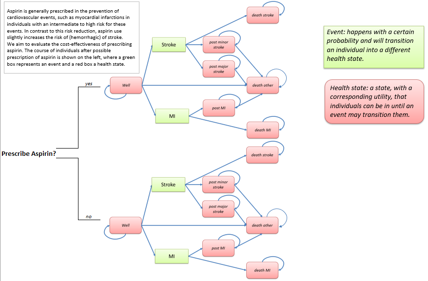

```{r setup, include = FALSE}
rm(list = ls())
require(learnr, quietly = TRUE)
knitr::opts_chunk$set(echo = FALSE)

# Setting parameters
n_cycles <- 10 # number of cycles
r_d_effects <- 0.015 # annual discount rate, health effects
r_d_costs <- 0.04 # annual discount rate, costs
v_names_hs <- c("Well", "Post-minor_stroke", "Post-major_stroke", "Post-MI", "Death_stroke", "Death_MI", "Death_other") # vector of names of health states
n_hs <- length(v_names_hs) # number of health states
n_ind <- 100000 # number of individuals to simulate  
v_start_hs <- c(n_ind, 0, 0, 0, 0, 0, 0) # vector of starting position in the model  

# Input parameters

## Rates & probabilities
r_fatal_mi	<- 0.25 # rate fatal MI
r_fatal_stroke	<- 0.3 # rate fatal stroke

## Treatment effectiveness
eff_mi	<- 0.6 # Treatment effectiveness of Aspirin on the probability of experiencing a MI
eff_stroke	<- 1.2 # Treatment effectiveness of Aspirin on the probability of experiencing a stroke

## Utility values 
u_healthy	<- 1 # utility value health state: Well
u_post_mi	<- 0.85 # utility value health state: Post-MI
u_post_minor_stroke	<- 0.75 # utility value health state: Post-minor stroke
u_post_major_stroke	<- 0.5 # utility value health state: Post-major stroke
u_aspirin_use	<- 0.999 # utility value health state: Well when using aspiring

## Costs
c_aspirin_use	<- 100 # yearly costs of using aspiring
c_post_mi	<- 8000 # yearly costs after having experienced a NON-FATAL MI
c_post_minor_stroke	<- 2000 # yearly costs after having experienced a NON-FATAL minor stroke
c_post_major_stroke	<- 20000 # yearly costs after having experienced a NON_FATAL major stroke
```

## Before starting
1. Watch the videos explaining how a Health State Transition Model (HSTM) works and can be used for a cost-effectiveness analyses (CEA), and on uncertainty assessment. To do so, you probably need to open open the tutorial in your browser using the 'Open in Browser' button on the upper left side of the screen.  
{width="70%"}
Link to the video: https://vimeo.com/453418864/050bf4acaf.

{width="70%"}
Link to the video: https://vimeo.com/453418898/90a5e63f1e.

## Aim and instructions
The aim of this practical assignment is to get you acquainted with the principle of HSTM. This assignmment focuses on evaluating the cost-effectiveness of aspirin treatment versus no aspirin treatment for the primary prevention of cardiovascular disease events using a HSTM, also called Markov model. During this assignment, you will first define the cohort simulation of both strategies (using transition probabilities, and matrix multiplication) and then calculate the outcomes (quality-adjusted life years, costs). First, familiarise yourself with the model structure.  
The method described in this practical is more extensively described in [Alarid Escudero et al. 2021](https://arxiv.org/abs/2001.07824).  

```{r, fig.align = 'center', out.width = "70%", echo = F}
knitr::include_graphics("Tutorial_hstm_1_files/images/Image_hint.png")
```

```{r, fig.align = 'center', out.width = "70%", echo = F}
knitr::include_graphics("Tutorial_hstm_1_files/images/Image_solution.png")
```

### Prerequisites
You should be able to following commands to perform this exercise:  

- `matrix()` function  
- perform matrix multiplication using `%*%`  
- using the command `for()` to perform forward loop  

## Model structure & parameters  
**DISCLAIMER: FOR THE FOLLOWING ASSIGNMENT, ASSUME THAT PROBABILITIES ARE THE SAME AS RATES. SEE *[Fleurence & Hollenbeak 2007]*(https://doi.org/10.2165/00019053-200725010-00002) FOR AN EXPLANATION OF THE DIFFERENCES BETWEEN RATES AND PROBABILITIES AND REMEMBER THAT WE USUALLY USE PROBABILITIES IN HEALTH ECONOMIC MODELLING** 

### Model structure
In this HSTM, individuals either receive aspirin or not (the two strategies we compare).In this model, individuals may remain "Well", or they can experience a stroke or a myocardial infarction (MI). These two events may be fatal or individuals may remain alive in the "Post-minor stroke", "Post-major stroke", or "Post-MI" health states when they survive these events. From all health states, individuals may die from general causes of death to "Death other".  
  
```{r, fig.align = 'center', out.width = "90%", echo = F}

```

### Model inputs
As you can see both strategies (prescribing aspirin or not) have similar diagrams. However, there will be differences in the values of the parameters applied in these strategies. First, we will focus on the disease progression of patients not using aspirin. Have a look at the input parameters which are already defined herebelow.   

```{r inputs_gen, echo = TRUE, eval = FALSE}
# Setting parameters
n_cycles <- 10 # number of cycles in the health economic model
r_d_effects <- 0.015 # annual discount rate, health effects
r_d_costs <- 0.04 # annual discount rate, costs
v_names_hs <- c("Well", "Post-minor_stroke", "Post-major_stroke", "Post-MI", "Death_stroke", "Death_MI", "Death_other") # vector of names of health states
n_hs <- length(v_names_hs) # number of health states
n_ind <- 100000 # number of individuals to simulate  
v_start_hs <- c(n_ind, 0, 0, 0, 0, 0, 0) # vector of starting position in the model  

# Input parameters

## Rates & probabilities
r_fatal_mi	<- 0.25 # rate fatal MI - no-Aspirin strategy
r_fatal_stroke	<- 0.3 # rate fatal stroke - no-Aspirin strategy

## Treatment effectiveness
eff_mi	<- 0.6 # Treatment effectiveness of Aspirin on the probability of experiencing a MI
eff_stroke	<- 1.2 # Treatment effectiveness of Aspirin on the probability of experiencing a stroke

## Utility values 
u_healthy	<- 1 # utility value health state: Well
u_post_mi	<- 0.85 # utility value health state: Post-MI
u_post_minor_stroke	<- 0.75 # utility value health state: Post-minor stroke
u_post_major_stroke	<- 0.5 # utility value health state: Post-major stroke
u_aspirin_use	<- 0.999 # utility value health state: Well when using aspiring

## Costs
c_aspirin_use	<- 100 # yearly costs of using aspirin
c_post_mi	<- 8000 # yearly costs after having experienced a NON-FATAL MI
c_post_minor_stroke	<- 2000 # yearly costs after having experienced a NON-FATAL minor stroke
c_post_major_stroke	<- 20000 # yearly costs after having experienced a NON_FATAL major stroke
```


When developing a health economic model we often have to combine evidence from different sources of literature. Assume that there was evidence that 235 out of 1,000 patients **who had a stroke and survived** moved into a post major stroke state (the remaining patients experienced a minor stroke). Based on this evidence, please define the parameter `p_minor_stroke` (probability of transiting to the "post-minor stroke" health state **after having experienced a NON-FATAL stroke** and `p_major_stroke` (probability of transiting to the "post-major stroke" health state **after having experienced a NON-FATAL stroke**.   
1.b. From other sources, you found that the incidence rates for myocardial infarction (MI), stroke, and death from other causes were respectively **400, 50, and 650 per 100,000 person-years**. Calculate the yearly incidence rates of MI, stroke, and death from other causes than MI and stroke in the placeholder of parameters `r_inc_mi`, `r_inc_stroke`, and `r_mort`.  

```{r calc_inputs, exercise = TRUE}
# Parameters to calculate
# probability to transit to "Post-major stroke" after a NON-FATAL stroke occured
# probability to transit to "Post-minor stroke" after a NON-FATAL stroke occured
# yearly incidence rate MI
# yearly incidence rate stroke
# yearly rate of death
```

```{r calc_inputs-hint}
# Example
p_post_major_stroke	<- 235 / 1000 # probability to transit to "Post-major stroke" after a NON-FATAL stroke occured
p_post_minor_stroke	<- 1 - p_post_major_stroke # probability to transit to "Post-minor stroke" after a NON-FATAL stroke occured
```

```{r calc_inputs-solution}
p_post_major_stroke	<- 235 / 1000 # probability to transit to "Post-major stroke" after a NON-FATAL stroke occured
p_post_minor_stroke	<- 1 - p_post_major_stroke # probability to transit to "Post-minor stroke" after a NON-FATAL stroke occured
r_inc_mi <- 400 / 100000 # yearly incidence rate MI
r_inc_stroke <- 50 / 100000 # yearly incidence rate stroke
r_mort <- 650 / 100000 # yearly rate of death
#data.frame(c(p_post_major_stroke, p_post_minor_stroke, r_inc_mi, r_inc_stroke, r_mort)) # show
```

## Transition matrices  
