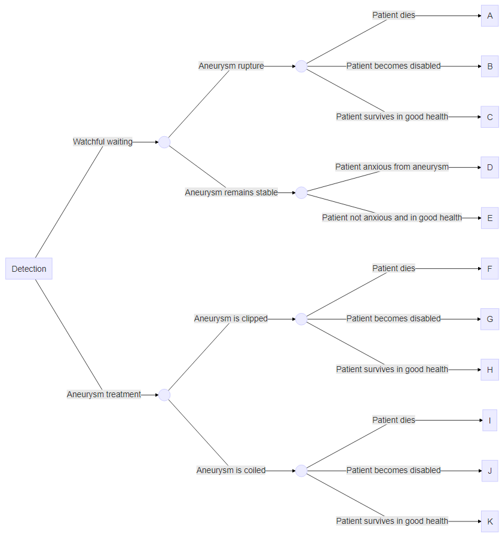
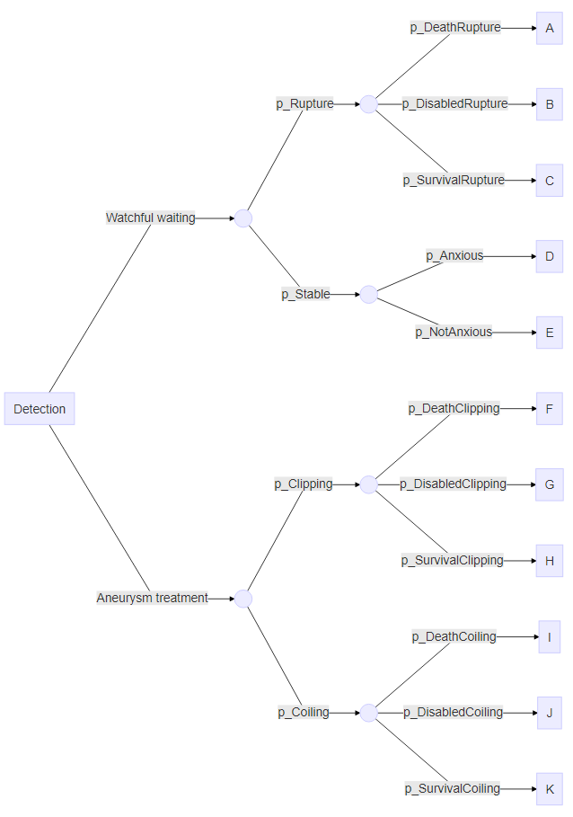

```{r setup, include = FALSE}
require(learnr, quietly = TRUE)
require(knitr, quietly = TRUE)
require(ggplot2, quietly = TRUE)
require(shiny, quietly = TRUE)
require(dplyr, quietly = TRUE)

knitr::opts_chunk$set(echo = FALSE)
```


## Instruction

### Before starting
1. Watch the video explaining how a decision tree works and can be used for a cost-effectiveness analyses (CEA). To do so, you probably need to open open the tutorial in your browser using the 'Open in Browser' button on the upper left side of the screen.  
{width="70%"}
Link to the video: https://vimeo.com/453418819/6c13bffaf4. 

### Aim and instructions
The aim of this practical assignment is to perform a health economic analysis using a decision tree. You are asked to evaluating the cost-effectiveness of a management strategy for patients with unruptured intracranial aneurysms versus watchful waiting.  

**NOTE**: the solutions which are provided are one way to perform the calculations, you can obtain the same results using other fomula's. The last 'Hint' is always the solution of the assignment. Soultions can be copy/paste in the chunk as shown in the figures below. Once you have completed a code chunk, you can run it by pushing the 'Run code' button on the upper-right side of the chunk.  


```{r, fig.align = 'center', out.width = "70%", echo = F}
knitr::include_graphics("Tutorial_decision_tree_files/images/Image_hint.png")
```

```{r, fig.align = 'center', out.width = "70%", echo = F}
knitr::include_graphics("Tutorial_decision_tree_files/images/Image_solution.png")
```

### The decision tree
This section provides an explanation of the decision tree used in this practical assignment. The decision tree compares two strategies: "Aneurysm treatment" and "Watchful waiting". The "Detection" rectangle represents the decision node (i.e. the point where the different strategies are defined). Both main branches of the decision tree describe the possible trajectories for each of these strategies. The circles are the chance nodes. Figure 1 provides a textual description of the trajectories, and Figure 2 provides a description of which probabilities belongs to each branch of the decision tree.  
**NOTE**: the sum of the probabilities following a chance node must sum up to 1.  

```{r, fig.align = 'center', fig.cap = "Description decision tree", echo = F}

```

```{r, fig.align = 'center', fig.cap = "Probabilities decision tree", echo = F}

```
